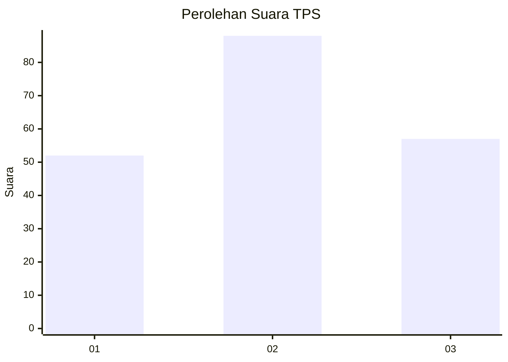
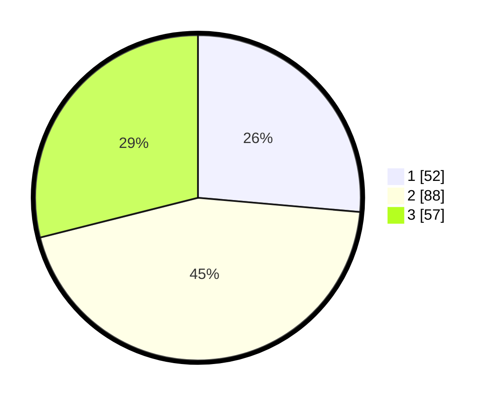

# Hasil

## Grafik

## Tabel

| No. | Nama Paslon    | Suara | Suara (raw) | Persentase |
|:--- |:-------------- | -----:| -----------:| ----------:|
| 1   | ANIES MUHAIMIN | 52    | [52][p-1]   | 26,40      |
| 2   | PRABOWO GIBRAN | 88    | [88][p-2]   | 44,67      |
| 3   | GANJAR MAHFUD  | 57    | [57][p-3]   | 28,93      |

[p-1]: https://github.com/gigit-pemilu/pemilu-2024-34-di-yogyakarta/blob/main/pilpres/hitung-suara/sub/34-di-yogyakarta/sub/04-sleman/sub/01-gamping/sub/2001-balecatur/sub/017-tps/sub/paslon-1.txt
[p-2]: https://github.com/gigit-pemilu/pemilu-2024-34-di-yogyakarta/blob/main/pilpres/hitung-suara/sub/34-di-yogyakarta/sub/04-sleman/sub/01-gamping/sub/2001-balecatur/sub/017-tps/sub/paslon-2.txt
[p-3]: https://github.com/gigit-pemilu/pemilu-2024-34-di-yogyakarta/blob/main/pilpres/hitung-suara/sub/34-di-yogyakarta/sub/04-sleman/sub/01-gamping/sub/2001-balecatur/sub/017-tps/sub/paslon-3.txt

## Foto C Plano

https://sirekap-obj-formc.kpu.go.id/7fdd/pemilu/ppwp/34/04/01/20/01/3404012001017-20240214-212419--21ff2204-bdd8-4b78-a3a3-07de2a43b93d.jpg

https://sirekap-obj-formc.kpu.go.id/7fdd/pemilu/ppwp/34/04/01/20/01/3404012001017-20240214-212949--61b9f5ad-4e5a-489a-ba52-b0938c252882.jpg

https://sirekap-obj-formc.kpu.go.id/7fdd/pemilu/ppwp/34/04/01/20/01/3404012001017-20240214-213138--aadb7890-557c-44e9-9447-584e6c1691a9.jpg

## Metadata

| Key        | Value               |
| ---------- | ------------------- |
| Time Stamp | 2024-02-15 17:30:25 |

