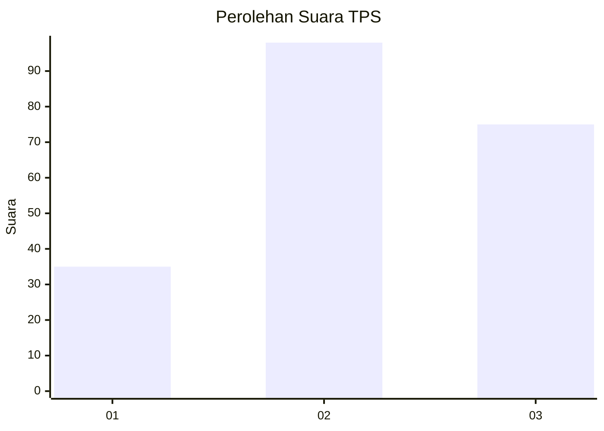
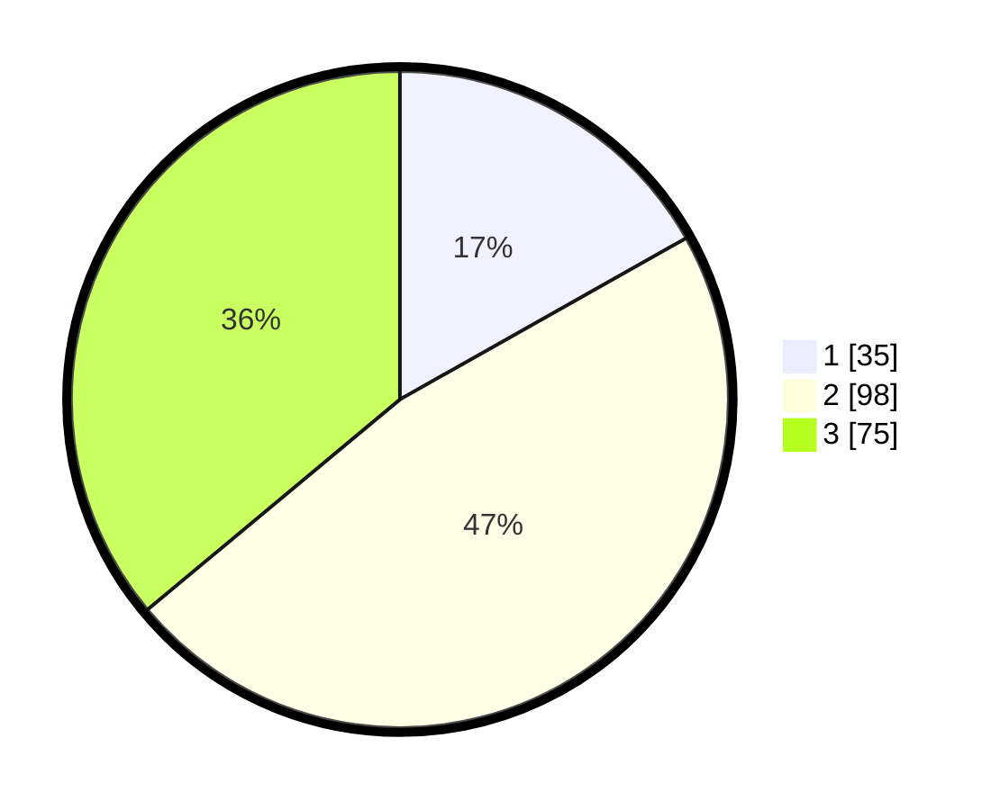

# Hasil

## Grafik

## Tabel

| No. | Nama Paslon    | Suara | Suara (raw) | Persentase |
|:--- |:-------------- | -----:| -----------:| ----------:|
| 1   | ANIES MUHAIMIN | 35    | [35][p-1]   | 16,83      |
| 2   | PRABOWO GIBRAN | 98    | [98][p-2]   | 47,12      |
| 3   | GANJAR MAHFUD  | 75    | [75][p-3]   | 36,06      |

[p-1]: https://github.com/gigit-pemilu/pemilu-2024-34-di-yogyakarta/blob/main/pilpres/hitung-suara/sub/34-di-yogyakarta/sub/04-sleman/sub/01-gamping/sub/2001-balecatur/sub/019-tps/sub/paslon-1.txt
[p-2]: https://github.com/gigit-pemilu/pemilu-2024-34-di-yogyakarta/blob/main/pilpres/hitung-suara/sub/34-di-yogyakarta/sub/04-sleman/sub/01-gamping/sub/2001-balecatur/sub/019-tps/sub/paslon-2.txt
[p-3]: https://github.com/gigit-pemilu/pemilu-2024-34-di-yogyakarta/blob/main/pilpres/hitung-suara/sub/34-di-yogyakarta/sub/04-sleman/sub/01-gamping/sub/2001-balecatur/sub/019-tps/sub/paslon-3.txt

## Foto C Plano

https://sirekap-obj-formc.kpu.go.id/200b/pemilu/ppwp/34/04/01/20/01/3404012001019-20240215-012128--14bd9ab3-b2c9-4047-b913-970db9a905a0.jpg

https://sirekap-obj-formc.kpu.go.id/200b/pemilu/ppwp/34/04/01/20/01/3404012001019-20240215-012928--92f590e4-c216-4dff-a9fa-4be34c539dba.jpg

https://sirekap-obj-formc.kpu.go.id/200b/pemilu/ppwp/34/04/01/20/01/3404012001019-20240215-012255--52cd8795-638f-4904-aab8-e130ce453661.jpg

## Metadata

| Key        | Value               |
| ---------- | ------------------- |
| Time Stamp | 2024-02-16 14:30:33 |

