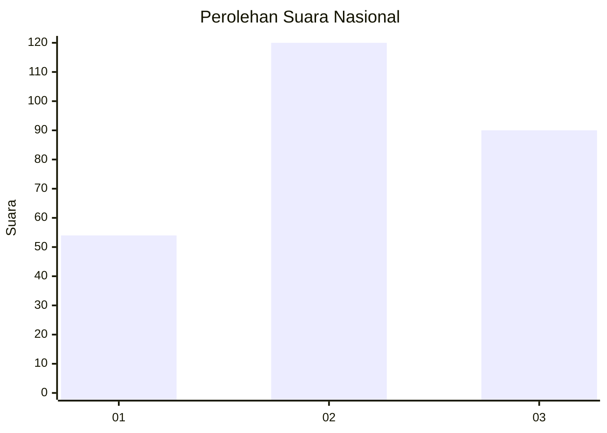
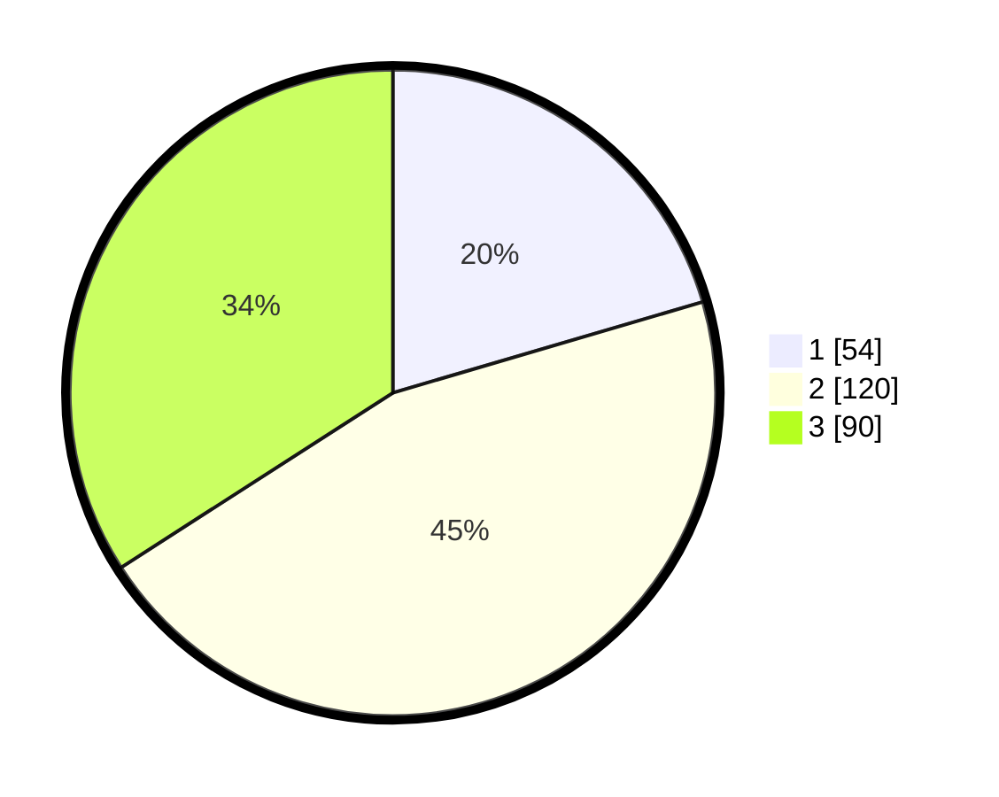

# Hasil

## Grafik

## Tabel

| No. | Nama Paslon    | Suara | Suara (raw) | Persentase |
|:--- |:-------------- | -----:| -----------:| ----------:|
| 1   | ANIES MUHAIMIN | 54    | [54][p-1]   | 20,45      |
| 2   | PRABOWO GIBRAN | 120   | [120][p-2]  | 45,45      |
| 3   | GANJAR MAHFUD  | 90    | [90][p-3]   | 34,09      |

[p-1]: https://github.com/gigit-pemilu/pemilu-2024/blob/main/pilpres/hitung-suara/sub/34-di-yogyakarta/sub/04-sleman/sub/01-gamping/sub/2001-balecatur/sub/022-tps/sub/paslon-1.txt
[p-2]: https://github.com/gigit-pemilu/pemilu-2024/blob/main/pilpres/hitung-suara/sub/34-di-yogyakarta/sub/04-sleman/sub/01-gamping/sub/2001-balecatur/sub/022-tps/sub/paslon-2.txt
[p-3]: https://github.com/gigit-pemilu/pemilu-2024/blob/main/pilpres/hitung-suara/sub/34-di-yogyakarta/sub/04-sleman/sub/01-gamping/sub/2001-balecatur/sub/022-tps/sub/paslon-3.txt

## Foto C Plano

https://sirekap-obj-formc.kpu.go.id/63b2/pemilu/ppwp/34/04/01/20/01/3404012001022-20240215-003258--ff18a16b-1963-4bd1-b2cd-73183927ab05.jpg

https://sirekap-obj-formc.kpu.go.id/63b2/pemilu/ppwp/34/04/01/20/01/3404012001022-20240215-003429--5ee1b9db-7a85-4e32-9faf-864d9552d3f8.jpg

https://sirekap-obj-formc.kpu.go.id/63b2/pemilu/ppwp/34/04/01/20/01/3404012001022-20240215-023630--fbf89593-e42f-4cee-b224-b069a4ad0ea5.jpg

## Metadata

| Key        | Value               |
| ---------- | ------------------- |
| Time Stamp | 2024-02-15 20:30:46 |

