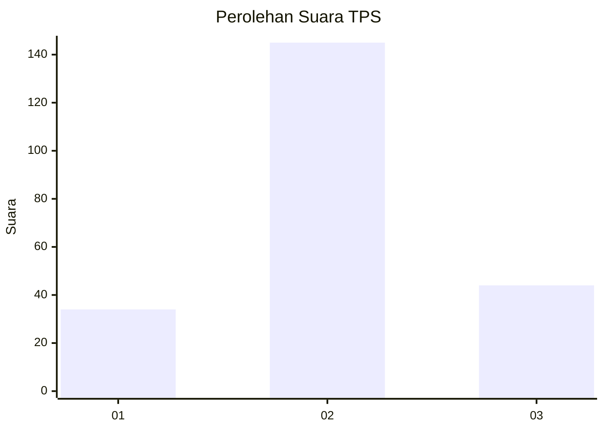
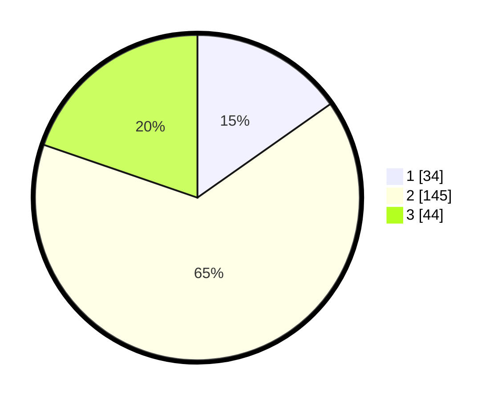

# Hasil

## Grafik

## Tabel

| No. | Nama Paslon    | Suara | Suara (raw) | Persentase |
|:--- |:-------------- | -----:| -----------:| ----------:|
| 1   | ANIES MUHAIMIN | 34    | [34][p-1]   | 15,25      |
| 2   | PRABOWO GIBRAN | 145   | [145][p-2]  | 65,02      |
| 3   | GANJAR MAHFUD  | 44    | [44][p-3]   | 19,73      |

[p-1]: https://github.com/gigit-pemilu/pemilu-2024-34-di-yogyakarta/blob/main/pilpres/hitung-suara/sub/34-di-yogyakarta/sub/04-sleman/sub/01-gamping/sub/2001-balecatur/sub/023-tps/sub/paslon-1.txt
[p-2]: https://github.com/gigit-pemilu/pemilu-2024-34-di-yogyakarta/blob/main/pilpres/hitung-suara/sub/34-di-yogyakarta/sub/04-sleman/sub/01-gamping/sub/2001-balecatur/sub/023-tps/sub/paslon-2.txt
[p-3]: https://github.com/gigit-pemilu/pemilu-2024-34-di-yogyakarta/blob/main/pilpres/hitung-suara/sub/34-di-yogyakarta/sub/04-sleman/sub/01-gamping/sub/2001-balecatur/sub/023-tps/sub/paslon-3.txt

## Foto C Plano

https://sirekap-obj-formc.kpu.go.id/1819/pemilu/ppwp/34/04/01/20/01/3404012001023-20240215-035122--0aeebebc-d5e4-44bf-acd7-936ce22226dd.jpg

https://sirekap-obj-formc.kpu.go.id/1819/pemilu/ppwp/34/04/01/20/01/3404012001023-20240214-155321--d64c3a2e-4edc-40ce-8ed3-76ba31e7f197.jpg

https://sirekap-obj-formc.kpu.go.id/1819/pemilu/ppwp/34/04/01/20/01/3404012001023-20240214-155356--8aa674a1-eb20-4d60-b295-37a492393b3a.jpg

## Metadata

| Key        | Value               |
| ---------- | ------------------- |
| Time Stamp | 2024-02-16 14:30:33 |

