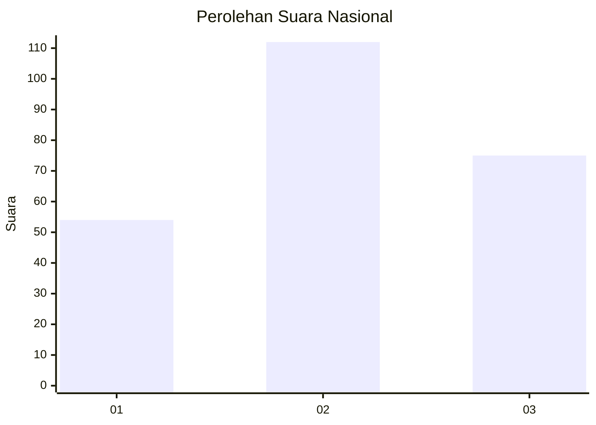
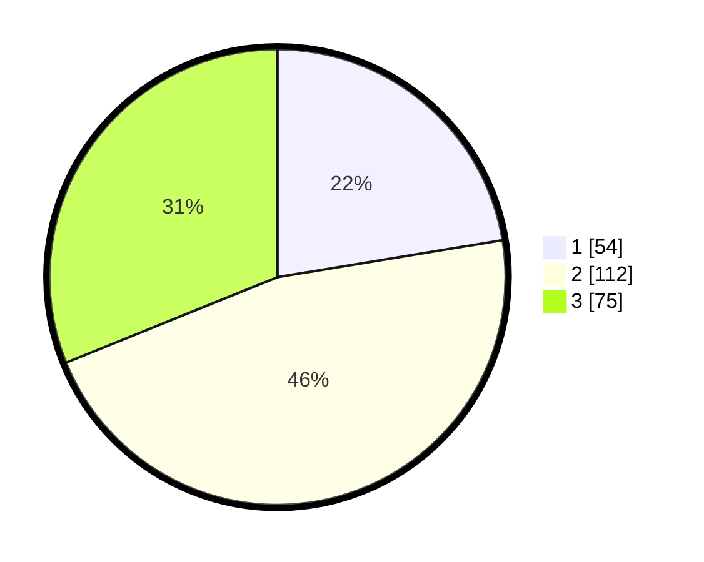

# Hasil

## Grafik

## Tabel

| No. | Nama Paslon    | Suara | Suara (raw) | Persentase |
|:--- |:-------------- | -----:| -----------:| ----------:|
| 1   | ANIES MUHAIMIN | 54    | [54][p-1]   | 22,41      |
| 2   | PRABOWO GIBRAN | 112   | [112][p-2]  | 46,47      |
| 3   | GANJAR MAHFUD  | 75    | [75][p-3]   | 31,12      |

[p-1]: https://github.com/gigit-pemilu/pemilu-2024/blob/main/pilpres/hitung-suara/sub/34-di-yogyakarta/sub/04-sleman/sub/01-gamping/sub/2001-balecatur/sub/024-tps/sub/paslon-1.txt
[p-2]: https://github.com/gigit-pemilu/pemilu-2024/blob/main/pilpres/hitung-suara/sub/34-di-yogyakarta/sub/04-sleman/sub/01-gamping/sub/2001-balecatur/sub/024-tps/sub/paslon-2.txt
[p-3]: https://github.com/gigit-pemilu/pemilu-2024/blob/main/pilpres/hitung-suara/sub/34-di-yogyakarta/sub/04-sleman/sub/01-gamping/sub/2001-balecatur/sub/024-tps/sub/paslon-3.txt

## Foto C Plano

https://sirekap-obj-formc.kpu.go.id/6353/pemilu/ppwp/34/04/01/20/01/3404012001024-20240215-005443--a70a4bfa-b87c-4d3f-a870-288d8f673cad.jpg

https://sirekap-obj-formc.kpu.go.id/6353/pemilu/ppwp/34/04/01/20/01/3404012001024-20240215-010609--d5147dc7-c862-448d-bb3a-79abdcae0faa.jpg

https://sirekap-obj-formc.kpu.go.id/6353/pemilu/ppwp/34/04/01/20/01/3404012001024-20240215-010003--20c8c843-e43b-4bf2-8d1f-7526ca0ac8c7.jpg

## Metadata

| Key        | Value               |
| ---------- | ------------------- |
| Time Stamp | 2024-02-16 16:25:10 |

