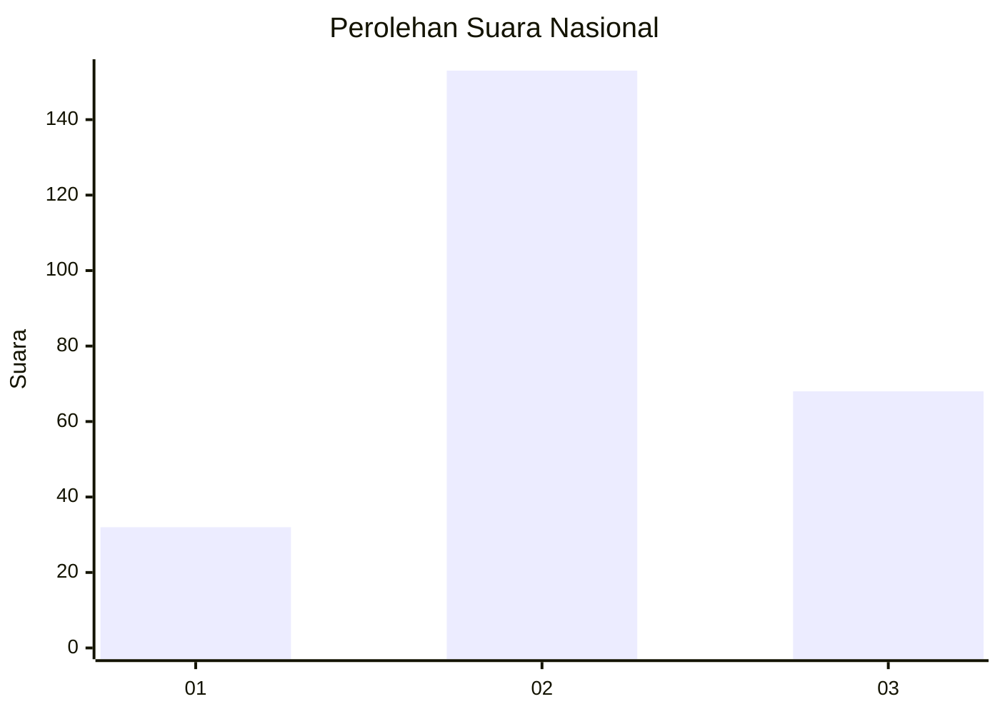
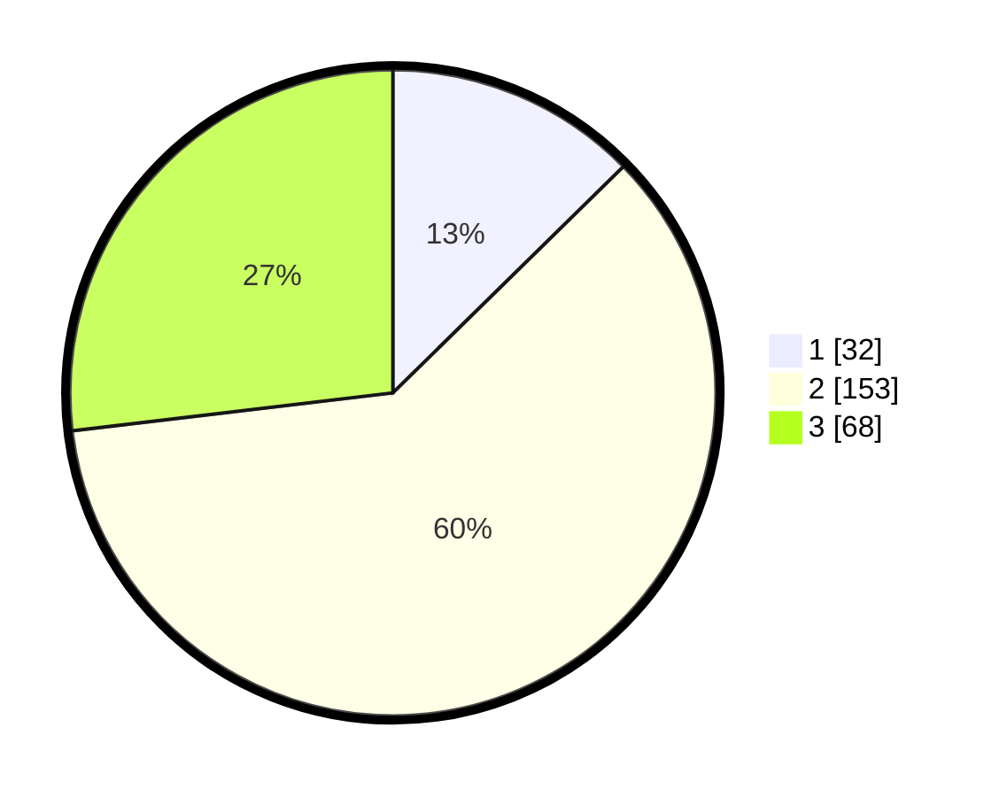

# Hasil

## Grafik

## Tabel

| No. | Nama Paslon    | Suara | Suara (raw) | Persentase |
|:--- |:-------------- | -----:| -----------:| ----------:|
| 1   | ANIES MUHAIMIN | 32    | [32][p-1]   | 12,65      |
| 2   | PRABOWO GIBRAN | 153   | [153][p-2]  | 60,47      |
| 3   | GANJAR MAHFUD  | 68    | [68][p-3]   | 26,88      |

[p-1]: https://github.com/gigit-pemilu/pemilu-2024/blob/main/pilpres/hitung-suara/sub/34-di-yogyakarta/sub/04-sleman/sub/01-gamping/sub/2001-balecatur/sub/026-tps/sub/paslon-1.txt
[p-2]: https://github.com/gigit-pemilu/pemilu-2024/blob/main/pilpres/hitung-suara/sub/34-di-yogyakarta/sub/04-sleman/sub/01-gamping/sub/2001-balecatur/sub/026-tps/sub/paslon-2.txt
[p-3]: https://github.com/gigit-pemilu/pemilu-2024/blob/main/pilpres/hitung-suara/sub/34-di-yogyakarta/sub/04-sleman/sub/01-gamping/sub/2001-balecatur/sub/026-tps/sub/paslon-3.txt

## Foto C Plano

https://sirekap-obj-formc.kpu.go.id/cbb8/pemilu/ppwp/34/04/01/20/01/3404012001026-20240214-192023--151a4210-4d21-431d-8f95-a463854b445c.jpg

https://sirekap-obj-formc.kpu.go.id/cbb8/pemilu/ppwp/34/04/01/20/01/3404012001026-20240214-192026--89938395-4913-4ee6-b723-fb9f057f44c6.jpg

https://sirekap-obj-formc.kpu.go.id/cbb8/pemilu/ppwp/34/04/01/20/01/3404012001026-20240214-192420--8188a1d4-b3d0-4423-adb8-8806b4ab8749.jpg

## Metadata

| Key        | Value               |
| ---------- | ------------------- |
| Time Stamp | 2024-02-15 21:30:27 |

