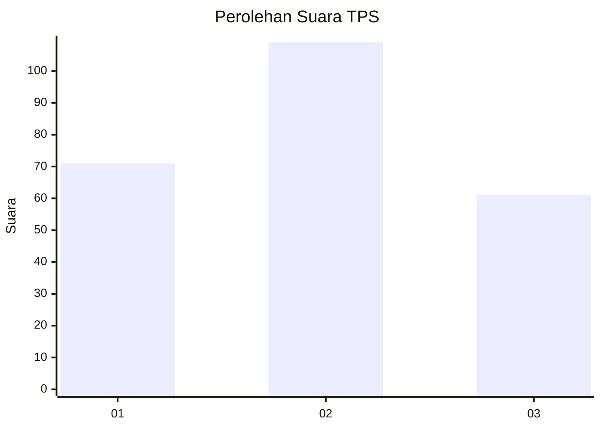
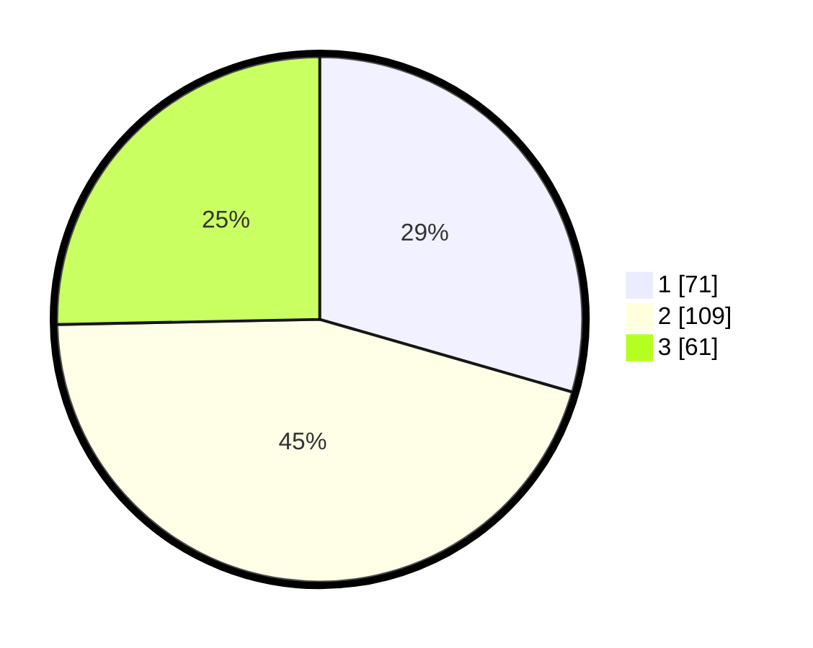

# Hasil

## Grafik

## Tabel

| No. | Nama Paslon    | Suara | Suara (raw) | Persentase |
|:--- |:-------------- | -----:| -----------:| ----------:|
| 1   | ANIES MUHAIMIN | 71    | [71][p-1]   | 29,46      |
| 2   | PRABOWO GIBRAN | 109   | [109][p-2]  | 45,23      |
| 3   | GANJAR MAHFUD  | 61    | [61][p-3]   | 25,31      |

[p-1]: https://github.com/gigit-pemilu/pemilu-2024-34-di-yogyakarta/blob/main/pilpres/hitung-suara/sub/34-di-yogyakarta/sub/04-sleman/sub/01-gamping/sub/2001-balecatur/sub/028-tps/sub/paslon-1.txt
[p-2]: https://github.com/gigit-pemilu/pemilu-2024-34-di-yogyakarta/blob/main/pilpres/hitung-suara/sub/34-di-yogyakarta/sub/04-sleman/sub/01-gamping/sub/2001-balecatur/sub/028-tps/sub/paslon-2.txt
[p-3]: https://github.com/gigit-pemilu/pemilu-2024-34-di-yogyakarta/blob/main/pilpres/hitung-suara/sub/34-di-yogyakarta/sub/04-sleman/sub/01-gamping/sub/2001-balecatur/sub/028-tps/sub/paslon-3.txt

## Foto C Plano

https://sirekap-obj-formc.kpu.go.id/0c1f/pemilu/ppwp/34/04/01/20/01/3404012001028-20240214-214216--6f54ccff-bce5-4c29-9c30-5d7232b05a6f.jpg

https://sirekap-obj-formc.kpu.go.id/0c1f/pemilu/ppwp/34/04/01/20/01/3404012001028-20240215-004804--d882d26f-3d6f-4fde-838b-e6b0909e2920.jpg

https://sirekap-obj-formc.kpu.go.id/0c1f/pemilu/ppwp/34/04/01/20/01/3404012001028-20240215-004911--29c470ac-df0a-4eba-bebd-a9d3989197d9.jpg

## Metadata

| Key        | Value               |
| ---------- | ------------------- |
| Time Stamp | 2024-02-15 12:00:28 |

