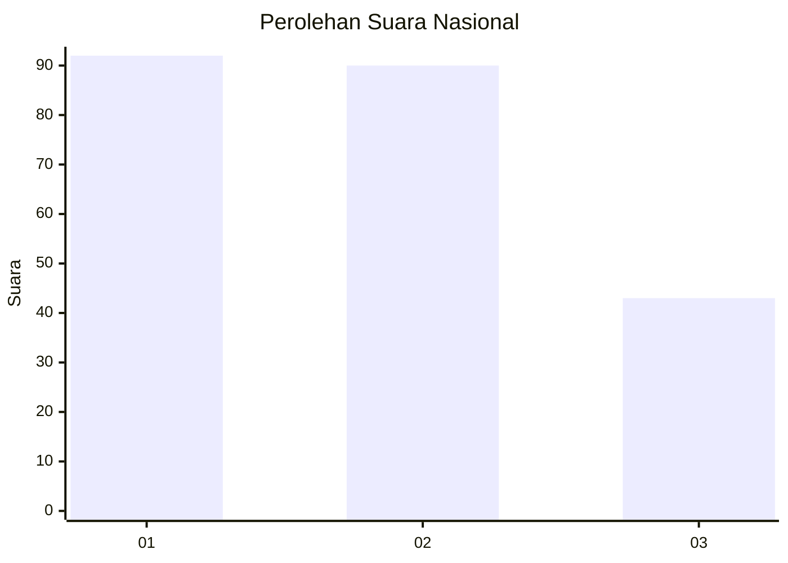
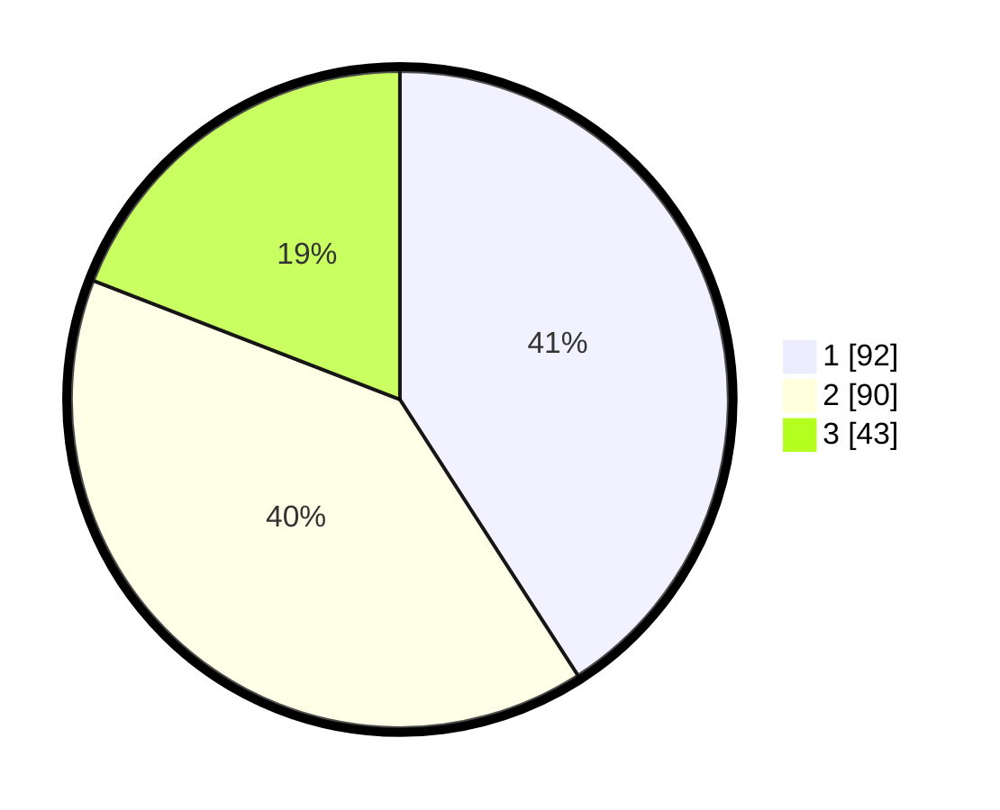

# Hasil

## Grafik

## Tabel

| No. | Nama Paslon    | Suara | Suara (raw) | Persentase |
|:--- |:-------------- | -----:| -----------:| ----------:|
| 1   | ANIES MUHAIMIN | 92    | [92][p-1]   | 40,89      |
| 2   | PRABOWO GIBRAN | 90    | [90][p-2]   | 40,00      |
| 3   | GANJAR MAHFUD  | 43    | [43][p-3]   | 19,11      |

[p-1]: https://github.com/gigit-pemilu/pemilu-2024/blob/main/pilpres/hitung-suara/sub/34-di-yogyakarta/sub/04-sleman/sub/01-gamping/sub/2001-balecatur/sub/032-tps/sub/paslon-1.txt
[p-2]: https://github.com/gigit-pemilu/pemilu-2024/blob/main/pilpres/hitung-suara/sub/34-di-yogyakarta/sub/04-sleman/sub/01-gamping/sub/2001-balecatur/sub/032-tps/sub/paslon-2.txt
[p-3]: https://github.com/gigit-pemilu/pemilu-2024/blob/main/pilpres/hitung-suara/sub/34-di-yogyakarta/sub/04-sleman/sub/01-gamping/sub/2001-balecatur/sub/032-tps/sub/paslon-3.txt

## Foto C Plano

https://sirekap-obj-formc.kpu.go.id/344e/pemilu/ppwp/34/04/01/20/01/3404012001032-20240214-213706--9427491e-1b03-42fe-a49e-a304cab558b0.jpg

https://sirekap-obj-formc.kpu.go.id/344e/pemilu/ppwp/34/04/01/20/01/3404012001032-20240214-213711--48bca662-6e2f-4aa2-ac1b-1c57885c5b4d.jpg

https://sirekap-obj-formc.kpu.go.id/344e/pemilu/ppwp/34/04/01/20/01/3404012001032-20240214-213716--53eeef51-e45d-41f2-9a59-b7dd7e86c692.jpg

## Metadata

| Key        | Value               |
| ---------- | ------------------- |
| Time Stamp | 2024-02-15 21:30:27 |

