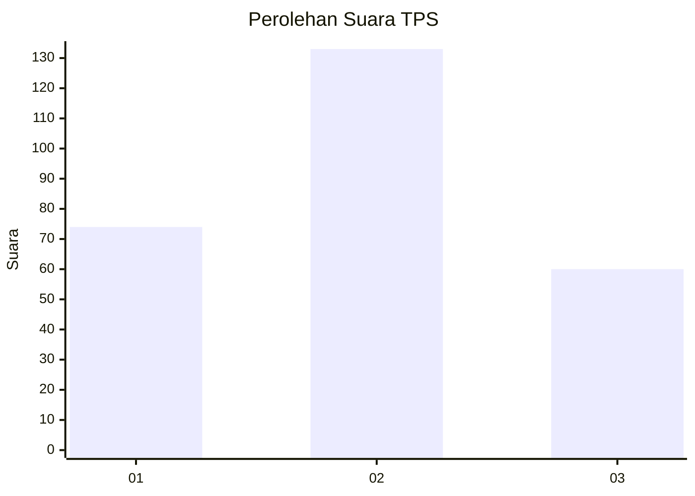
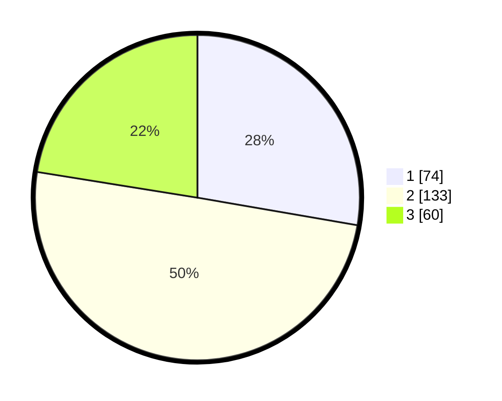

# Hasil

## Grafik

## Tabel

| No. | Nama Paslon    | Suara | Suara (raw) | Persentase |
|:--- |:-------------- | -----:| -----------:| ----------:|
| 1   | ANIES MUHAIMIN | 74    | [74][p-1]   | 27,72      |
| 2   | PRABOWO GIBRAN | 133   | [133][p-2]  | 49,81      |
| 3   | GANJAR MAHFUD  | 60    | [60][p-3]   | 22,47      |

[p-1]: https://github.com/gigit-pemilu/pemilu-2024-34-di-yogyakarta/blob/main/pilpres/hitung-suara/sub/34-di-yogyakarta/sub/04-sleman/sub/01-gamping/sub/2001-balecatur/sub/035-tps/sub/paslon-1.txt
[p-2]: https://github.com/gigit-pemilu/pemilu-2024-34-di-yogyakarta/blob/main/pilpres/hitung-suara/sub/34-di-yogyakarta/sub/04-sleman/sub/01-gamping/sub/2001-balecatur/sub/035-tps/sub/paslon-2.txt
[p-3]: https://github.com/gigit-pemilu/pemilu-2024-34-di-yogyakarta/blob/main/pilpres/hitung-suara/sub/34-di-yogyakarta/sub/04-sleman/sub/01-gamping/sub/2001-balecatur/sub/035-tps/sub/paslon-3.txt

## Foto C Plano

https://sirekap-obj-formc.kpu.go.id/d83b/pemilu/ppwp/34/04/01/20/01/3404012001035-20240214-231556--4aa997cf-da10-4467-8f8c-15e351b26532.jpg

https://sirekap-obj-formc.kpu.go.id/d83b/pemilu/ppwp/34/04/01/20/01/3404012001035-20240217-081543--92fee73f-f84d-453f-8bb1-e0ff287b7a84.jpg

https://sirekap-obj-formc.kpu.go.id/d83b/pemilu/ppwp/34/04/01/20/01/3404012001035-20240214-231739--76c43cbc-d7b9-49de-91b2-3cb6da36e78c.jpg

## Metadata

| Key        | Value               |
| ---------- | ------------------- |
| Time Stamp | 2024-02-17 11:30:03 |

