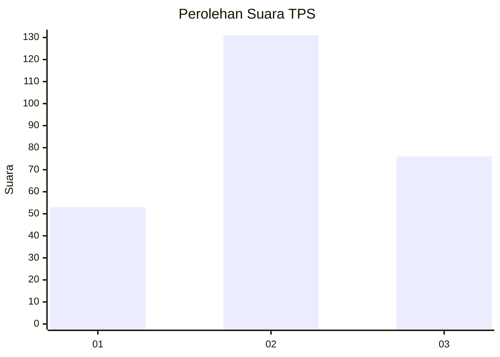
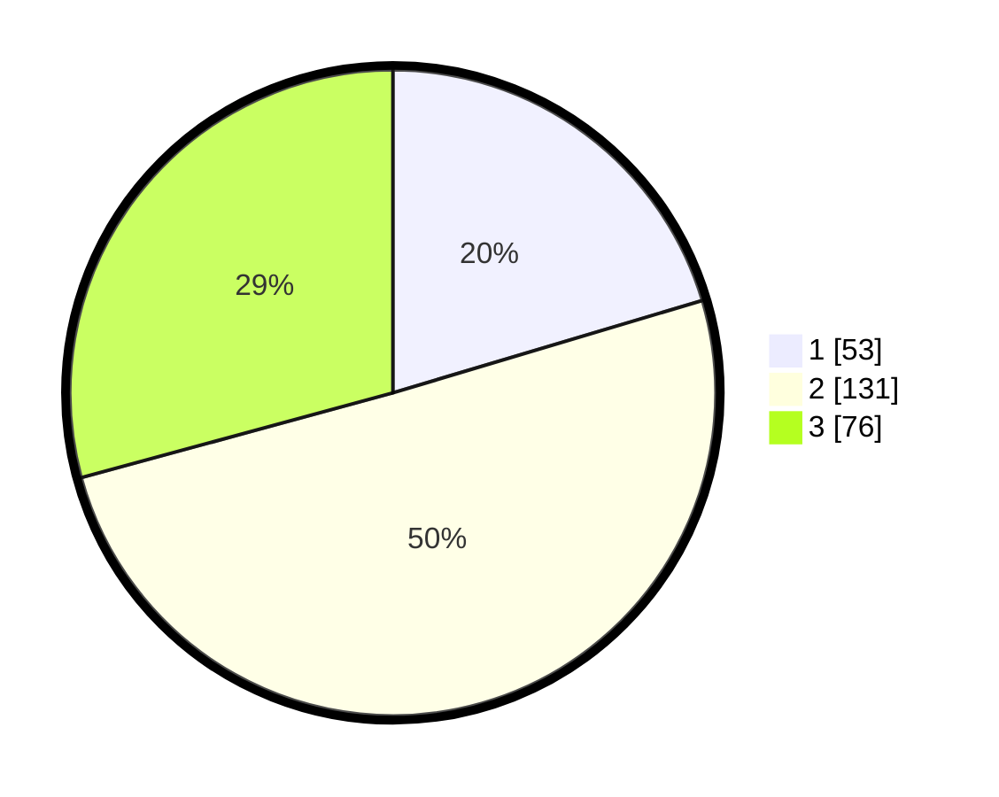

# Hasil

## Grafik

## Tabel

| No. | Nama Paslon    | Suara | Suara (raw) | Persentase |
|:--- |:-------------- | -----:| -----------:| ----------:|
| 1   | ANIES MUHAIMIN | 53    | [53][p-1]   | 20,38      |
| 2   | PRABOWO GIBRAN | 131   | [131][p-2]  | 50,38      |
| 3   | GANJAR MAHFUD  | 76    | [76][p-3]   | 29,23      |

[p-1]: https://github.com/gigit-pemilu/pemilu-2024-34-di-yogyakarta/blob/main/pilpres/hitung-suara/sub/34-di-yogyakarta/sub/04-sleman/sub/01-gamping/sub/2001-balecatur/sub/036-tps/sub/paslon-1.txt
[p-2]: https://github.com/gigit-pemilu/pemilu-2024-34-di-yogyakarta/blob/main/pilpres/hitung-suara/sub/34-di-yogyakarta/sub/04-sleman/sub/01-gamping/sub/2001-balecatur/sub/036-tps/sub/paslon-2.txt
[p-3]: https://github.com/gigit-pemilu/pemilu-2024-34-di-yogyakarta/blob/main/pilpres/hitung-suara/sub/34-di-yogyakarta/sub/04-sleman/sub/01-gamping/sub/2001-balecatur/sub/036-tps/sub/paslon-3.txt

## Foto C Plano

https://sirekap-obj-formc.kpu.go.id/b221/pemilu/ppwp/34/04/01/20/01/3404012001036-20240215-005119--8167ea29-0a35-4c19-bce9-9da791140922.jpg

https://sirekap-obj-formc.kpu.go.id/b221/pemilu/ppwp/34/04/01/20/01/3404012001036-20240215-005542--695e908c-2fc5-4181-90c5-6f877584dc1b.jpg

https://sirekap-obj-formc.kpu.go.id/b221/pemilu/ppwp/34/04/01/20/01/3404012001036-20240215-005758--0af9c913-3a79-4a5c-99b8-e4ef0ea4f51c.jpg

## Metadata

| Key        | Value               |
| ---------- | ------------------- |
| Time Stamp | 2024-02-15 12:00:28 |

