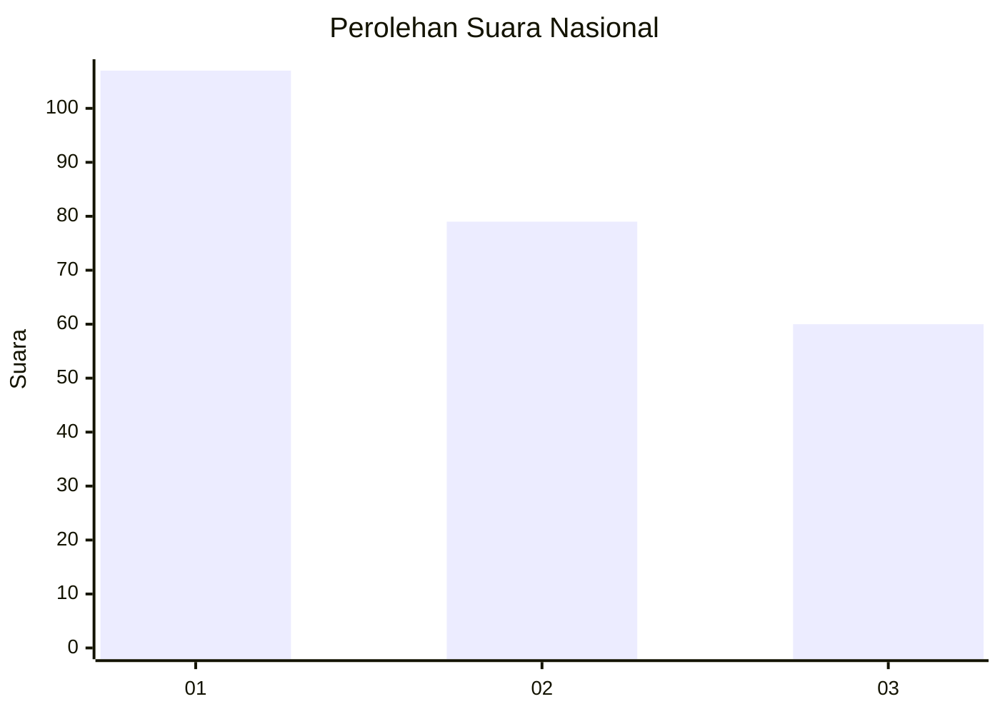
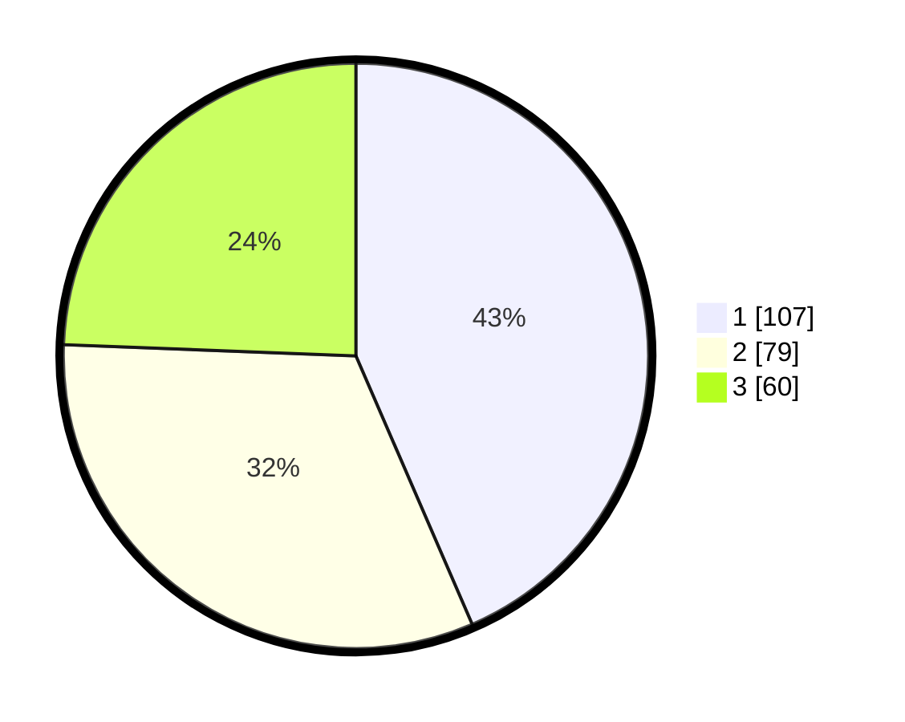

# Hasil

## Grafik

## Tabel

| No. | Nama Paslon    | Suara | Suara (raw) | Persentase |
|:--- |:-------------- | -----:| -----------:| ----------:|
| 1   | ANIES MUHAIMIN | 107   | [107][p-1]  | 43,50      |
| 2   | PRABOWO GIBRAN | 79    | [79][p-2]   | 32,11      |
| 3   | GANJAR MAHFUD  | 60    | [60][p-3]   | 24,39      |

[p-1]: https://github.com/gigit-pemilu/pemilu-2024/blob/main/pilpres/hitung-suara/sub/34-di-yogyakarta/sub/04-sleman/sub/01-gamping/sub/2001-balecatur/sub/039-tps/sub/paslon-1.txt
[p-2]: https://github.com/gigit-pemilu/pemilu-2024/blob/main/pilpres/hitung-suara/sub/34-di-yogyakarta/sub/04-sleman/sub/01-gamping/sub/2001-balecatur/sub/039-tps/sub/paslon-2.txt
[p-3]: https://github.com/gigit-pemilu/pemilu-2024/blob/main/pilpres/hitung-suara/sub/34-di-yogyakarta/sub/04-sleman/sub/01-gamping/sub/2001-balecatur/sub/039-tps/sub/paslon-3.txt

## Foto C Plano

https://sirekap-obj-formc.kpu.go.id/647f/pemilu/ppwp/34/04/01/20/01/3404012001039-20240214-222512--5bd958f4-f5a7-42af-ba53-f2c635d1ee57.jpg

https://sirekap-obj-formc.kpu.go.id/647f/pemilu/ppwp/34/04/01/20/01/3404012001039-20240214-223117--1c32be19-6c85-48fa-a376-68fd583231d4.jpg

https://sirekap-obj-formc.kpu.go.id/647f/pemilu/ppwp/34/04/01/20/01/3404012001039-20240214-223153--021c6116-e94d-4a9b-8390-d92d518ac64b.jpg

## Metadata

| Key        | Value               |
| ---------- | ------------------- |
| Time Stamp | 2024-02-15 21:01:18 |

