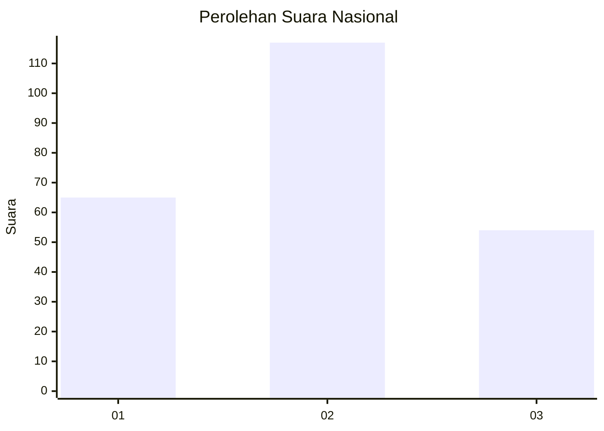
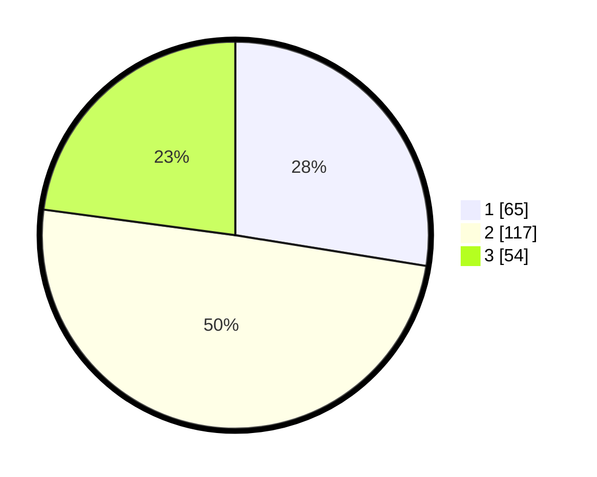

# Hasil

## Grafik

## Tabel

| No. | Nama Paslon    | Suara | Suara (raw) | Persentase |
|:--- |:-------------- | -----:| -----------:| ----------:|
| 1   | ANIES MUHAIMIN | 65    | [65][p-1]   | 27,54      |
| 2   | PRABOWO GIBRAN | 117   | [117][p-2]  | 49,58      |
| 3   | GANJAR MAHFUD  | 54    | [54][p-3]   | 22,88      |

[p-1]: https://github.com/gigit-pemilu/pemilu-2024/blob/main/pilpres/hitung-suara/sub/34-di-yogyakarta/sub/04-sleman/sub/01-gamping/sub/2001-balecatur/sub/040-tps/sub/paslon-1.txt
[p-2]: https://github.com/gigit-pemilu/pemilu-2024/blob/main/pilpres/hitung-suara/sub/34-di-yogyakarta/sub/04-sleman/sub/01-gamping/sub/2001-balecatur/sub/040-tps/sub/paslon-2.txt
[p-3]: https://github.com/gigit-pemilu/pemilu-2024/blob/main/pilpres/hitung-suara/sub/34-di-yogyakarta/sub/04-sleman/sub/01-gamping/sub/2001-balecatur/sub/040-tps/sub/paslon-3.txt

## Foto C Plano

https://sirekap-obj-formc.kpu.go.id/97ea/pemilu/ppwp/34/04/01/20/01/3404012001040-20240214-235445--0e1a60cf-4338-4977-b3ef-89de434d8a5c.jpg

https://sirekap-obj-formc.kpu.go.id/97ea/pemilu/ppwp/34/04/01/20/01/3404012001040-20240214-235540--c1f204d5-e934-4a7f-9984-e3e1fed24360.jpg

https://sirekap-obj-formc.kpu.go.id/97ea/pemilu/ppwp/34/04/01/20/01/3404012001040-20240214-235634--c59b3984-8e15-4831-aa10-db6df433659e.jpg

## Metadata

| Key        | Value               |
| ---------- | ------------------- |
| Time Stamp | 2024-02-15 12:00:28 |

