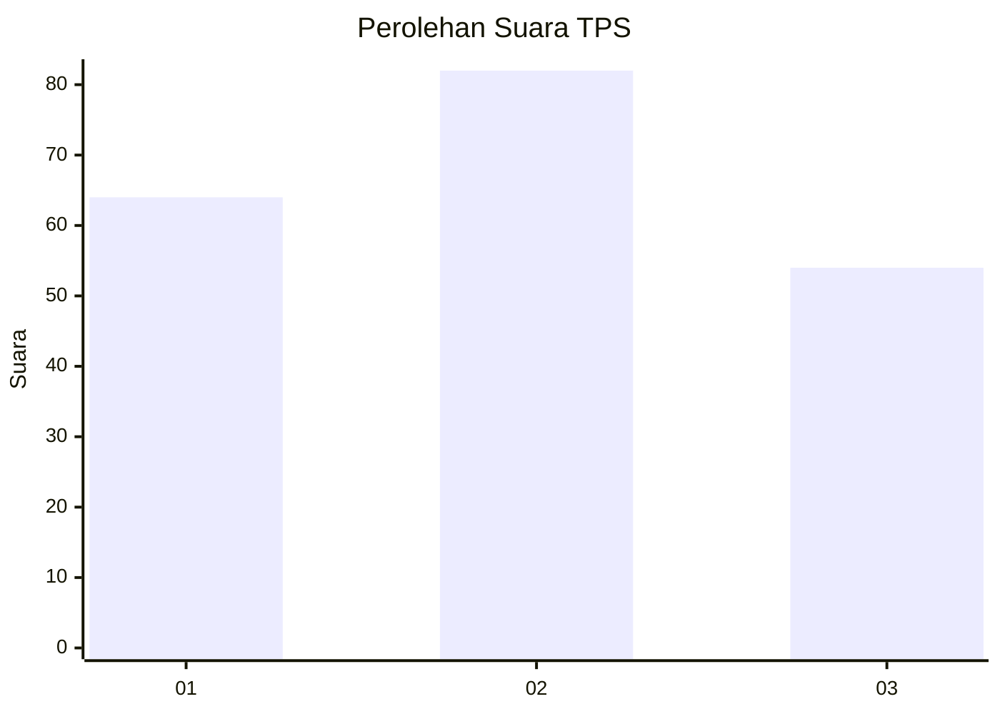
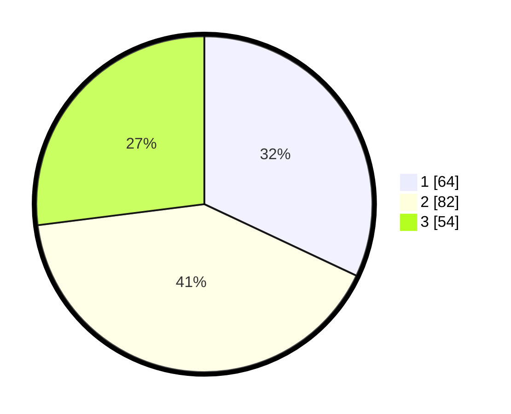

# Hasil

## Grafik

## Tabel

| No. | Nama Paslon    | Suara | Suara (raw) | Persentase |
|:--- |:-------------- | -----:| -----------:| ----------:|
| 1   | ANIES MUHAIMIN | 64    | [64][p-1]   | 32,00      |
| 2   | PRABOWO GIBRAN | 82    | [82][p-2]   | 41,00      |
| 3   | GANJAR MAHFUD  | 54    | [54][p-3]   | 27,00      |

[p-1]: https://github.com/gigit-pemilu/pemilu-2024-34-di-yogyakarta/blob/main/pilpres/hitung-suara/sub/34-di-yogyakarta/sub/04-sleman/sub/01-gamping/sub/2001-balecatur/sub/041-tps/sub/paslon-1.txt
[p-2]: https://github.com/gigit-pemilu/pemilu-2024-34-di-yogyakarta/blob/main/pilpres/hitung-suara/sub/34-di-yogyakarta/sub/04-sleman/sub/01-gamping/sub/2001-balecatur/sub/041-tps/sub/paslon-2.txt
[p-3]: https://github.com/gigit-pemilu/pemilu-2024-34-di-yogyakarta/blob/main/pilpres/hitung-suara/sub/34-di-yogyakarta/sub/04-sleman/sub/01-gamping/sub/2001-balecatur/sub/041-tps/sub/paslon-3.txt

## Foto C Plano

https://sirekap-obj-formc.kpu.go.id/14dd/pemilu/ppwp/34/04/01/20/01/3404012001041-20240215-030509--86f5d980-b718-4266-922d-735288992b37.jpg

https://sirekap-obj-formc.kpu.go.id/14dd/pemilu/ppwp/34/04/01/20/01/3404012001041-20240215-030559--2ad99bef-da4c-454d-be7e-9e0534a5157d.jpg

https://sirekap-obj-formc.kpu.go.id/14dd/pemilu/ppwp/34/04/01/20/01/3404012001041-20240215-030638--110c6856-8d94-45b8-aef4-e46a50f2a0d2.jpg

## Metadata

| Key        | Value               |
| ---------- | ------------------- |
| Time Stamp | 2024-02-15 18:00:26 |

