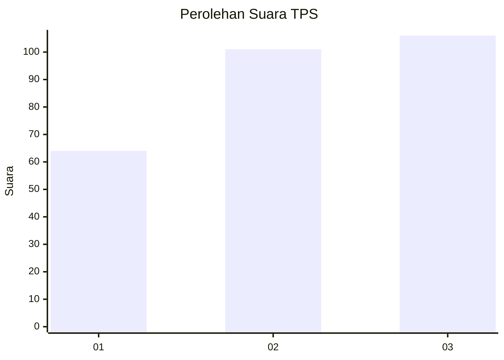
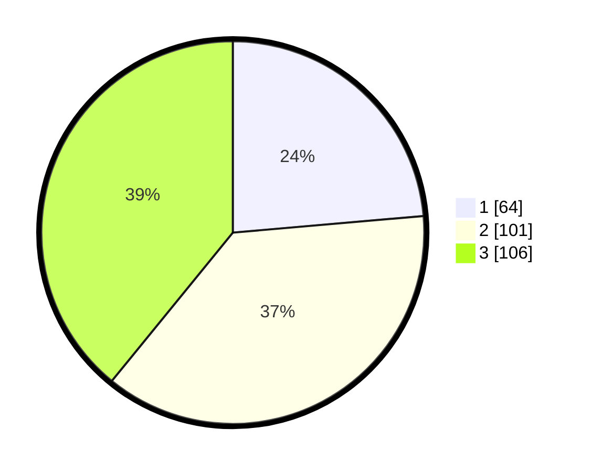

# Hasil

## Grafik

## Tabel

| No. | Nama Paslon    | Suara | Suara (raw) | Persentase |
|:--- |:-------------- | -----:| -----------:| ----------:|
| 1   | ANIES MUHAIMIN | 64    | [64][p-1]   | 23,62      |
| 2   | PRABOWO GIBRAN | 101   | [101][p-2]  | 37,27      |
| 3   | GANJAR MAHFUD  | 106   | [106][p-3]  | 39,11      |

[p-1]: https://github.com/gigit-pemilu/pemilu-2024-34-di-yogyakarta/blob/main/pilpres/hitung-suara/sub/34-di-yogyakarta/sub/04-sleman/sub/01-gamping/sub/2001-balecatur/sub/047-tps/sub/paslon-1.txt
[p-2]: https://github.com/gigit-pemilu/pemilu-2024-34-di-yogyakarta/blob/main/pilpres/hitung-suara/sub/34-di-yogyakarta/sub/04-sleman/sub/01-gamping/sub/2001-balecatur/sub/047-tps/sub/paslon-2.txt
[p-3]: https://github.com/gigit-pemilu/pemilu-2024-34-di-yogyakarta/blob/main/pilpres/hitung-suara/sub/34-di-yogyakarta/sub/04-sleman/sub/01-gamping/sub/2001-balecatur/sub/047-tps/sub/paslon-3.txt

## Foto C Plano

https://sirekap-obj-formc.kpu.go.id/be75/pemilu/ppwp/34/04/01/20/01/3404012001047-20240215-015833--7b633234-14e6-4d70-bad5-aeda413c20d6.jpg

https://sirekap-obj-formc.kpu.go.id/be75/pemilu/ppwp/34/04/01/20/01/3404012001047-20240215-002957--bd284ebd-7c40-43ff-b0cb-effb33a497a9.jpg

https://sirekap-obj-formc.kpu.go.id/be75/pemilu/ppwp/34/04/01/20/01/3404012001047-20240215-020118--66525bea-1163-41bc-a212-eab1d7cb3324.jpg

## Metadata

| Key        | Value               |
| ---------- | ------------------- |
| Time Stamp | 2024-02-15 20:30:46 |

