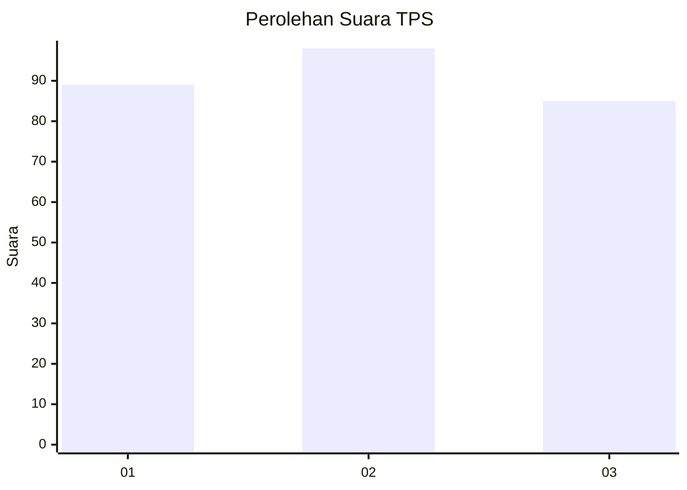
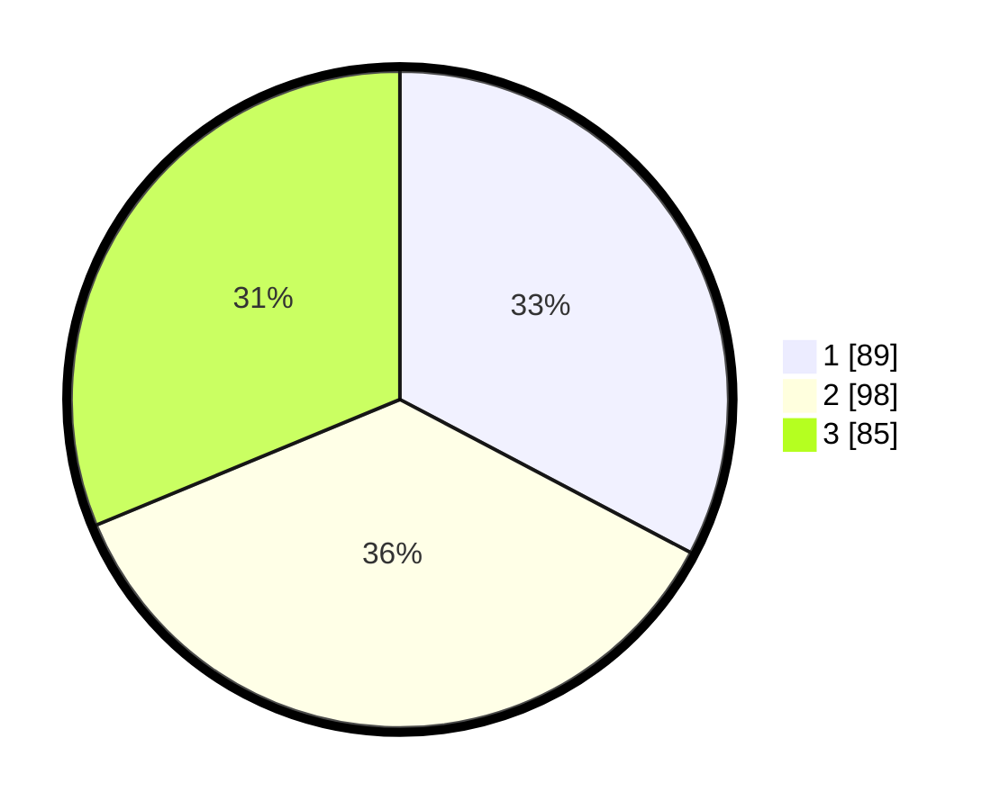

# Hasil

## Grafik

## Tabel

| No. | Nama Paslon    | Suara | Suara (raw) | Persentase |
|:--- |:-------------- | -----:| -----------:| ----------:|
| 1   | ANIES MUHAIMIN | 89    | [89][p-1]   | 32,72      |
| 2   | PRABOWO GIBRAN | 98    | [98][p-2]   | 36,03      |
| 3   | GANJAR MAHFUD  | 85    | [85][p-3]   | 31,25      |

[p-1]: https://github.com/gigit-pemilu/pemilu-2024-34-di-yogyakarta/blob/main/pilpres/hitung-suara/sub/34-di-yogyakarta/sub/04-sleman/sub/01-gamping/sub/2001-balecatur/sub/049-tps/sub/paslon-1.txt
[p-2]: https://github.com/gigit-pemilu/pemilu-2024-34-di-yogyakarta/blob/main/pilpres/hitung-suara/sub/34-di-yogyakarta/sub/04-sleman/sub/01-gamping/sub/2001-balecatur/sub/049-tps/sub/paslon-2.txt
[p-3]: https://github.com/gigit-pemilu/pemilu-2024-34-di-yogyakarta/blob/main/pilpres/hitung-suara/sub/34-di-yogyakarta/sub/04-sleman/sub/01-gamping/sub/2001-balecatur/sub/049-tps/sub/paslon-3.txt

## Foto C Plano

https://sirekap-obj-formc.kpu.go.id/d95e/pemilu/ppwp/34/04/01/20/01/3404012001049-20240214-222846--a43915fa-cacd-4a90-ba9c-030d222ca04c.jpg

https://sirekap-obj-formc.kpu.go.id/d95e/pemilu/ppwp/34/04/01/20/01/3404012001049-20240214-223045--2e45f323-eff8-4bdb-b759-50916fe27d37.jpg

https://sirekap-obj-formc.kpu.go.id/d95e/pemilu/ppwp/34/04/01/20/01/3404012001049-20240214-223215--c3cf0b70-44d7-4c43-84aa-6e88b5db0278.jpg

## Metadata

| Key        | Value               |
| ---------- | ------------------- |
| Time Stamp | 2024-02-15 21:30:27 |

