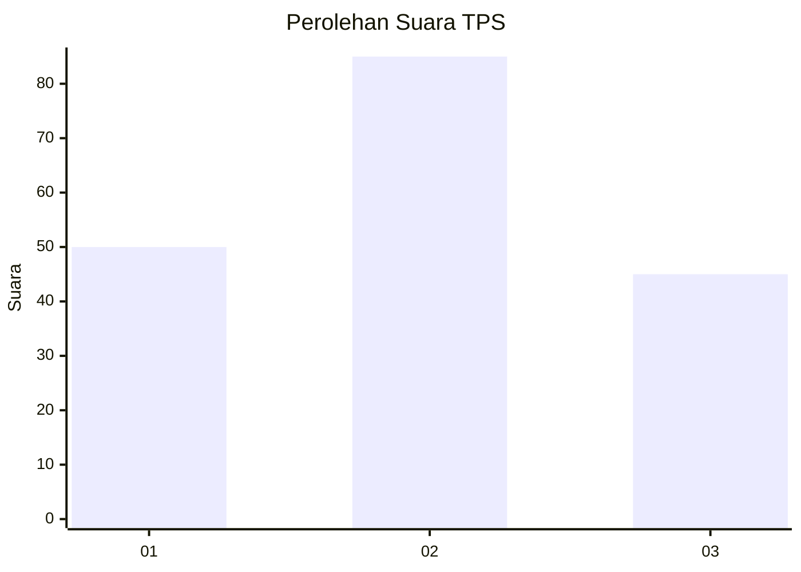
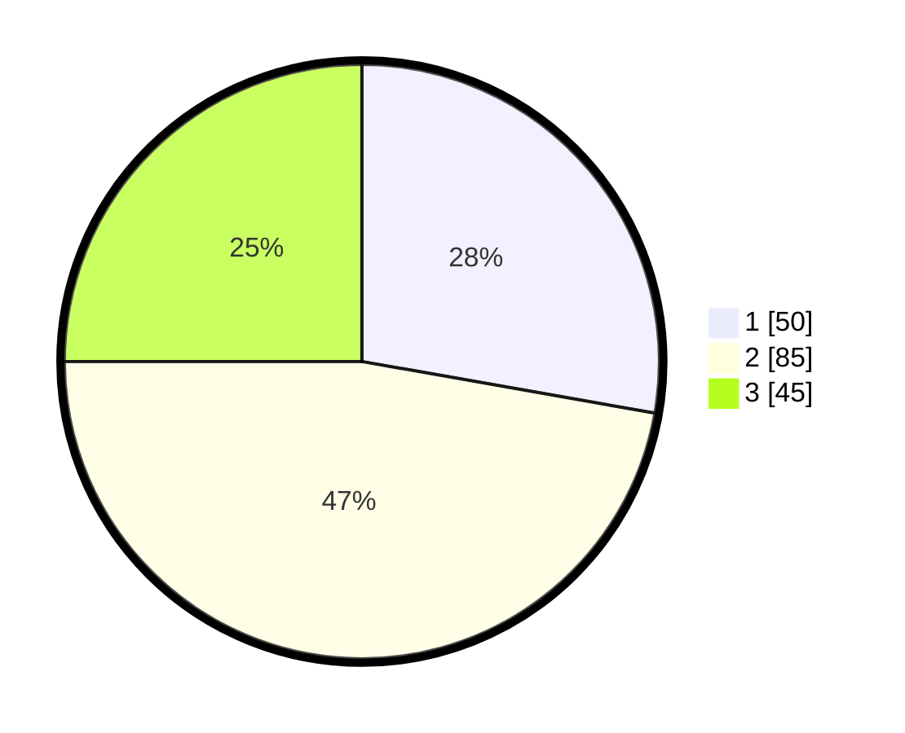

# Hasil

## Grafik

## Tabel

| No. | Nama Paslon    | Suara | Suara (raw) | Persentase |
|:--- |:-------------- | -----:| -----------:| ----------:|
| 1   | ANIES MUHAIMIN | 50    | [50][p-1]   | 27,78      |
| 2   | PRABOWO GIBRAN | 85    | [85][p-2]   | 47,22      |
| 3   | GANJAR MAHFUD  | 45    | [45][p-3]   | 25,00      |

[p-1]: https://github.com/gigit-pemilu/pemilu-2024-34-di-yogyakarta/blob/main/pilpres/hitung-suara/sub/34-di-yogyakarta/sub/04-sleman/sub/01-gamping/sub/2001-balecatur/sub/050-tps/sub/paslon-1.txt
[p-2]: https://github.com/gigit-pemilu/pemilu-2024-34-di-yogyakarta/blob/main/pilpres/hitung-suara/sub/34-di-yogyakarta/sub/04-sleman/sub/01-gamping/sub/2001-balecatur/sub/050-tps/sub/paslon-2.txt
[p-3]: https://github.com/gigit-pemilu/pemilu-2024-34-di-yogyakarta/blob/main/pilpres/hitung-suara/sub/34-di-yogyakarta/sub/04-sleman/sub/01-gamping/sub/2001-balecatur/sub/050-tps/sub/paslon-3.txt

## Foto C Plano

https://sirekap-obj-formc.kpu.go.id/0ed3/pemilu/ppwp/34/04/01/20/01/3404012001050-20240214-221749--84cc4a91-310d-4875-811d-a45f00e7ffaa.jpg

https://sirekap-obj-formc.kpu.go.id/0ed3/pemilu/ppwp/34/04/01/20/01/3404012001050-20240214-221819--1f5b3a69-95b6-4509-ba3f-512d2109ae0e.jpg

https://sirekap-obj-formc.kpu.go.id/0ed3/pemilu/ppwp/34/04/01/20/01/3404012001050-20240214-221842--fffa2eb8-99b7-472d-abad-16aa9056d204.jpg

## Metadata

| Key        | Value               |
| ---------- | ------------------- |
| Time Stamp | 2024-02-15 20:00:44 |

