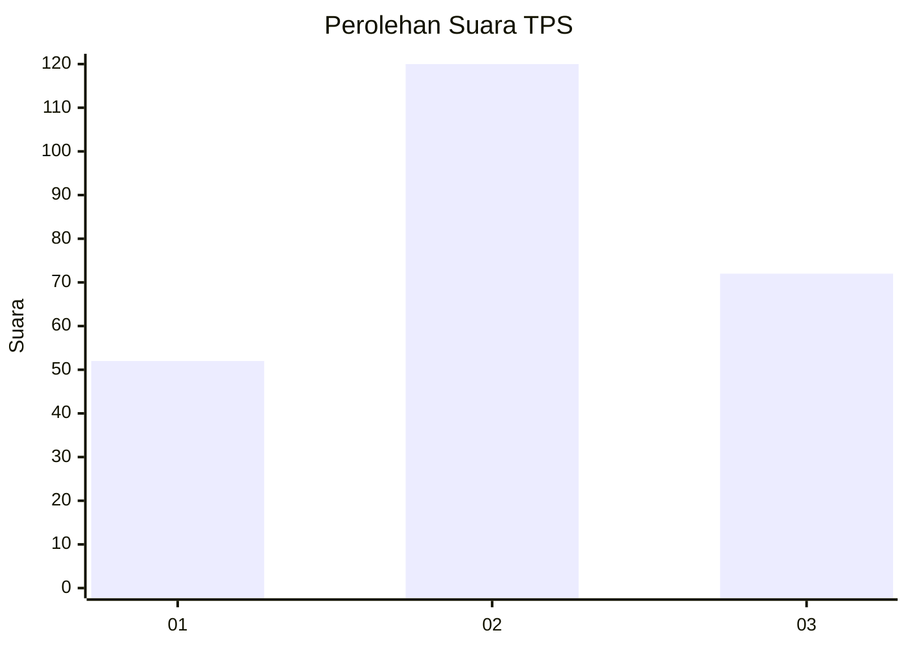
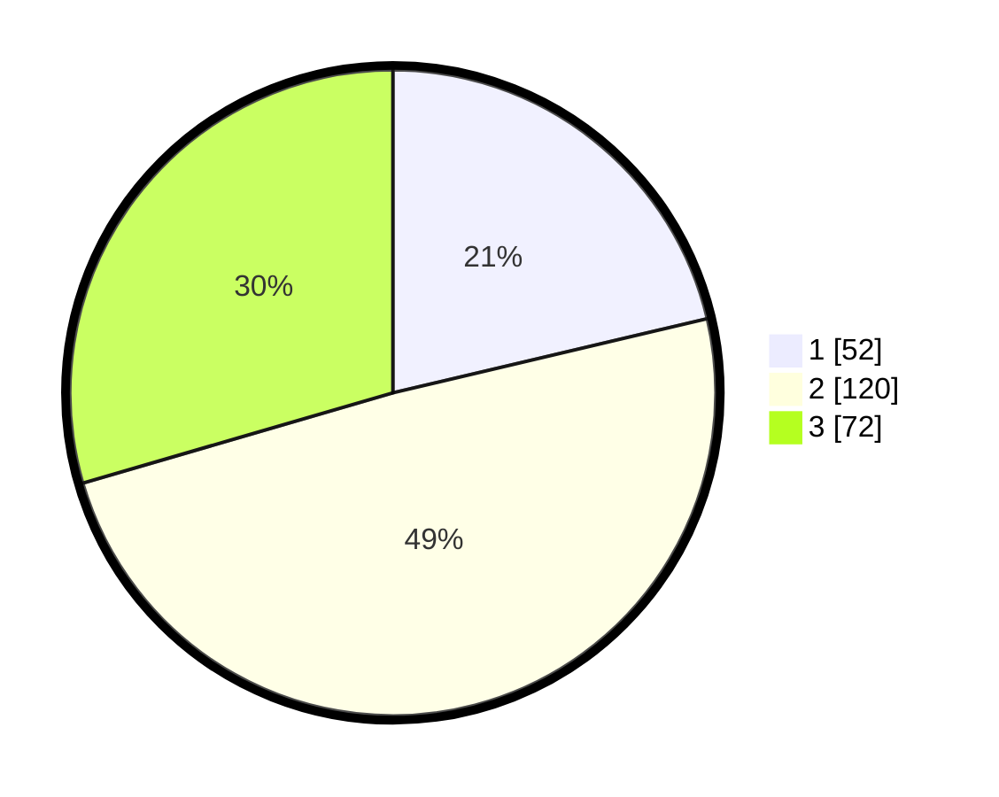

# Hasil

## Grafik

## Tabel

| No. | Nama Paslon    | Suara | Suara (raw) | Persentase |
|:--- |:-------------- | -----:| -----------:| ----------:|
| 1   | ANIES MUHAIMIN | 52    | [52][p-1]   | 21,31      |
| 2   | PRABOWO GIBRAN | 120   | [120][p-2]  | 49,18      |
| 3   | GANJAR MAHFUD  | 72    | [72][p-3]   | 29,51      |

[p-1]: https://github.com/gigit-pemilu/pemilu-2024-34-di-yogyakarta/blob/main/pilpres/hitung-suara/sub/34-di-yogyakarta/sub/04-sleman/sub/01-gamping/sub/2001-balecatur/sub/051-tps/sub/paslon-1.txt
[p-2]: https://github.com/gigit-pemilu/pemilu-2024-34-di-yogyakarta/blob/main/pilpres/hitung-suara/sub/34-di-yogyakarta/sub/04-sleman/sub/01-gamping/sub/2001-balecatur/sub/051-tps/sub/paslon-2.txt
[p-3]: https://github.com/gigit-pemilu/pemilu-2024-34-di-yogyakarta/blob/main/pilpres/hitung-suara/sub/34-di-yogyakarta/sub/04-sleman/sub/01-gamping/sub/2001-balecatur/sub/051-tps/sub/paslon-3.txt

## Foto C Plano

https://sirekap-obj-formc.kpu.go.id/7343/pemilu/ppwp/34/04/01/20/01/3404012001051-20240214-234612--76edf4c6-00f3-40f3-b686-3cd1435654bc.jpg

https://sirekap-obj-formc.kpu.go.id/7343/pemilu/ppwp/34/04/01/20/01/3404012001051-20240214-234759--002bff1b-76b1-4a52-8143-a24b9d4d8f88.jpg

https://sirekap-obj-formc.kpu.go.id/7343/pemilu/ppwp/34/04/01/20/01/3404012001051-20240214-234911--a14af03b-49e4-4d78-98bd-3af191f61af2.jpg

## Metadata

| Key        | Value               |
| ---------- | ------------------- |
| Time Stamp | 2024-02-15 21:30:27 |

