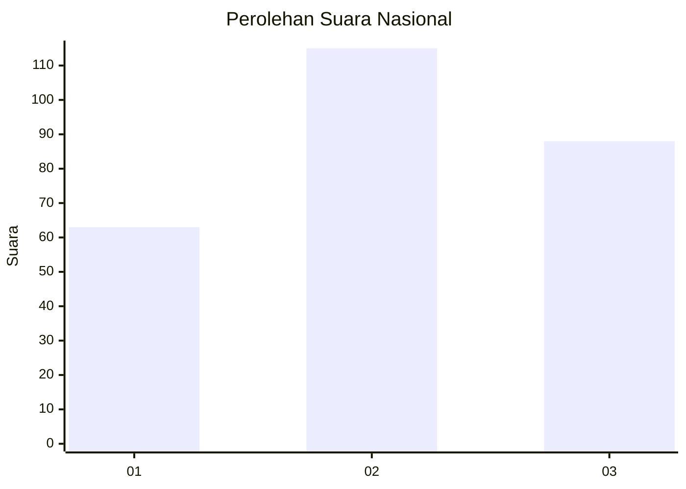
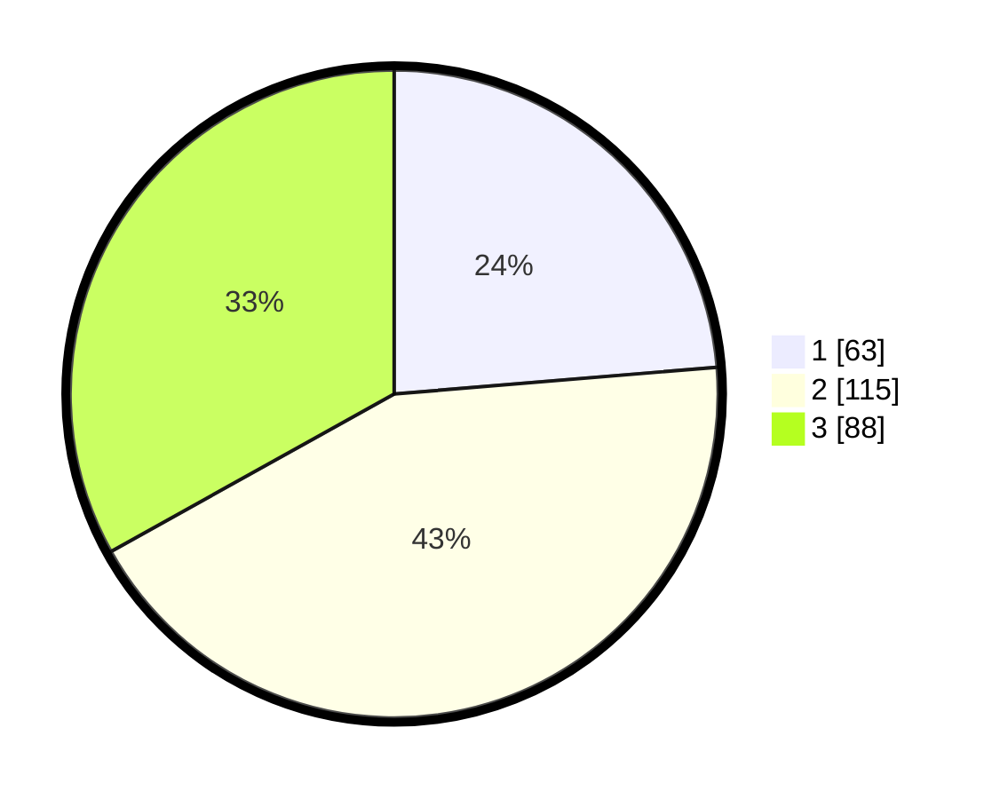

# Hasil

## Grafik

## Tabel

| No. | Nama Paslon    | Suara | Suara (raw) | Persentase |
|:--- |:-------------- | -----:| -----------:| ----------:|
| 1   | ANIES MUHAIMIN | 63    | [63][p-1]   | 23,68      |
| 2   | PRABOWO GIBRAN | 115   | [115][p-2]  | 43,23      |
| 3   | GANJAR MAHFUD  | 88    | [88][p-3]   | 33,08      |

[p-1]: https://github.com/gigit-pemilu/pemilu-2024/blob/main/pilpres/hitung-suara/sub/34-di-yogyakarta/sub/04-sleman/sub/01-gamping/sub/2001-balecatur/sub/054-tps/sub/paslon-1.txt
[p-2]: https://github.com/gigit-pemilu/pemilu-2024/blob/main/pilpres/hitung-suara/sub/34-di-yogyakarta/sub/04-sleman/sub/01-gamping/sub/2001-balecatur/sub/054-tps/sub/paslon-2.txt
[p-3]: https://github.com/gigit-pemilu/pemilu-2024/blob/main/pilpres/hitung-suara/sub/34-di-yogyakarta/sub/04-sleman/sub/01-gamping/sub/2001-balecatur/sub/054-tps/sub/paslon-3.txt

## Foto C Plano

https://sirekap-obj-formc.kpu.go.id/9a31/pemilu/ppwp/34/04/01/20/01/3404012001054-20240214-235843--bac506b1-32af-47b4-96db-390a7af22799.jpg

https://sirekap-obj-formc.kpu.go.id/9a31/pemilu/ppwp/34/04/01/20/01/3404012001054-20240214-235900--1e68fd1e-bc34-4773-83fd-a98c19b0b2bd.jpg

https://sirekap-obj-formc.kpu.go.id/9a31/pemilu/ppwp/34/04/01/20/01/3404012001054-20240214-235920--9af9abe2-6ea8-4527-b0bd-e054cc290c91.jpg

## Metadata

| Key        | Value               |
| ---------- | ------------------- |
| Time Stamp | 2024-02-15 06:00:23 |

