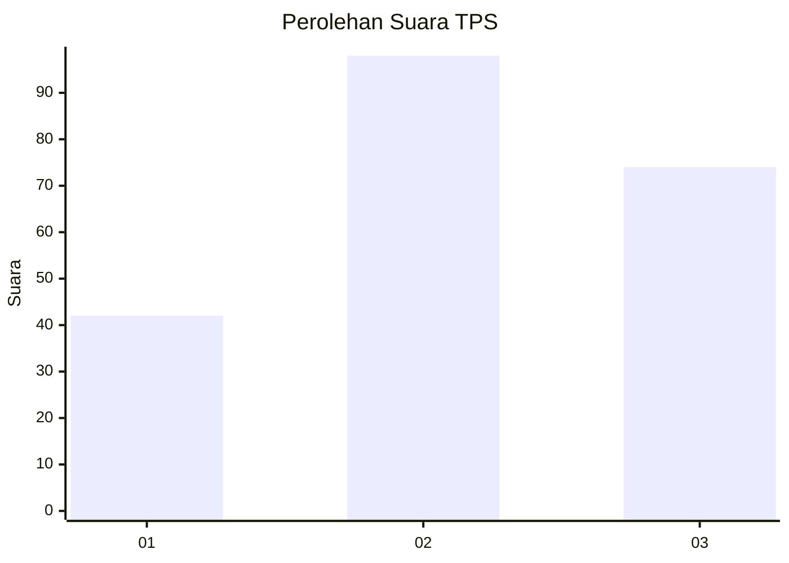
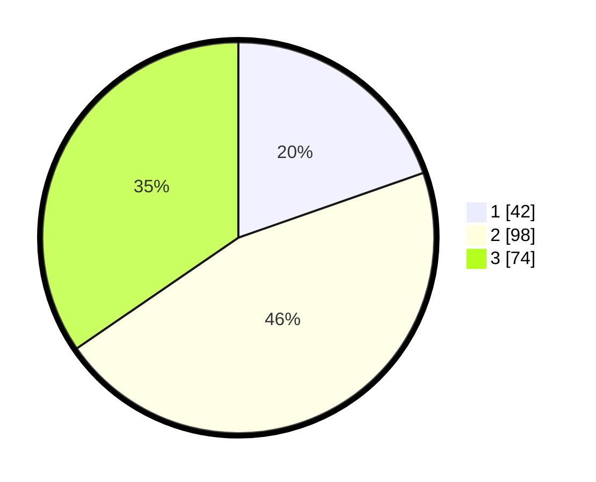

# Hasil

## Grafik

## Tabel

| No. | Nama Paslon    | Suara | Suara (raw) | Persentase |
|:--- |:-------------- | -----:| -----------:| ----------:|
| 1   | ANIES MUHAIMIN | 42    | [42][p-1]   | 19,63      |
| 2   | PRABOWO GIBRAN | 98    | [98][p-2]   | 45,79      |
| 3   | GANJAR MAHFUD  | 74    | [74][p-3]   | 34,58      |

[p-1]: https://github.com/gigit-pemilu/pemilu-2024-34-di-yogyakarta/blob/main/pilpres/hitung-suara/sub/34-di-yogyakarta/sub/04-sleman/sub/01-gamping/sub/2001-balecatur/sub/060-tps/sub/paslon-1.txt
[p-2]: https://github.com/gigit-pemilu/pemilu-2024-34-di-yogyakarta/blob/main/pilpres/hitung-suara/sub/34-di-yogyakarta/sub/04-sleman/sub/01-gamping/sub/2001-balecatur/sub/060-tps/sub/paslon-2.txt
[p-3]: https://github.com/gigit-pemilu/pemilu-2024-34-di-yogyakarta/blob/main/pilpres/hitung-suara/sub/34-di-yogyakarta/sub/04-sleman/sub/01-gamping/sub/2001-balecatur/sub/060-tps/sub/paslon-3.txt

## Foto C Plano

https://sirekap-obj-formc.kpu.go.id/ae7a/pemilu/ppwp/34/04/01/20/01/3404012001060-20240214-212713--d7877fb1-f598-437a-9e50-8fa077a1d3da.jpg

https://sirekap-obj-formc.kpu.go.id/ae7a/pemilu/ppwp/34/04/01/20/01/3404012001060-20240214-212748--fef4ea3f-eca9-497e-af08-1564cfb6e4a5.jpg

https://sirekap-obj-formc.kpu.go.id/ae7a/pemilu/ppwp/34/04/01/20/01/3404012001060-20240214-212751--5a864d45-ff98-4dac-98a1-16dfd601bf48.jpg

## Metadata

| Key        | Value               |
| ---------- | ------------------- |
| Time Stamp | 2024-02-15 20:30:46 |

