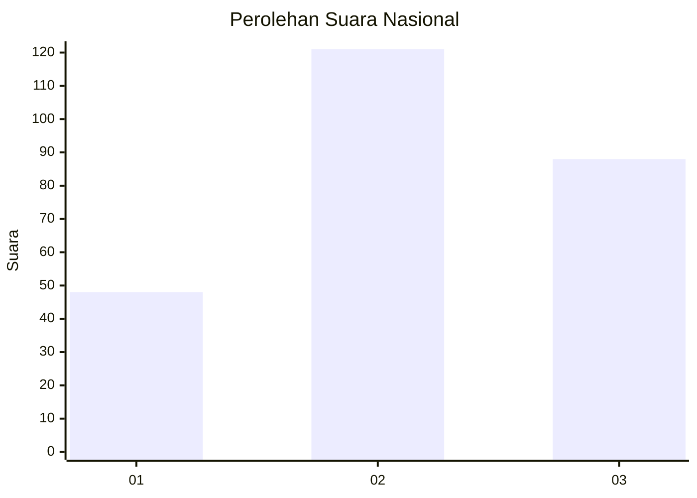
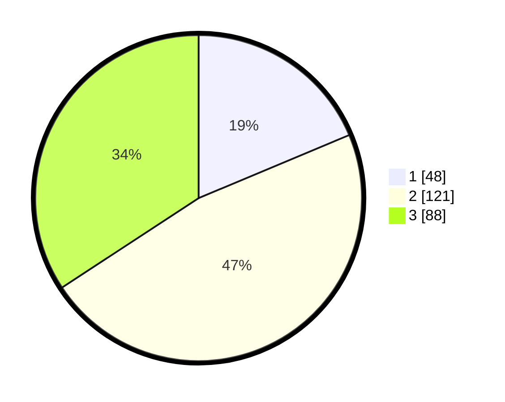

# Hasil

## Grafik

## Tabel

| No. | Nama Paslon    | Suara | Suara (raw) | Persentase |
|:--- |:-------------- | -----:| -----------:| ----------:|
| 1   | ANIES MUHAIMIN | 48    | [48][p-1]   | 18,68      |
| 2   | PRABOWO GIBRAN | 121   | [121][p-2]  | 47,08      |
| 3   | GANJAR MAHFUD  | 88    | [88][p-3]   | 34,24      |

[p-1]: https://github.com/gigit-pemilu/pemilu-2024/blob/main/pilpres/hitung-suara/sub/34-di-yogyakarta/sub/04-sleman/sub/01-gamping/sub/2002-ambarketawang/sub/001-tps/sub/paslon-1.txt
[p-2]: https://github.com/gigit-pemilu/pemilu-2024/blob/main/pilpres/hitung-suara/sub/34-di-yogyakarta/sub/04-sleman/sub/01-gamping/sub/2002-ambarketawang/sub/001-tps/sub/paslon-2.txt
[p-3]: https://github.com/gigit-pemilu/pemilu-2024/blob/main/pilpres/hitung-suara/sub/34-di-yogyakarta/sub/04-sleman/sub/01-gamping/sub/2002-ambarketawang/sub/001-tps/sub/paslon-3.txt

## Foto C Plano

https://sirekap-obj-formc.kpu.go.id/3591/pemilu/ppwp/34/04/01/20/02/3404012002001-20240215-024605--7151c5ad-cb60-4fd5-a73d-0c442930d05c.jpg

https://sirekap-obj-formc.kpu.go.id/3591/pemilu/ppwp/34/04/01/20/02/3404012002001-20240215-024743--cafa25d0-1495-4d83-bcea-1ad5b745ba93.jpg

https://sirekap-obj-formc.kpu.go.id/3591/pemilu/ppwp/34/04/01/20/02/3404012002001-20240215-024922--b028be4f-e57a-432e-a7fd-893415703639.jpg

## Metadata

| Key        | Value               |
| ---------- | ------------------- |
| Time Stamp | 2024-02-24 22:31:28 |

