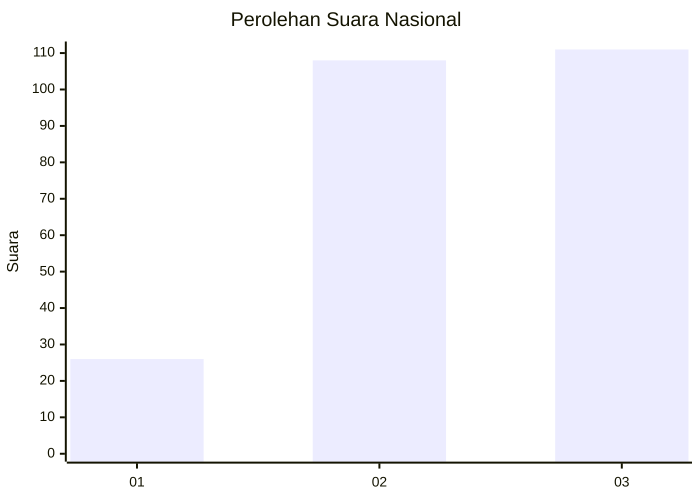
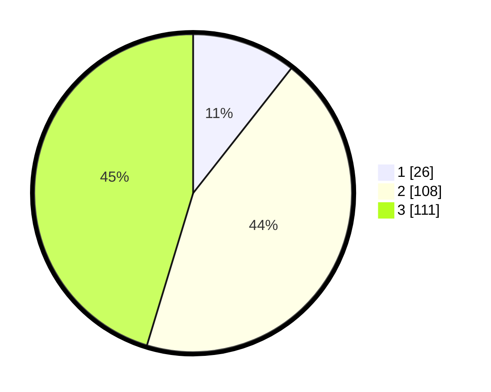

# Hasil

## Grafik

## Tabel

| No. | Nama Paslon    | Suara | Suara (raw) | Persentase |
|:--- |:-------------- | -----:| -----------:| ----------:|
| 1   | ANIES MUHAIMIN | 26    | [26][p-1]   | 10,61      |
| 2   | PRABOWO GIBRAN | 108   | [108][p-2]  | 44,08      |
| 3   | GANJAR MAHFUD  | 111   | [111][p-3]  | 45,31      |

[p-1]: https://github.com/gigit-pemilu/pemilu-2024/blob/main/pilpres/hitung-suara/sub/34-di-yogyakarta/sub/04-sleman/sub/01-gamping/sub/2002-ambarketawang/sub/005-tps/sub/paslon-1.txt
[p-2]: https://github.com/gigit-pemilu/pemilu-2024/blob/main/pilpres/hitung-suara/sub/34-di-yogyakarta/sub/04-sleman/sub/01-gamping/sub/2002-ambarketawang/sub/005-tps/sub/paslon-2.txt
[p-3]: https://github.com/gigit-pemilu/pemilu-2024/blob/main/pilpres/hitung-suara/sub/34-di-yogyakarta/sub/04-sleman/sub/01-gamping/sub/2002-ambarketawang/sub/005-tps/sub/paslon-3.txt

## Foto C Plano

https://sirekap-obj-formc.kpu.go.id/a8f1/pemilu/ppwp/34/04/01/20/02/3404012002005-20240215-022326--a011a7ce-e9c7-4f44-a0a6-9ed5c2a2ac21.jpg

https://sirekap-obj-formc.kpu.go.id/a8f1/pemilu/ppwp/34/04/01/20/02/3404012002005-20240215-022410--949b372c-0892-402b-b527-5a8a6327372b.jpg

https://sirekap-obj-formc.kpu.go.id/a8f1/pemilu/ppwp/34/04/01/20/02/3404012002005-20240215-022450--aa2ebb19-3c44-4135-ba7a-02486799c2d2.jpg

## Metadata

| Key        | Value               |
| ---------- | ------------------- |
| Time Stamp | 2024-02-15 17:30:25 |

