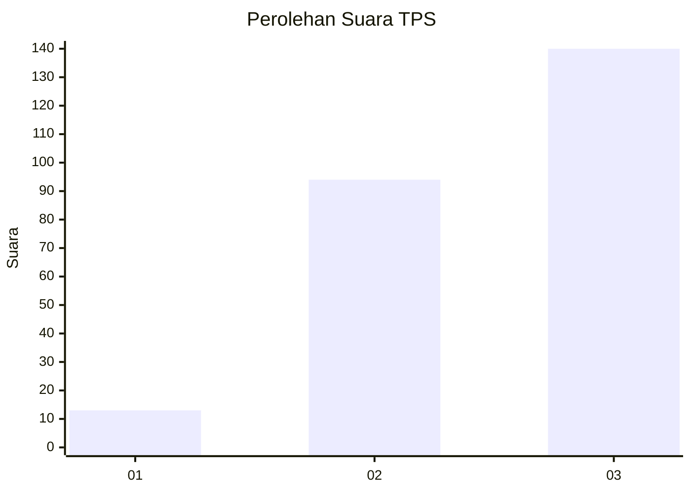
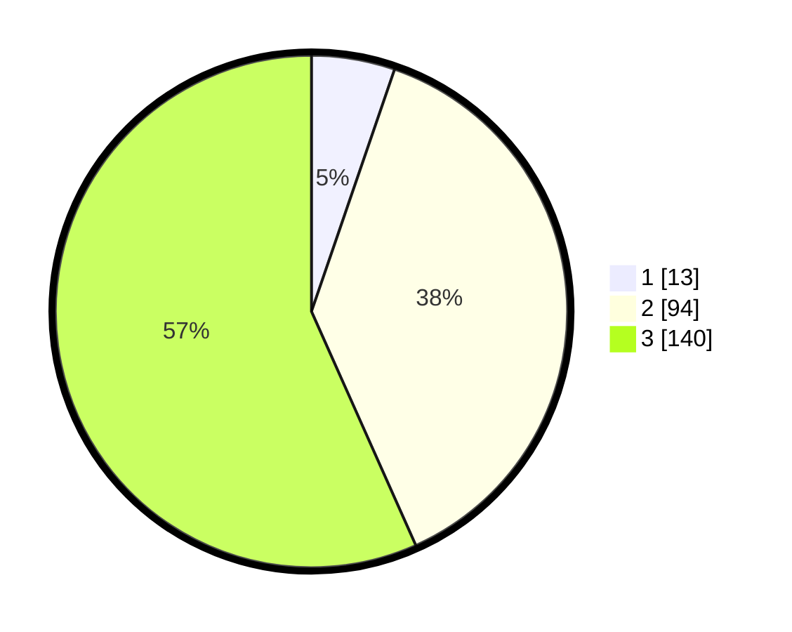

# Hasil

## Grafik

## Tabel

| No. | Nama Paslon    | Suara | Suara (raw) | Persentase |
|:--- |:-------------- | -----:| -----------:| ----------:|
| 1   | ANIES MUHAIMIN | 13    | [13][p-1]   | 5,26       |
| 2   | PRABOWO GIBRAN | 94    | [94][p-2]   | 38,06      |
| 3   | GANJAR MAHFUD  | 140   | [140][p-3]  | 56,68      |

[p-1]: https://github.com/gigit-pemilu/pemilu-2024-34-di-yogyakarta/blob/main/pilpres/hitung-suara/sub/34-di-yogyakarta/sub/04-sleman/sub/01-gamping/sub/2002-ambarketawang/sub/006-tps/sub/paslon-1.txt
[p-2]: https://github.com/gigit-pemilu/pemilu-2024-34-di-yogyakarta/blob/main/pilpres/hitung-suara/sub/34-di-yogyakarta/sub/04-sleman/sub/01-gamping/sub/2002-ambarketawang/sub/006-tps/sub/paslon-2.txt
[p-3]: https://github.com/gigit-pemilu/pemilu-2024-34-di-yogyakarta/blob/main/pilpres/hitung-suara/sub/34-di-yogyakarta/sub/04-sleman/sub/01-gamping/sub/2002-ambarketawang/sub/006-tps/sub/paslon-3.txt

## Foto C Plano

https://sirekap-obj-formc.kpu.go.id/20bc/pemilu/ppwp/34/04/01/20/02/3404012002006-20240217-091933--8cfc15b4-04e8-4007-98d0-2084b00ac9ca.jpg

https://sirekap-obj-formc.kpu.go.id/20bc/pemilu/ppwp/34/04/01/20/02/3404012002006-20240217-092049--e1bb1b20-11d0-442f-9c7c-cca1f7018eea.jpg

https://sirekap-obj-formc.kpu.go.id/20bc/pemilu/ppwp/34/04/01/20/02/3404012002006-20240217-092157--0310095c-3f47-4370-9118-1ece14ad0da6.jpg

## Metadata

| Key        | Value               |
| ---------- | ------------------- |
| Time Stamp | 2024-02-17 11:30:03 |

