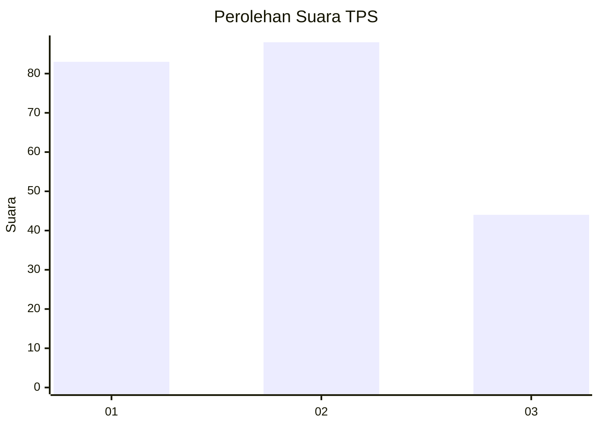
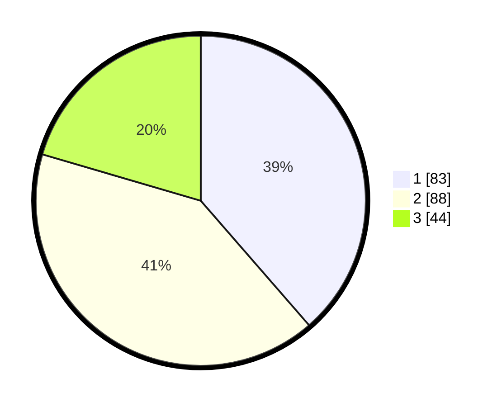

# Hasil

## Grafik

## Tabel

| No. | Nama Paslon    | Suara | Suara (raw) | Persentase |
|:--- |:-------------- | -----:| -----------:| ----------:|
| 1   | ANIES MUHAIMIN | 83    | [83][p-1]   | 38,60      |
| 2   | PRABOWO GIBRAN | 88    | [88][p-2]   | 40,93      |
| 3   | GANJAR MAHFUD  | 44    | [44][p-3]   | 20,47      |

[p-1]: https://github.com/gigit-pemilu/pemilu-2024-34-di-yogyakarta/blob/main/pilpres/hitung-suara/sub/34-di-yogyakarta/sub/04-sleman/sub/01-gamping/sub/2002-ambarketawang/sub/007-tps/sub/paslon-1.txt
[p-2]: https://github.com/gigit-pemilu/pemilu-2024-34-di-yogyakarta/blob/main/pilpres/hitung-suara/sub/34-di-yogyakarta/sub/04-sleman/sub/01-gamping/sub/2002-ambarketawang/sub/007-tps/sub/paslon-2.txt
[p-3]: https://github.com/gigit-pemilu/pemilu-2024-34-di-yogyakarta/blob/main/pilpres/hitung-suara/sub/34-di-yogyakarta/sub/04-sleman/sub/01-gamping/sub/2002-ambarketawang/sub/007-tps/sub/paslon-3.txt

## Foto C Plano

https://sirekap-obj-formc.kpu.go.id/4022/pemilu/ppwp/34/04/01/20/02/3404012002007-20240214-221159--efdea2c1-378e-4c37-822b-94e354fad375.jpg

https://sirekap-obj-formc.kpu.go.id/4022/pemilu/ppwp/34/04/01/20/02/3404012002007-20240214-221234--93463cb4-91c2-409c-9e4b-f68cf756c59f.jpg

https://sirekap-obj-formc.kpu.go.id/4022/pemilu/ppwp/34/04/01/20/02/3404012002007-20240214-221238--5e55f2f6-83bb-48c2-a428-109975389ab9.jpg

## Metadata

| Key        | Value               |
| ---------- | ------------------- |
| Time Stamp | 2024-02-15 12:00:28 |

