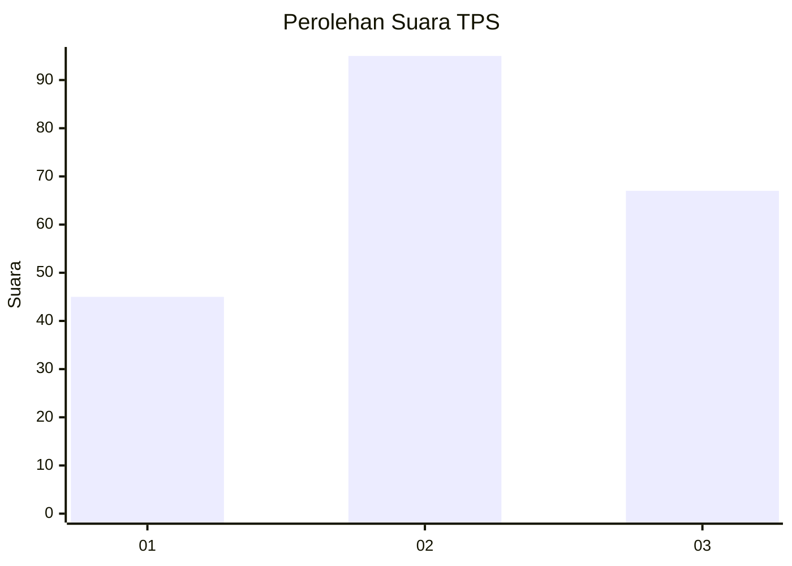
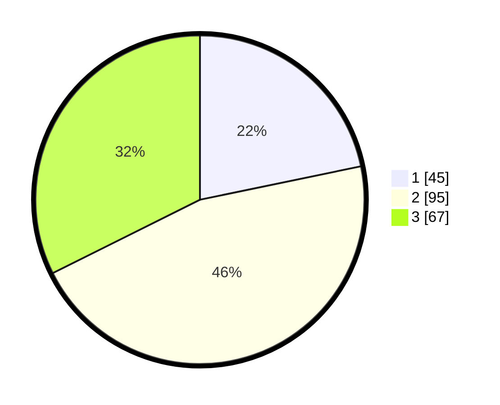

# Hasil

## Grafik

## Tabel

| No. | Nama Paslon    | Suara | Suara (raw) | Persentase |
|:--- |:-------------- | -----:| -----------:| ----------:|
| 1   | ANIES MUHAIMIN | 45    | [45][p-1]   | 21,74      |
| 2   | PRABOWO GIBRAN | 95    | [95][p-2]   | 45,89      |
| 3   | GANJAR MAHFUD  | 67    | [67][p-3]   | 32,37      |

[p-1]: https://github.com/gigit-pemilu/pemilu-2024-34-di-yogyakarta/blob/main/pilpres/hitung-suara/sub/34-di-yogyakarta/sub/04-sleman/sub/01-gamping/sub/2002-ambarketawang/sub/019-tps/sub/paslon-1.txt
[p-2]: https://github.com/gigit-pemilu/pemilu-2024-34-di-yogyakarta/blob/main/pilpres/hitung-suara/sub/34-di-yogyakarta/sub/04-sleman/sub/01-gamping/sub/2002-ambarketawang/sub/019-tps/sub/paslon-2.txt
[p-3]: https://github.com/gigit-pemilu/pemilu-2024-34-di-yogyakarta/blob/main/pilpres/hitung-suara/sub/34-di-yogyakarta/sub/04-sleman/sub/01-gamping/sub/2002-ambarketawang/sub/019-tps/sub/paslon-3.txt

## Foto C Plano

https://sirekap-obj-formc.kpu.go.id/ea97/pemilu/ppwp/34/04/01/20/02/3404012002019-20240214-212421--3c6dfa8d-c2e2-4584-9bbb-dd2dbab0191a.jpg

https://sirekap-obj-formc.kpu.go.id/ea97/pemilu/ppwp/34/04/01/20/02/3404012002019-20240214-213003--3cdd7306-8883-4579-bb6b-8ecc8fff6117.jpg

https://sirekap-obj-formc.kpu.go.id/ea97/pemilu/ppwp/34/04/01/20/02/3404012002019-20240214-213607--d1118cde-d9ed-4101-8f15-1e59860d4e9b.jpg

## Metadata

| Key        | Value               |
| ---------- | ------------------- |
| Time Stamp | 2024-02-15 20:30:46 |

