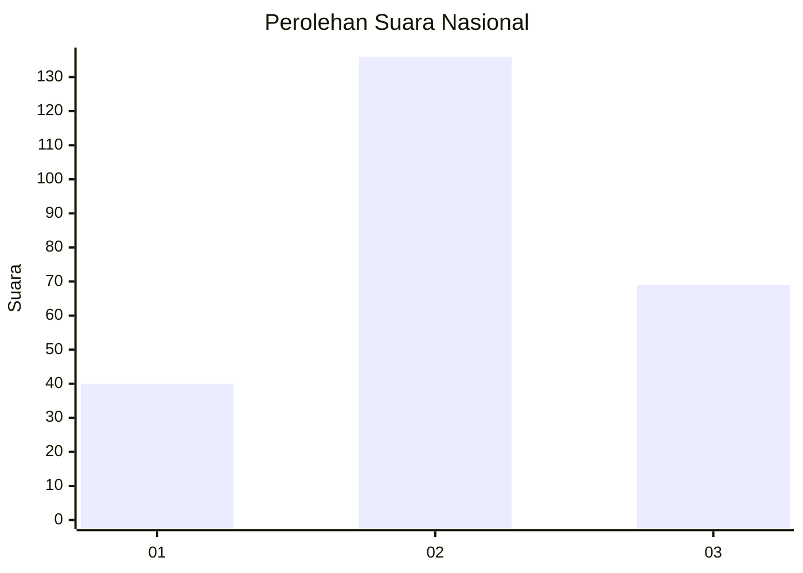
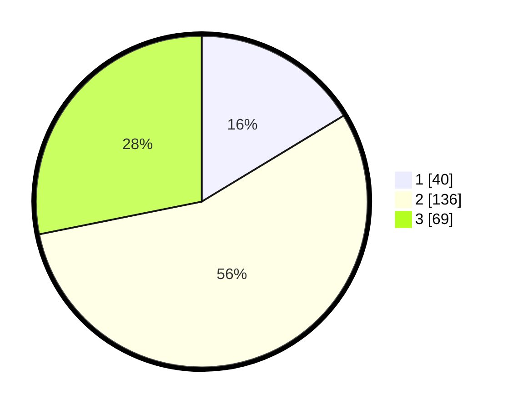

# Hasil

## Grafik

## Tabel

| No. | Nama Paslon    | Suara | Suara (raw) | Persentase |
|:--- |:-------------- | -----:| -----------:| ----------:|
| 1   | ANIES MUHAIMIN | 40    | [40][p-1]   | 16,33      |
| 2   | PRABOWO GIBRAN | 136   | [136][p-2]  | 55,51      |
| 3   | GANJAR MAHFUD  | 69    | [69][p-3]   | 28,16      |

[p-1]: https://github.com/gigit-pemilu/pemilu-2024/blob/main/pilpres/hitung-suara/sub/34-di-yogyakarta/sub/04-sleman/sub/01-gamping/sub/2002-ambarketawang/sub/027-tps/sub/paslon-1.txt
[p-2]: https://github.com/gigit-pemilu/pemilu-2024/blob/main/pilpres/hitung-suara/sub/34-di-yogyakarta/sub/04-sleman/sub/01-gamping/sub/2002-ambarketawang/sub/027-tps/sub/paslon-2.txt
[p-3]: https://github.com/gigit-pemilu/pemilu-2024/blob/main/pilpres/hitung-suara/sub/34-di-yogyakarta/sub/04-sleman/sub/01-gamping/sub/2002-ambarketawang/sub/027-tps/sub/paslon-3.txt

## Foto C Plano

https://sirekap-obj-formc.kpu.go.id/3081/pemilu/ppwp/34/04/01/20/02/3404012002027-20240214-235356--1505dd46-a4e6-4f02-b82c-f0778790998d.jpg

https://sirekap-obj-formc.kpu.go.id/3081/pemilu/ppwp/34/04/01/20/02/3404012002027-20240215-000103--007520a4-19ec-47c3-a0d9-08dcd5a548d4.jpg

https://sirekap-obj-formc.kpu.go.id/3081/pemilu/ppwp/34/04/01/20/02/3404012002027-20240214-235748--d4bac1f1-b59f-4b9d-85ed-10217a5a715c.jpg

## Metadata

| Key        | Value               |
| ---------- | ------------------- |
| Time Stamp | 2024-02-15 21:30:27 |

