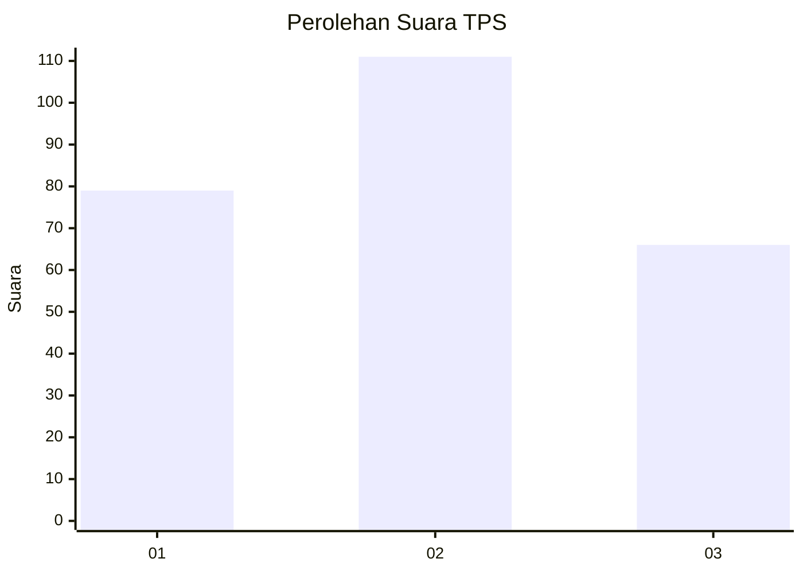
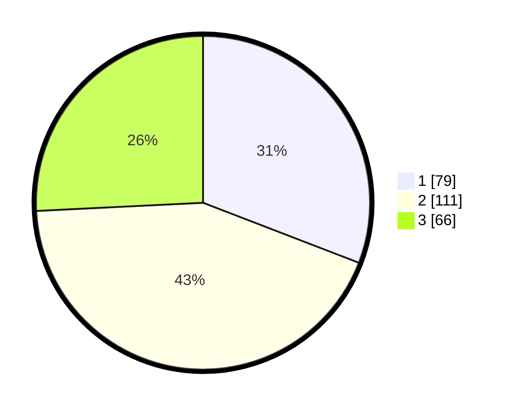

# Hasil

## Grafik

## Tabel

| No. | Nama Paslon    | Suara | Suara (raw) | Persentase |
|:--- |:-------------- | -----:| -----------:| ----------:|
| 1   | ANIES MUHAIMIN | 79    | [79][p-1]   | 30,86      |
| 2   | PRABOWO GIBRAN | 111   | [111][p-2]  | 43,36      |
| 3   | GANJAR MAHFUD  | 66    | [66][p-3]   | 25,78      |

[p-1]: https://github.com/gigit-pemilu/pemilu-2024-34-di-yogyakarta/blob/main/pilpres/hitung-suara/sub/34-di-yogyakarta/sub/04-sleman/sub/01-gamping/sub/2002-ambarketawang/sub/032-tps/sub/paslon-1.txt
[p-2]: https://github.com/gigit-pemilu/pemilu-2024-34-di-yogyakarta/blob/main/pilpres/hitung-suara/sub/34-di-yogyakarta/sub/04-sleman/sub/01-gamping/sub/2002-ambarketawang/sub/032-tps/sub/paslon-2.txt
[p-3]: https://github.com/gigit-pemilu/pemilu-2024-34-di-yogyakarta/blob/main/pilpres/hitung-suara/sub/34-di-yogyakarta/sub/04-sleman/sub/01-gamping/sub/2002-ambarketawang/sub/032-tps/sub/paslon-3.txt

## Foto C Plano

https://sirekap-obj-formc.kpu.go.id/f1d1/pemilu/ppwp/34/04/01/20/02/3404012002032-20240214-235120--14e2740f-ea07-41ed-b874-8a37352743b3.jpg

https://sirekap-obj-formc.kpu.go.id/f1d1/pemilu/ppwp/34/04/01/20/02/3404012002032-20240214-235157--400412c0-70da-4de1-9817-ccaf4bba775c.jpg

https://sirekap-obj-formc.kpu.go.id/f1d1/pemilu/ppwp/34/04/01/20/02/3404012002032-20240214-235248--19fea1a0-5752-4c15-ba8a-ab785952d4ab.jpg

## Metadata

| Key        | Value               |
| ---------- | ------------------- |
| Time Stamp | 2024-02-15 20:30:46 |

