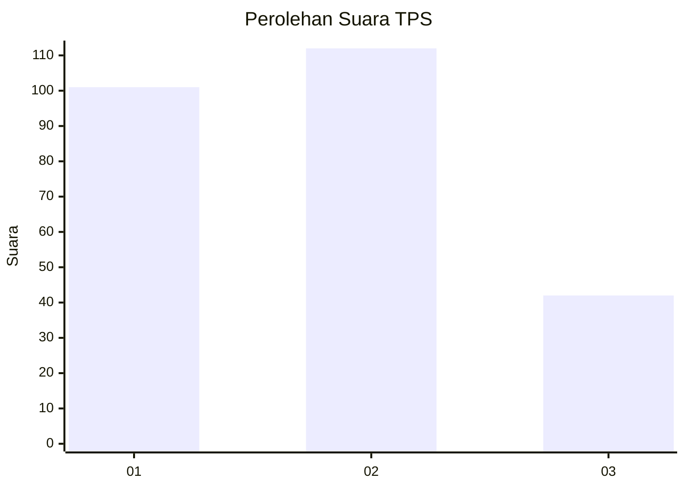
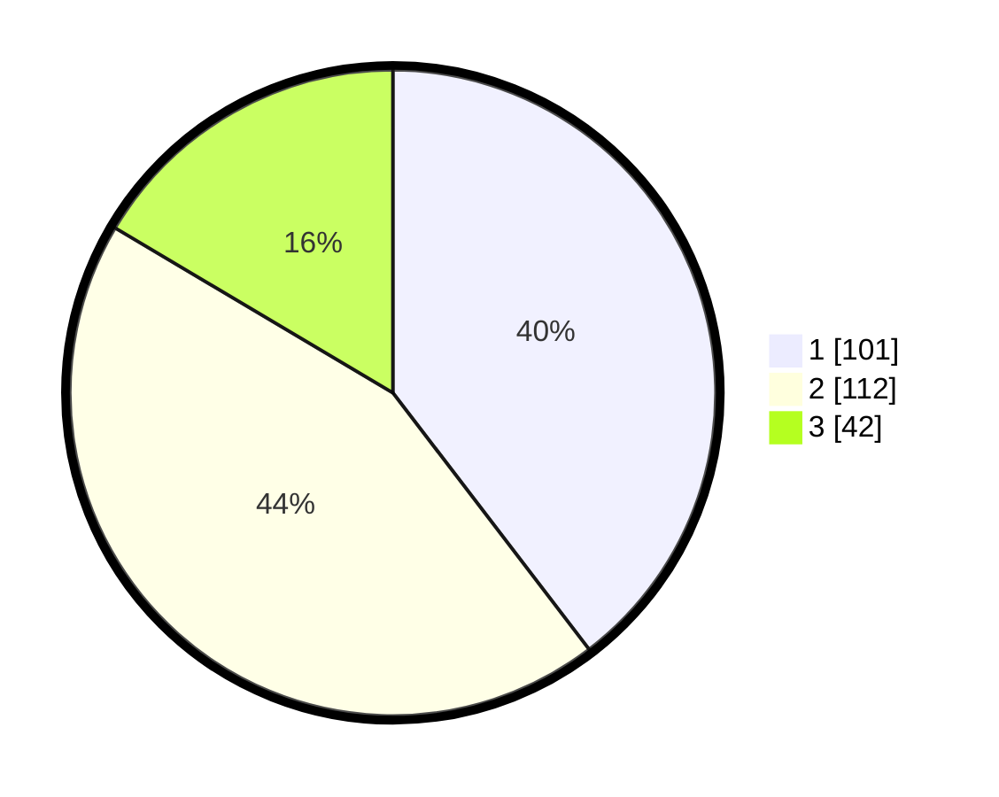

# Hasil

## Grafik

## Tabel

| No. | Nama Paslon    | Suara | Suara (raw) | Persentase |
|:--- |:-------------- | -----:| -----------:| ----------:|
| 1   | ANIES MUHAIMIN | 101   | [101][p-1]  | 39,61      |
| 2   | PRABOWO GIBRAN | 112   | [112][p-2]  | 43,92      |
| 3   | GANJAR MAHFUD  | 42    | [42][p-3]   | 16,47      |

[p-1]: https://github.com/gigit-pemilu/pemilu-2024-34-di-yogyakarta/blob/main/pilpres/hitung-suara/sub/34-di-yogyakarta/sub/04-sleman/sub/01-gamping/sub/2002-ambarketawang/sub/035-tps/sub/paslon-1.txt
[p-2]: https://github.com/gigit-pemilu/pemilu-2024-34-di-yogyakarta/blob/main/pilpres/hitung-suara/sub/34-di-yogyakarta/sub/04-sleman/sub/01-gamping/sub/2002-ambarketawang/sub/035-tps/sub/paslon-2.txt
[p-3]: https://github.com/gigit-pemilu/pemilu-2024-34-di-yogyakarta/blob/main/pilpres/hitung-suara/sub/34-di-yogyakarta/sub/04-sleman/sub/01-gamping/sub/2002-ambarketawang/sub/035-tps/sub/paslon-3.txt

## Foto C Plano

https://sirekap-obj-formc.kpu.go.id/e061/pemilu/ppwp/34/04/01/20/02/3404012002035-20240214-215644--b5e1167c-c84a-4955-af09-ad68adcc01e1.jpg

https://sirekap-obj-formc.kpu.go.id/e061/pemilu/ppwp/34/04/01/20/02/3404012002035-20240214-215700--e489426d-98d5-4375-b8f2-7a8ca3d1f9bf.jpg

https://sirekap-obj-formc.kpu.go.id/e061/pemilu/ppwp/34/04/01/20/02/3404012002035-20240214-215713--1c0862ca-cd5f-437c-805f-1f5db492c372.jpg

## Metadata

| Key        | Value               |
| ---------- | ------------------- |
| Time Stamp | 2024-02-15 20:30:46 |

