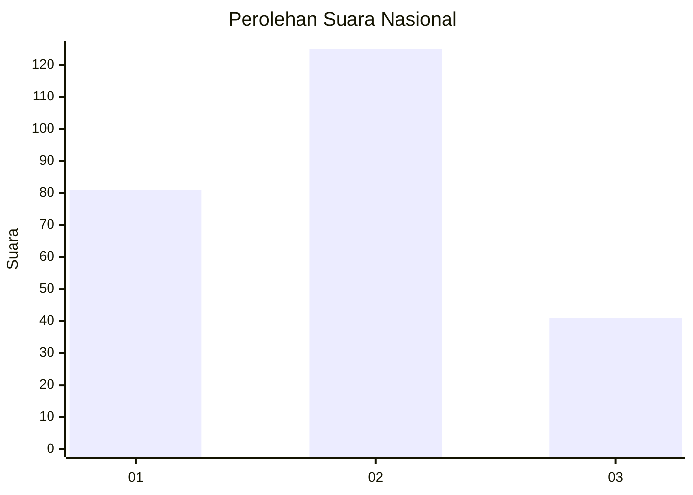
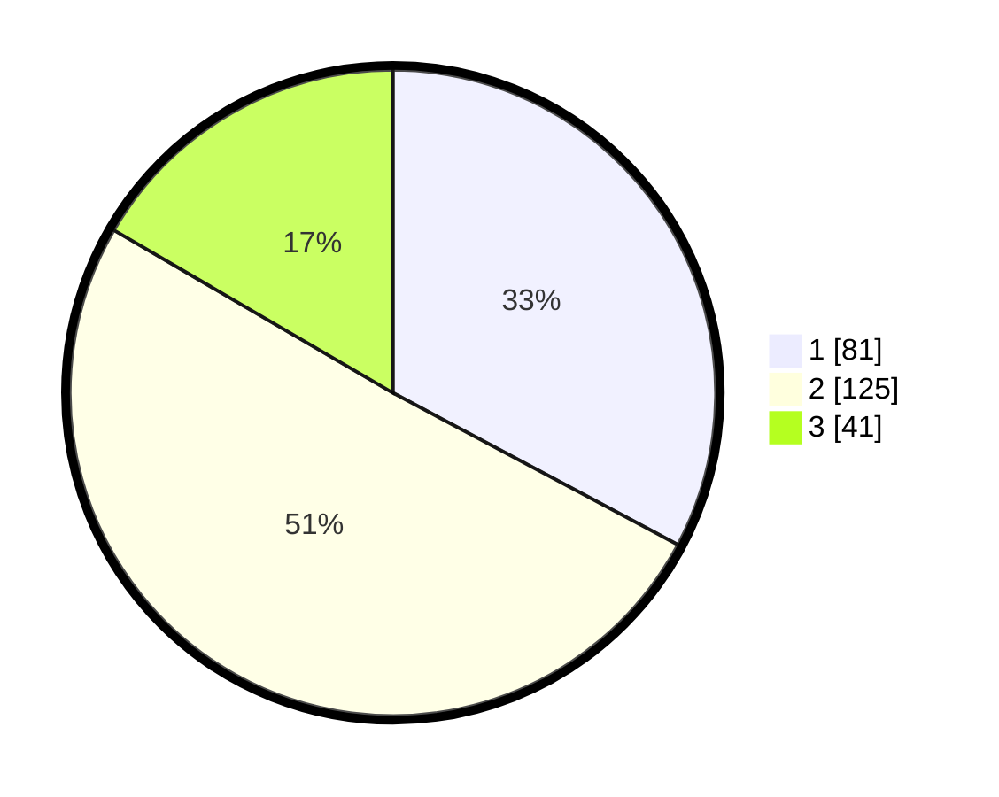

# Hasil

## Grafik

## Tabel

| No. | Nama Paslon    | Suara | Suara (raw) | Persentase |
|:--- |:-------------- | -----:| -----------:| ----------:|
| 1   | ANIES MUHAIMIN | 81    | [81][p-1]   | 32,79      |
| 2   | PRABOWO GIBRAN | 125   | [125][p-2]  | 50,61      |
| 3   | GANJAR MAHFUD  | 41    | [41][p-3]   | 16,60      |

[p-1]: https://github.com/gigit-pemilu/pemilu-2024/blob/main/pilpres/hitung-suara/sub/34-di-yogyakarta/sub/04-sleman/sub/01-gamping/sub/2002-ambarketawang/sub/038-tps/sub/paslon-1.txt
[p-2]: https://github.com/gigit-pemilu/pemilu-2024/blob/main/pilpres/hitung-suara/sub/34-di-yogyakarta/sub/04-sleman/sub/01-gamping/sub/2002-ambarketawang/sub/038-tps/sub/paslon-2.txt
[p-3]: https://github.com/gigit-pemilu/pemilu-2024/blob/main/pilpres/hitung-suara/sub/34-di-yogyakarta/sub/04-sleman/sub/01-gamping/sub/2002-ambarketawang/sub/038-tps/sub/paslon-3.txt

## Foto C Plano

https://sirekap-obj-formc.kpu.go.id/714e/pemilu/ppwp/34/04/01/20/02/3404012002038-20240214-224520--ded9035d-fab0-47a0-b31d-c9330e74bc75.jpg

https://sirekap-obj-formc.kpu.go.id/714e/pemilu/ppwp/34/04/01/20/02/3404012002038-20240214-224707--4d85ef73-014c-4470-ac70-dce664eeae83.jpg

https://sirekap-obj-formc.kpu.go.id/714e/pemilu/ppwp/34/04/01/20/02/3404012002038-20240214-225110--df6f673a-438a-4ae9-9b14-d38ea659e380.jpg

## Metadata

| Key        | Value               |
| ---------- | ------------------- |
| Time Stamp | 2024-02-15 21:30:27 |

