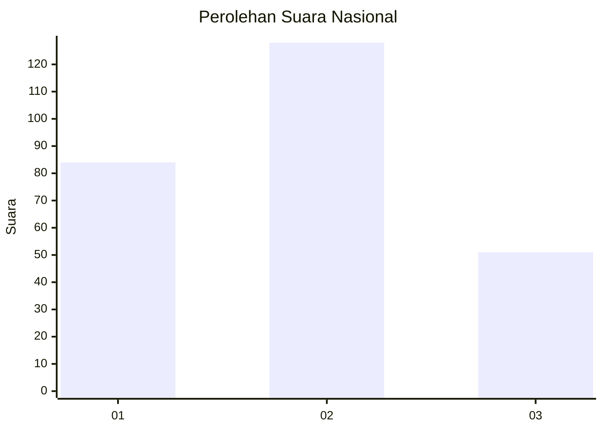
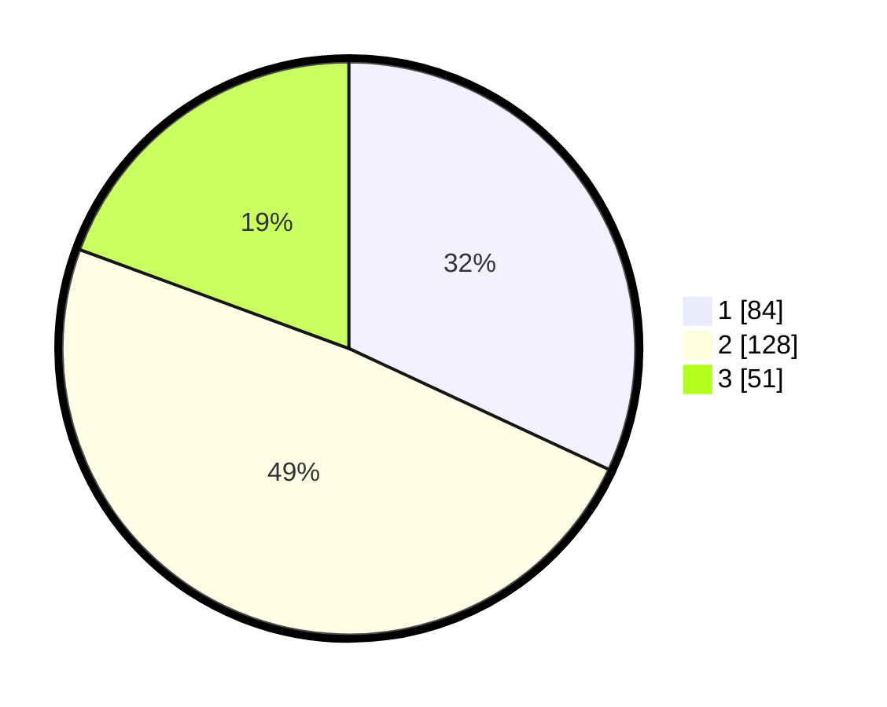

# Hasil

## Grafik

## Tabel

| No. | Nama Paslon    | Suara | Suara (raw) | Persentase |
|:--- |:-------------- | -----:| -----------:| ----------:|
| 1   | ANIES MUHAIMIN | 84    | [84][p-1]   | 31,94      |
| 2   | PRABOWO GIBRAN | 128   | [128][p-2]  | 48,67      |
| 3   | GANJAR MAHFUD  | 51    | [51][p-3]   | 19,39      |

[p-1]: https://github.com/gigit-pemilu/pemilu-2024/blob/main/pilpres/hitung-suara/sub/34-di-yogyakarta/sub/04-sleman/sub/01-gamping/sub/2002-ambarketawang/sub/042-tps/sub/paslon-1.txt
[p-2]: https://github.com/gigit-pemilu/pemilu-2024/blob/main/pilpres/hitung-suara/sub/34-di-yogyakarta/sub/04-sleman/sub/01-gamping/sub/2002-ambarketawang/sub/042-tps/sub/paslon-2.txt
[p-3]: https://github.com/gigit-pemilu/pemilu-2024/blob/main/pilpres/hitung-suara/sub/34-di-yogyakarta/sub/04-sleman/sub/01-gamping/sub/2002-ambarketawang/sub/042-tps/sub/paslon-3.txt

## Foto C Plano

https://sirekap-obj-formc.kpu.go.id/00d3/pemilu/ppwp/34/04/01/20/02/3404012002042-20240214-214144--8519aacb-01f4-4292-adc7-fcf744c1cb57.jpg

https://sirekap-obj-formc.kpu.go.id/00d3/pemilu/ppwp/34/04/01/20/02/3404012002042-20240215-025539--26f4e68d-1301-4a9a-98c0-643c5f232b81.jpg

https://sirekap-obj-formc.kpu.go.id/00d3/pemilu/ppwp/34/04/01/20/02/3404012002042-20240214-214149--b19b0f5a-93b0-4992-b384-a3abcc92368f.jpg

## Metadata

| Key        | Value               |
| ---------- | ------------------- |
| Time Stamp | 2024-02-15 17:30:25 |

