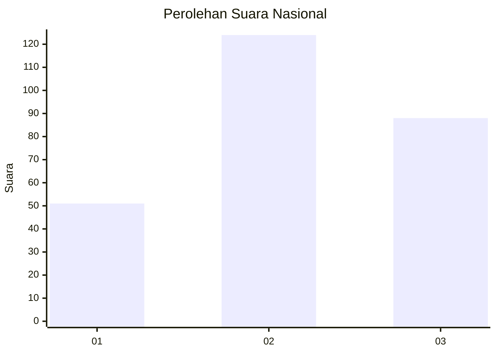
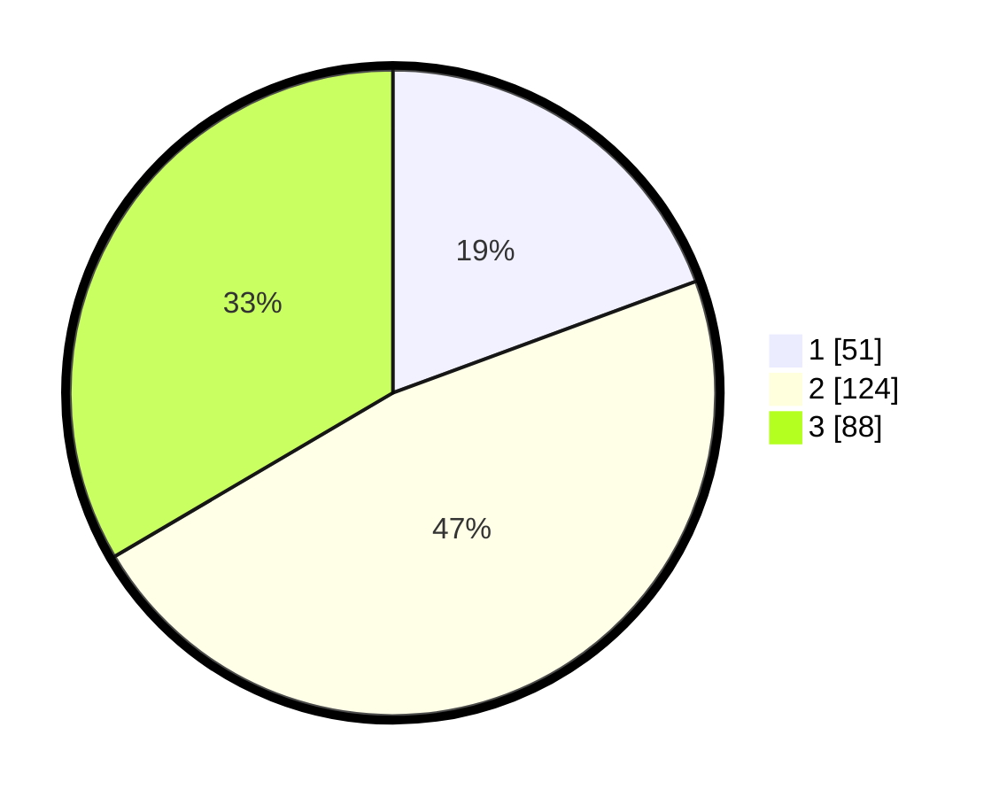

# Hasil

## Grafik

## Tabel

| No. | Nama Paslon    | Suara | Suara (raw) | Persentase |
|:--- |:-------------- | -----:| -----------:| ----------:|
| 1   | ANIES MUHAIMIN | 51    | [51][p-1]   | 19,39      |
| 2   | PRABOWO GIBRAN | 124   | [124][p-2]  | 47,15      |
| 3   | GANJAR MAHFUD  | 88    | [88][p-3]   | 33,46      |

[p-1]: https://github.com/gigit-pemilu/pemilu-2024/blob/main/pilpres/hitung-suara/sub/34-di-yogyakarta/sub/04-sleman/sub/01-gamping/sub/2002-ambarketawang/sub/049-tps/sub/paslon-1.txt
[p-2]: https://github.com/gigit-pemilu/pemilu-2024/blob/main/pilpres/hitung-suara/sub/34-di-yogyakarta/sub/04-sleman/sub/01-gamping/sub/2002-ambarketawang/sub/049-tps/sub/paslon-2.txt
[p-3]: https://github.com/gigit-pemilu/pemilu-2024/blob/main/pilpres/hitung-suara/sub/34-di-yogyakarta/sub/04-sleman/sub/01-gamping/sub/2002-ambarketawang/sub/049-tps/sub/paslon-3.txt

## Foto C Plano

https://sirekap-obj-formc.kpu.go.id/daf9/pemilu/ppwp/34/04/01/20/02/3404012002049-20240214-234029--b5137a6b-1a06-4316-8826-27a2e8b8cd8a.jpg

https://sirekap-obj-formc.kpu.go.id/daf9/pemilu/ppwp/34/04/01/20/02/3404012002049-20240214-234204--cb01b039-2e83-470f-a6cd-98caeead1c47.jpg

https://sirekap-obj-formc.kpu.go.id/daf9/pemilu/ppwp/34/04/01/20/02/3404012002049-20240214-234302--46451389-46c1-43c7-b84b-6cf615691250.jpg

## Metadata

| Key        | Value               |
| ---------- | ------------------- |
| Time Stamp | 2024-02-15 22:00:27 |

