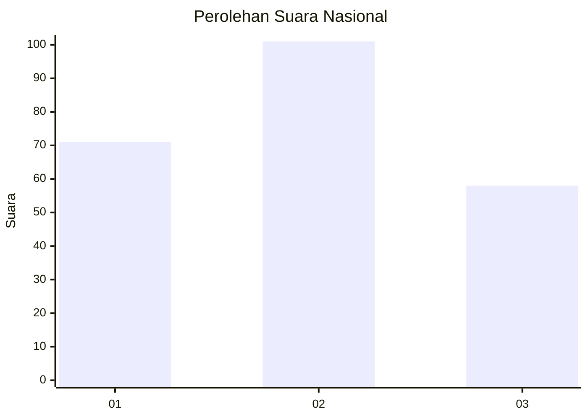
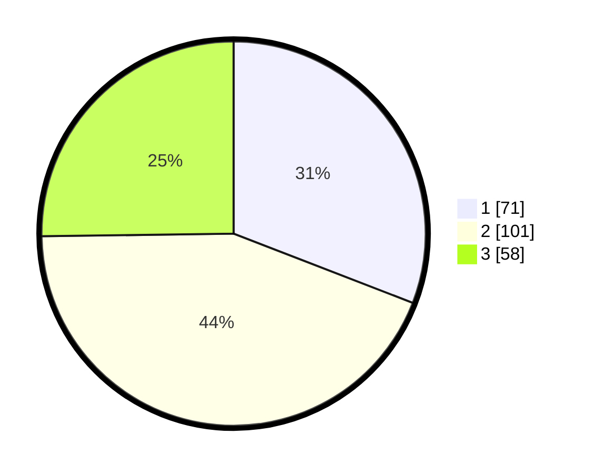

# Hasil

## Grafik

## Tabel

| No. | Nama Paslon    | Suara | Suara (raw) | Persentase |
|:--- |:-------------- | -----:| -----------:| ----------:|
| 1   | ANIES MUHAIMIN | 71    | [71][p-1]   | 30,87      |
| 2   | PRABOWO GIBRAN | 101   | [101][p-2]  | 43,91      |
| 3   | GANJAR MAHFUD  | 58    | [58][p-3]   | 25,22      |

[p-1]: https://github.com/gigit-pemilu/pemilu-2024/blob/main/pilpres/hitung-suara/sub/34-di-yogyakarta/sub/04-sleman/sub/01-gamping/sub/2002-ambarketawang/sub/050-tps/sub/paslon-1.txt
[p-2]: https://github.com/gigit-pemilu/pemilu-2024/blob/main/pilpres/hitung-suara/sub/34-di-yogyakarta/sub/04-sleman/sub/01-gamping/sub/2002-ambarketawang/sub/050-tps/sub/paslon-2.txt
[p-3]: https://github.com/gigit-pemilu/pemilu-2024/blob/main/pilpres/hitung-suara/sub/34-di-yogyakarta/sub/04-sleman/sub/01-gamping/sub/2002-ambarketawang/sub/050-tps/sub/paslon-3.txt

## Foto C Plano

https://sirekap-obj-formc.kpu.go.id/be37/pemilu/ppwp/34/04/01/20/02/3404012002050-20240215-030120--fa9a1f89-0ad2-4990-85c2-22730afd6ac0.jpg

https://sirekap-obj-formc.kpu.go.id/be37/pemilu/ppwp/34/04/01/20/02/3404012002050-20240215-030156--0a38c2ec-c9c5-4228-89a0-fe6c7e0963f1.jpg

https://sirekap-obj-formc.kpu.go.id/be37/pemilu/ppwp/34/04/01/20/02/3404012002050-20240215-030239--8942551e-153a-41a6-8240-f355644d2973.jpg

## Metadata

| Key        | Value               |
| ---------- | ------------------- |
| Time Stamp | 2024-02-15 15:00:29 |

