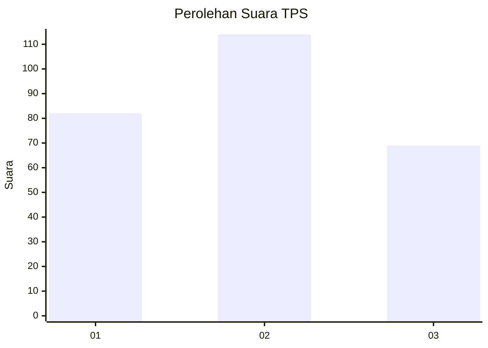
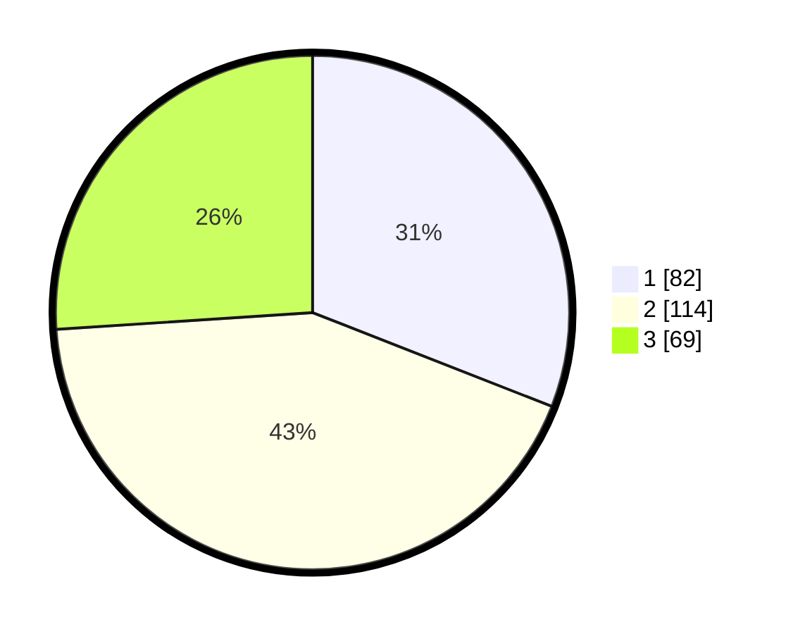

# Hasil

## Grafik

## Tabel

| No. | Nama Paslon    | Suara | Suara (raw) | Persentase |
|:--- |:-------------- | -----:| -----------:| ----------:|
| 1   | ANIES MUHAIMIN | 82    | [82][p-1]   | 30,94      |
| 2   | PRABOWO GIBRAN | 114   | [114][p-2]  | 43,02      |
| 3   | GANJAR MAHFUD  | 69    | [69][p-3]   | 26,04      |

[p-1]: https://github.com/gigit-pemilu/pemilu-2024-34-di-yogyakarta/blob/main/pilpres/hitung-suara/sub/34-di-yogyakarta/sub/04-sleman/sub/01-gamping/sub/2002-ambarketawang/sub/051-tps/sub/paslon-1.txt
[p-2]: https://github.com/gigit-pemilu/pemilu-2024-34-di-yogyakarta/blob/main/pilpres/hitung-suara/sub/34-di-yogyakarta/sub/04-sleman/sub/01-gamping/sub/2002-ambarketawang/sub/051-tps/sub/paslon-2.txt
[p-3]: https://github.com/gigit-pemilu/pemilu-2024-34-di-yogyakarta/blob/main/pilpres/hitung-suara/sub/34-di-yogyakarta/sub/04-sleman/sub/01-gamping/sub/2002-ambarketawang/sub/051-tps/sub/paslon-3.txt

## Foto C Plano

https://sirekap-obj-formc.kpu.go.id/5abd/pemilu/ppwp/34/04/01/20/02/3404012002051-20240214-231311--b63b23b6-c416-4a5f-83b6-6e0629676912.jpg

https://sirekap-obj-formc.kpu.go.id/5abd/pemilu/ppwp/34/04/01/20/02/3404012002051-20240214-231339--e969591e-a7f5-4f58-a032-95a9aa2b63c6.jpg

https://sirekap-obj-formc.kpu.go.id/5abd/pemilu/ppwp/34/04/01/20/02/3404012002051-20240214-231404--e313734d-32b7-438e-9551-33415409ab65.jpg

## Metadata

| Key        | Value               |
| ---------- | ------------------- |
| Time Stamp | 2024-02-15 22:00:27 |

