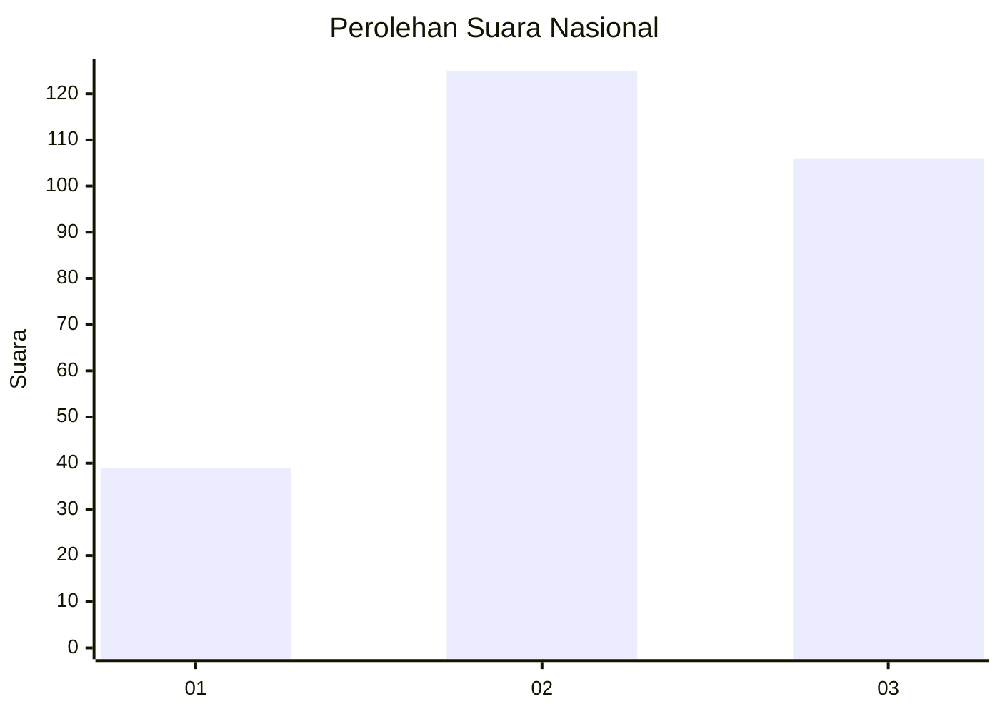
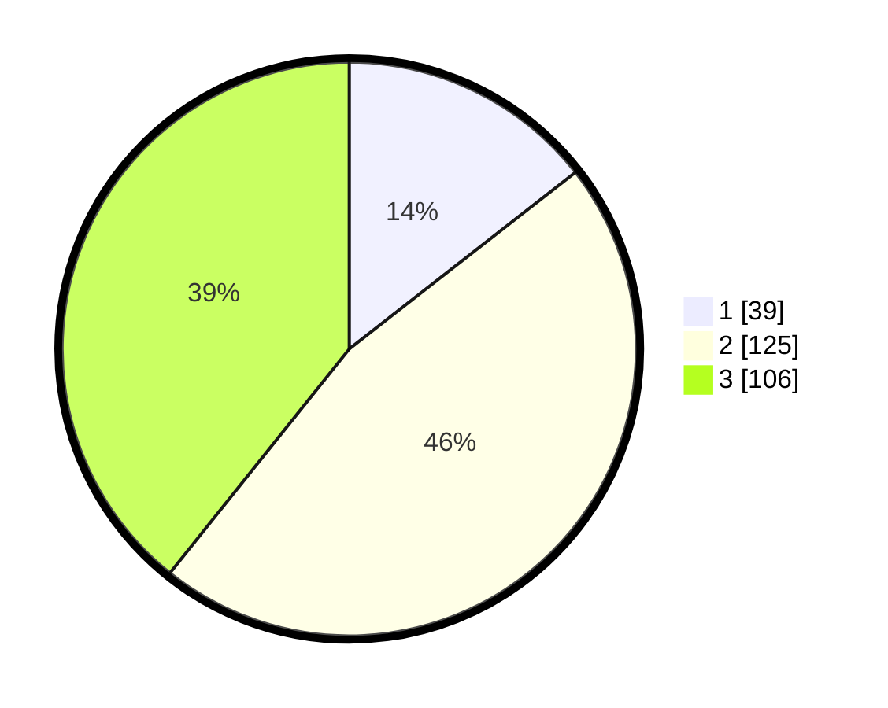

# Hasil

## Grafik

## Tabel

| No. | Nama Paslon    | Suara | Suara (raw) | Persentase |
|:--- |:-------------- | -----:| -----------:| ----------:|
| 1   | ANIES MUHAIMIN | 39    | [39][p-1]   | 14,44      |
| 2   | PRABOWO GIBRAN | 125   | [125][p-2]  | 46,30      |
| 3   | GANJAR MAHFUD  | 106   | [106][p-3]  | 39,26      |

[p-1]: https://github.com/gigit-pemilu/pemilu-2024/blob/main/pilpres/hitung-suara/sub/34-di-yogyakarta/sub/04-sleman/sub/01-gamping/sub/2002-ambarketawang/sub/057-tps/sub/paslon-1.txt
[p-2]: https://github.com/gigit-pemilu/pemilu-2024/blob/main/pilpres/hitung-suara/sub/34-di-yogyakarta/sub/04-sleman/sub/01-gamping/sub/2002-ambarketawang/sub/057-tps/sub/paslon-2.txt
[p-3]: https://github.com/gigit-pemilu/pemilu-2024/blob/main/pilpres/hitung-suara/sub/34-di-yogyakarta/sub/04-sleman/sub/01-gamping/sub/2002-ambarketawang/sub/057-tps/sub/paslon-3.txt

## Foto C Plano

https://sirekap-obj-formc.kpu.go.id/1b82/pemilu/ppwp/34/04/01/20/02/3404012002057-20240215-053757--be7ba628-4494-4ce4-950b-ad082f44e56e.jpg

https://sirekap-obj-formc.kpu.go.id/1b82/pemilu/ppwp/34/04/01/20/02/3404012002057-20240215-053858--aabad6dd-489b-4ee0-881e-6b13d516985f.jpg

https://sirekap-obj-formc.kpu.go.id/1b82/pemilu/ppwp/34/04/01/20/02/3404012002057-20240215-054018--739830fc-ace0-4ba4-b786-4be1f56f8716.jpg

## Metadata

| Key        | Value               |
| ---------- | ------------------- |
| Time Stamp | 2024-02-15 22:00:27 |

