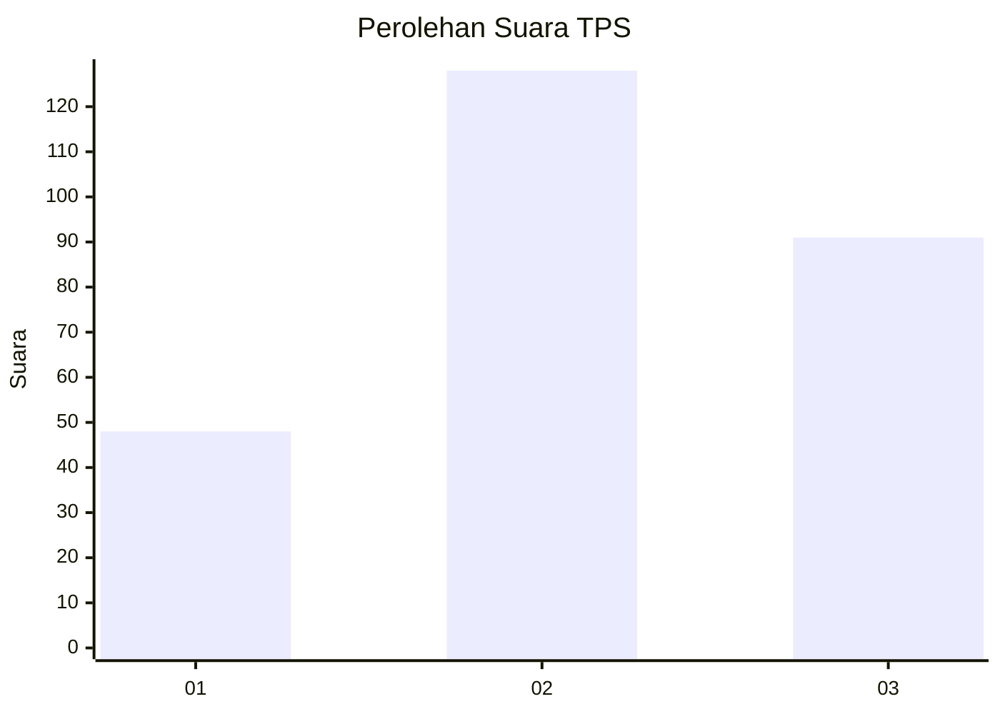
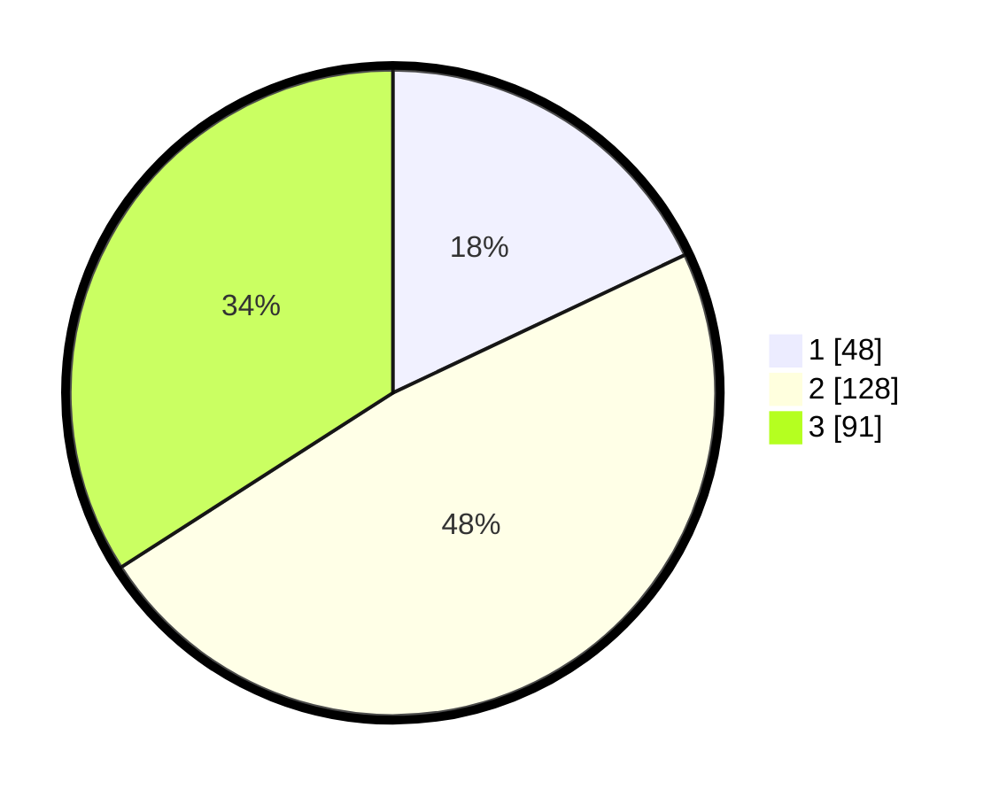

# Hasil

## Grafik

## Tabel

| No. | Nama Paslon    | Suara | Suara (raw) | Persentase |
|:--- |:-------------- | -----:| -----------:| ----------:|
| 1   | ANIES MUHAIMIN | 48    | [48][p-1]   | 17,98      |
| 2   | PRABOWO GIBRAN | 128   | [128][p-2]  | 47,94      |
| 3   | GANJAR MAHFUD  | 91    | [91][p-3]   | 34,08      |

[p-1]: https://github.com/gigit-pemilu/pemilu-2024-34-di-yogyakarta/blob/main/pilpres/hitung-suara/sub/34-di-yogyakarta/sub/04-sleman/sub/01-gamping/sub/2002-ambarketawang/sub/060-tps/sub/paslon-1.txt
[p-2]: https://github.com/gigit-pemilu/pemilu-2024-34-di-yogyakarta/blob/main/pilpres/hitung-suara/sub/34-di-yogyakarta/sub/04-sleman/sub/01-gamping/sub/2002-ambarketawang/sub/060-tps/sub/paslon-2.txt
[p-3]: https://github.com/gigit-pemilu/pemilu-2024-34-di-yogyakarta/blob/main/pilpres/hitung-suara/sub/34-di-yogyakarta/sub/04-sleman/sub/01-gamping/sub/2002-ambarketawang/sub/060-tps/sub/paslon-3.txt

## Foto C Plano

https://sirekap-obj-formc.kpu.go.id/8e21/pemilu/ppwp/34/04/01/20/02/3404012002060-20240214-213348--630e1a26-5822-4a74-afa6-f7d061f4a79b.jpg

https://sirekap-obj-formc.kpu.go.id/8e21/pemilu/ppwp/34/04/01/20/02/3404012002060-20240214-213504--6151f8f6-659b-4548-a4f7-7054bdf4bedc.jpg

https://sirekap-obj-formc.kpu.go.id/8e21/pemilu/ppwp/34/04/01/20/02/3404012002060-20240214-213602--688d8a53-954f-4929-b086-93467fec2fe5.jpg

## Metadata

| Key        | Value               |
| ---------- | ------------------- |
| Time Stamp | 2024-02-15 12:00:28 |

