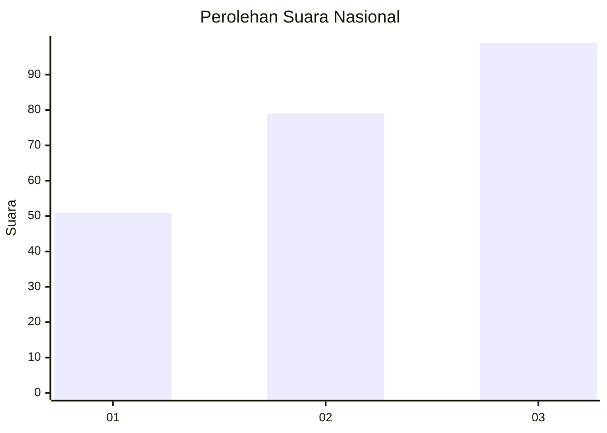
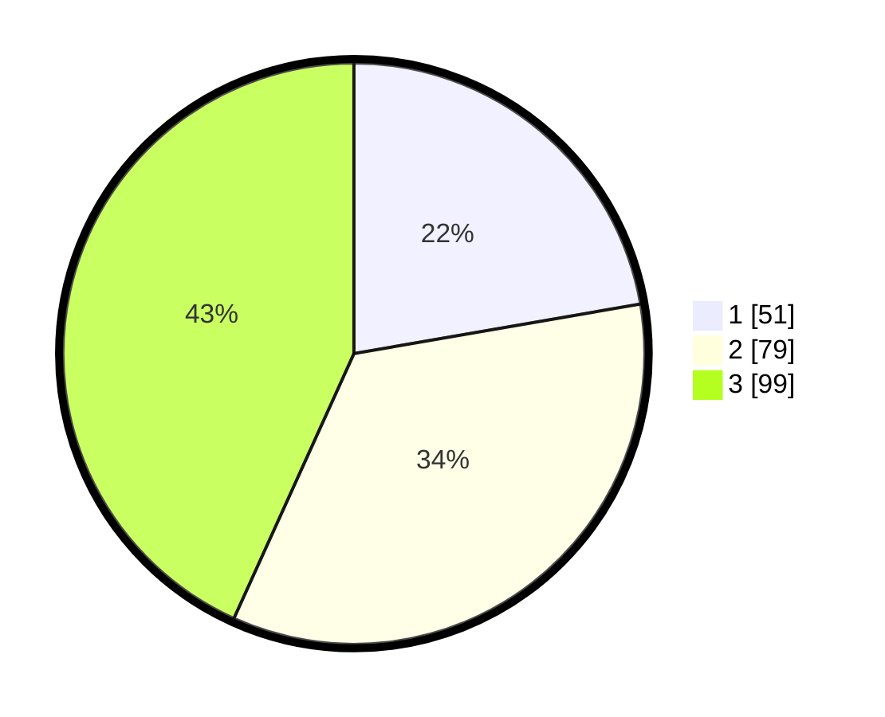

# Hasil

## Grafik

## Tabel

| No. | Nama Paslon    | Suara | Suara (raw) | Persentase |
|:--- |:-------------- | -----:| -----------:| ----------:|
| 1   | ANIES MUHAIMIN | 51    | [51][p-1]   | 22,27      |
| 2   | PRABOWO GIBRAN | 79    | [79][p-2]   | 34,50      |
| 3   | GANJAR MAHFUD  | 99    | [99][p-3]   | 43,23      |

[p-1]: https://github.com/gigit-pemilu/pemilu-2024/blob/main/pilpres/hitung-suara/sub/34-di-yogyakarta/sub/04-sleman/sub/01-gamping/sub/2002-ambarketawang/sub/062-tps/sub/paslon-1.txt
[p-2]: https://github.com/gigit-pemilu/pemilu-2024/blob/main/pilpres/hitung-suara/sub/34-di-yogyakarta/sub/04-sleman/sub/01-gamping/sub/2002-ambarketawang/sub/062-tps/sub/paslon-2.txt
[p-3]: https://github.com/gigit-pemilu/pemilu-2024/blob/main/pilpres/hitung-suara/sub/34-di-yogyakarta/sub/04-sleman/sub/01-gamping/sub/2002-ambarketawang/sub/062-tps/sub/paslon-3.txt

## Foto C Plano

https://sirekap-obj-formc.kpu.go.id/513b/pemilu/ppwp/34/04/01/20/02/3404012002062-20240215-014344--d9aa6a52-fcba-4b81-aace-ca838dbb53dc.jpg

https://sirekap-obj-formc.kpu.go.id/513b/pemilu/ppwp/34/04/01/20/02/3404012002062-20240215-014304--f5571328-0ab5-45a0-8b2c-5ebb0f9b868c.jpg

https://sirekap-obj-formc.kpu.go.id/513b/pemilu/ppwp/34/04/01/20/02/3404012002062-20240215-014423--37be061c-e156-4eaa-8419-e0d03bf57902.jpg

## Metadata

| Key        | Value               |
| ---------- | ------------------- |
| Time Stamp | 2024-02-15 12:00:28 |

