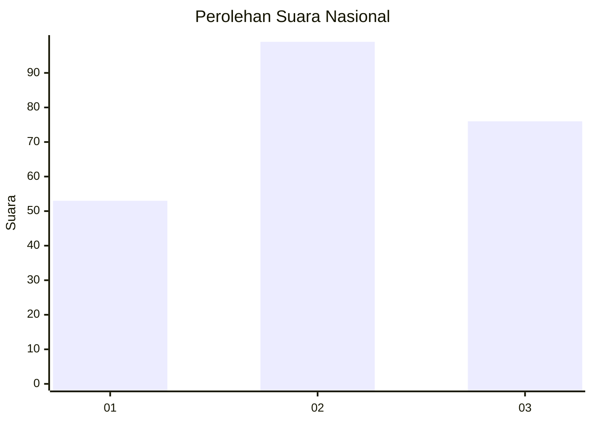
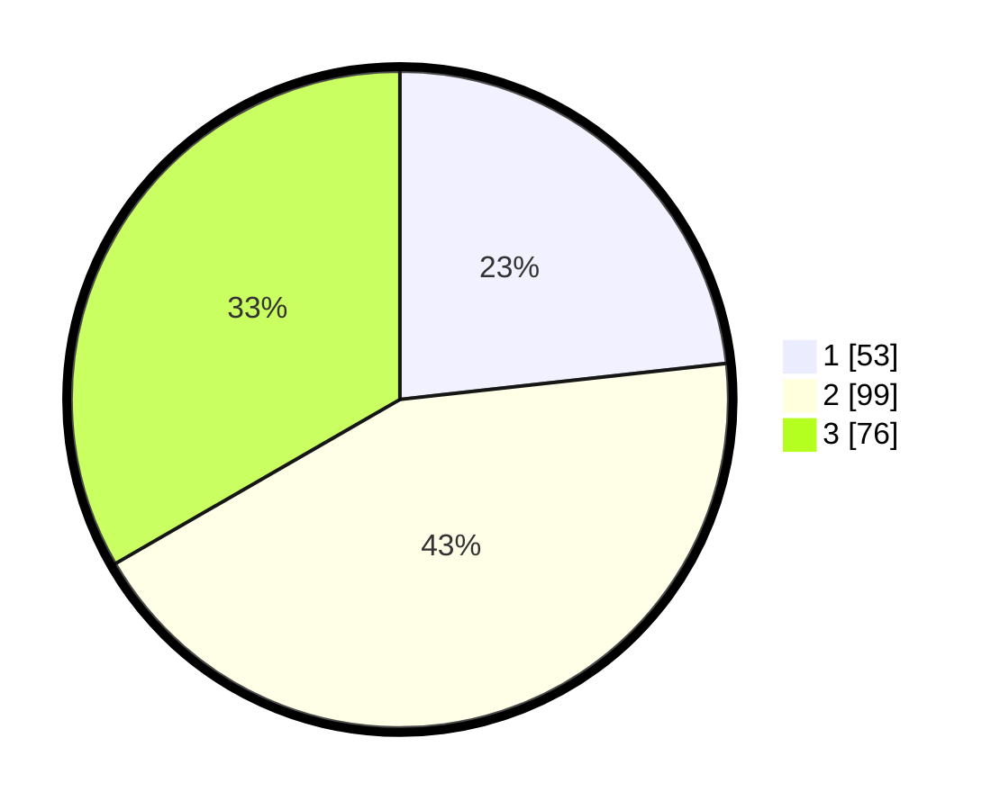

# Hasil

## Grafik

## Tabel

| No. | Nama Paslon    | Suara | Suara (raw) | Persentase |
|:--- |:-------------- | -----:| -----------:| ----------:|
| 1   | ANIES MUHAIMIN | 53    | [53][p-1]   | 23,25      |
| 2   | PRABOWO GIBRAN | 99    | [99][p-2]   | 43,42      |
| 3   | GANJAR MAHFUD  | 76    | [76][p-3]   | 33,33      |

[p-1]: https://github.com/gigit-pemilu/pemilu-2024/blob/main/pilpres/hitung-suara/sub/34-di-yogyakarta/sub/04-sleman/sub/01-gamping/sub/2003-banyuraden/sub/006-tps/sub/paslon-1.txt
[p-2]: https://github.com/gigit-pemilu/pemilu-2024/blob/main/pilpres/hitung-suara/sub/34-di-yogyakarta/sub/04-sleman/sub/01-gamping/sub/2003-banyuraden/sub/006-tps/sub/paslon-2.txt
[p-3]: https://github.com/gigit-pemilu/pemilu-2024/blob/main/pilpres/hitung-suara/sub/34-di-yogyakarta/sub/04-sleman/sub/01-gamping/sub/2003-banyuraden/sub/006-tps/sub/paslon-3.txt

## Foto C Plano

https://sirekap-obj-formc.kpu.go.id/41b5/pemilu/ppwp/34/04/01/20/03/3404012003006-20240214-232331--78c4f4e6-084f-4518-b9fe-6b5451705033.jpg

https://sirekap-obj-formc.kpu.go.id/41b5/pemilu/ppwp/34/04/01/20/03/3404012003006-20240214-232453--d10d9db5-90aa-4b5b-9a19-5b54b00663e4.jpg

https://sirekap-obj-formc.kpu.go.id/41b5/pemilu/ppwp/34/04/01/20/03/3404012003006-20240214-232748--0910edca-848a-4ea2-a1fa-edcfc0ab7779.jpg

## Metadata

| Key        | Value               |
| ---------- | ------------------- |
| Time Stamp | 2024-02-15 20:30:46 |

