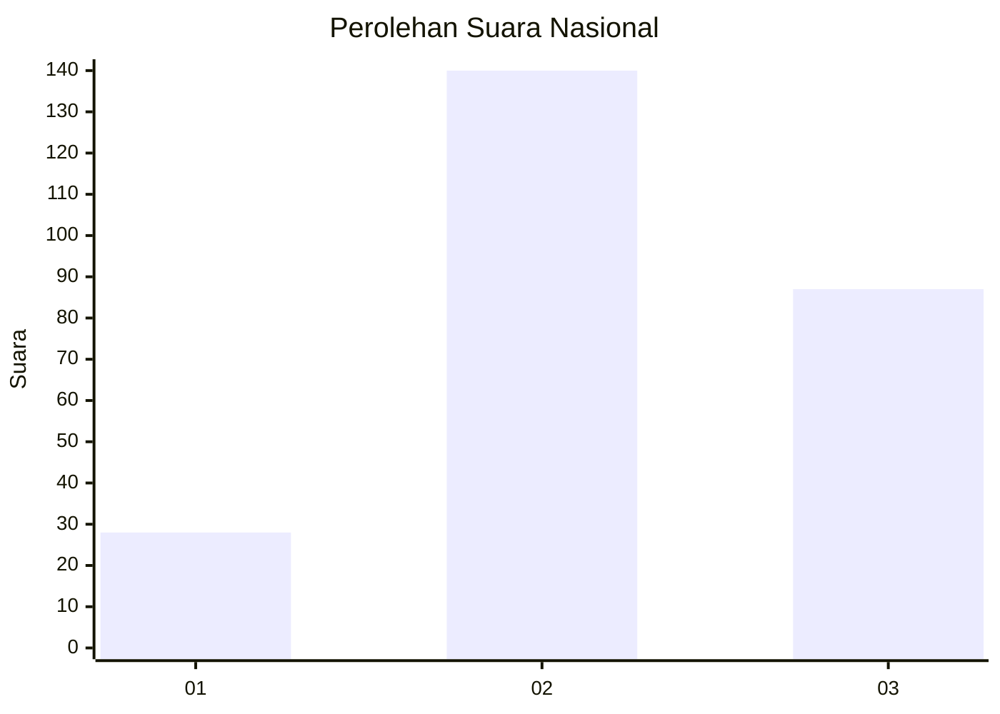
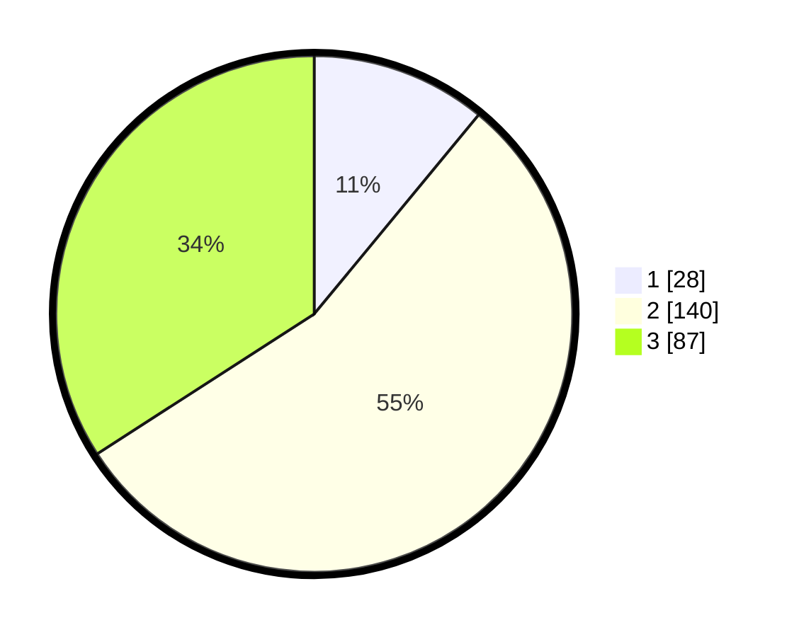

# Hasil

## Grafik

## Tabel

| No. | Nama Paslon    | Suara | Suara (raw) | Persentase |
|:--- |:-------------- | -----:| -----------:| ----------:|
| 1   | ANIES MUHAIMIN | 28    | [28][p-1]   | 10,98      |
| 2   | PRABOWO GIBRAN | 140   | [140][p-2]  | 54,90      |
| 3   | GANJAR MAHFUD  | 87    | [87][p-3]   | 34,12      |

[p-1]: https://github.com/gigit-pemilu/pemilu-2024/blob/main/pilpres/hitung-suara/sub/34-di-yogyakarta/sub/04-sleman/sub/01-gamping/sub/2003-banyuraden/sub/008-tps/sub/paslon-1.txt
[p-2]: https://github.com/gigit-pemilu/pemilu-2024/blob/main/pilpres/hitung-suara/sub/34-di-yogyakarta/sub/04-sleman/sub/01-gamping/sub/2003-banyuraden/sub/008-tps/sub/paslon-2.txt
[p-3]: https://github.com/gigit-pemilu/pemilu-2024/blob/main/pilpres/hitung-suara/sub/34-di-yogyakarta/sub/04-sleman/sub/01-gamping/sub/2003-banyuraden/sub/008-tps/sub/paslon-3.txt

## Foto C Plano

https://sirekap-obj-formc.kpu.go.id/f02b/pemilu/ppwp/34/04/01/20/03/3404012003008-20240214-212125--2124edd6-b279-4f6e-866d-8f35ce63154c.jpg

https://sirekap-obj-formc.kpu.go.id/f02b/pemilu/ppwp/34/04/01/20/03/3404012003008-20240214-212314--c8c5c036-68be-403c-81cf-0a807666b9d7.jpg

https://sirekap-obj-formc.kpu.go.id/f02b/pemilu/ppwp/34/04/01/20/03/3404012003008-20240214-212421--8e7c7a90-fad4-428d-88cc-0735a7326c3c.jpg

## Metadata

| Key        | Value               |
| ---------- | ------------------- |
| Time Stamp | 2024-02-15 17:30:25 |

