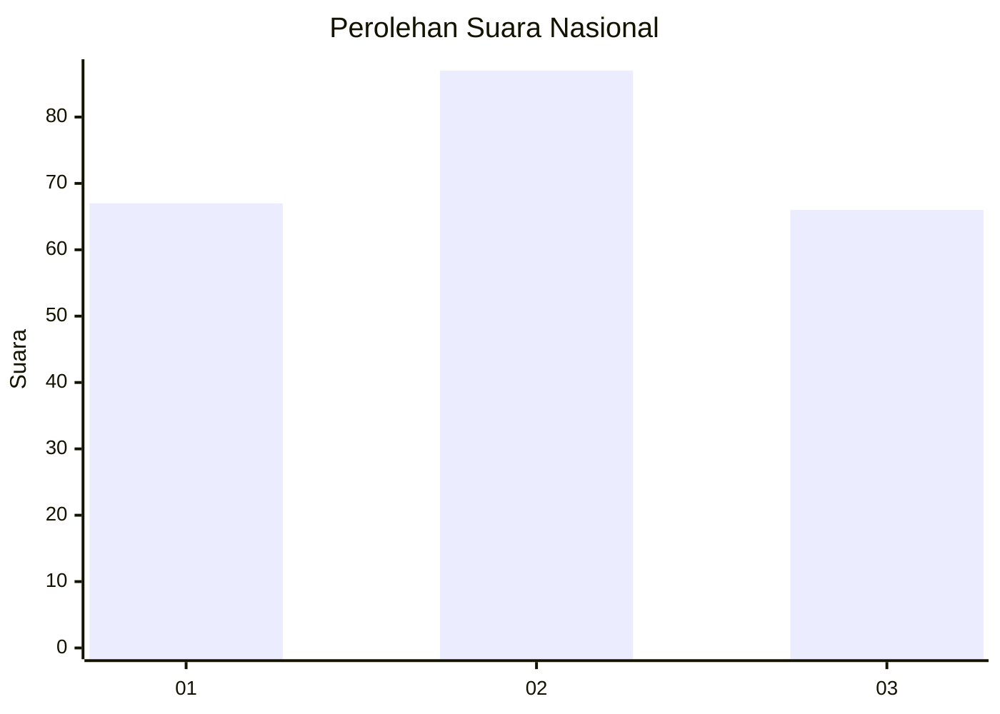
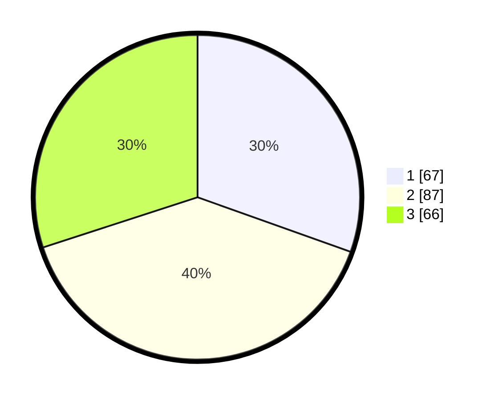

# Hasil

## Grafik

## Tabel

| No. | Nama Paslon    | Suara | Suara (raw) | Persentase |
|:--- |:-------------- | -----:| -----------:| ----------:|
| 1   | ANIES MUHAIMIN | 67    | [67][p-1]   | 30,45      |
| 2   | PRABOWO GIBRAN | 87    | [87][p-2]   | 39,55      |
| 3   | GANJAR MAHFUD  | 66    | [66][p-3]   | 30,00      |

[p-1]: https://github.com/gigit-pemilu/pemilu-2024/blob/main/pilpres/hitung-suara/sub/34-di-yogyakarta/sub/04-sleman/sub/01-gamping/sub/2003-banyuraden/sub/015-tps/sub/paslon-1.txt
[p-2]: https://github.com/gigit-pemilu/pemilu-2024/blob/main/pilpres/hitung-suara/sub/34-di-yogyakarta/sub/04-sleman/sub/01-gamping/sub/2003-banyuraden/sub/015-tps/sub/paslon-2.txt
[p-3]: https://github.com/gigit-pemilu/pemilu-2024/blob/main/pilpres/hitung-suara/sub/34-di-yogyakarta/sub/04-sleman/sub/01-gamping/sub/2003-banyuraden/sub/015-tps/sub/paslon-3.txt

## Foto C Plano

https://sirekap-obj-formc.kpu.go.id/41ee/pemilu/ppwp/34/04/01/20/03/3404012003015-20240215-005521--18c6c1ff-a56c-414a-a200-27c304903189.jpg

https://sirekap-obj-formc.kpu.go.id/41ee/pemilu/ppwp/34/04/01/20/03/3404012003015-20240215-005626--18481938-d789-4431-acc5-d7093cae7a2b.jpg

https://sirekap-obj-formc.kpu.go.id/41ee/pemilu/ppwp/34/04/01/20/03/3404012003015-20240215-005721--43f48ea0-de60-4403-b413-9557d51ed1dd.jpg

## Metadata

| Key        | Value               |
| ---------- | ------------------- |
| Time Stamp | 2024-02-15 20:00:44 |

