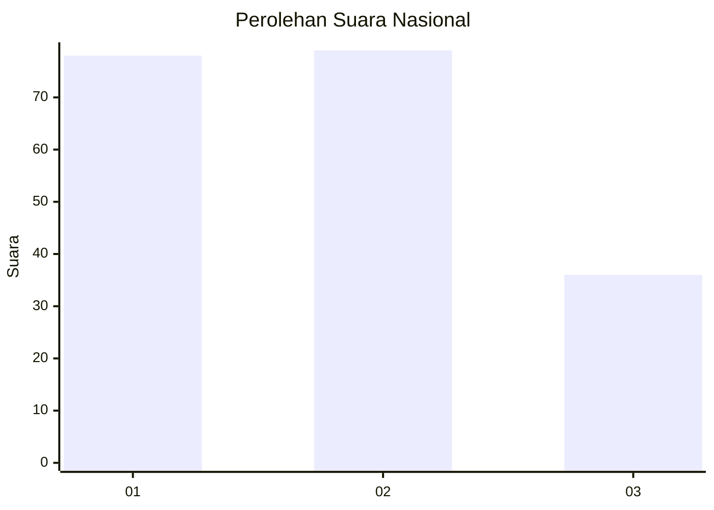
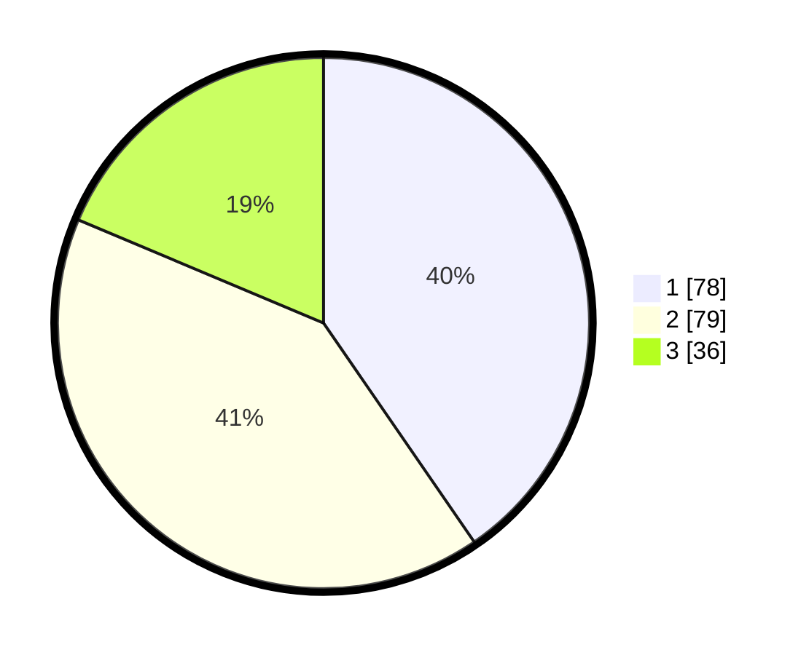

# Hasil

## Grafik

## Tabel

| No. | Nama Paslon    | Suara | Suara (raw) | Persentase |
|:--- |:-------------- | -----:| -----------:| ----------:|
| 1   | ANIES MUHAIMIN | 78    | [78][p-1]   | 40,41      |
| 2   | PRABOWO GIBRAN | 79    | [79][p-2]   | 40,93      |
| 3   | GANJAR MAHFUD  | 36    | [36][p-3]   | 18,65      |

[p-1]: https://github.com/gigit-pemilu/pemilu-2024/blob/main/pilpres/hitung-suara/sub/34-di-yogyakarta/sub/04-sleman/sub/01-gamping/sub/2003-banyuraden/sub/019-tps/sub/paslon-1.txt
[p-2]: https://github.com/gigit-pemilu/pemilu-2024/blob/main/pilpres/hitung-suara/sub/34-di-yogyakarta/sub/04-sleman/sub/01-gamping/sub/2003-banyuraden/sub/019-tps/sub/paslon-2.txt
[p-3]: https://github.com/gigit-pemilu/pemilu-2024/blob/main/pilpres/hitung-suara/sub/34-di-yogyakarta/sub/04-sleman/sub/01-gamping/sub/2003-banyuraden/sub/019-tps/sub/paslon-3.txt

## Foto C Plano

https://sirekap-obj-formc.kpu.go.id/7247/pemilu/ppwp/34/04/01/20/03/3404012003019-20240215-020243--bcca4527-0781-454e-b17e-42cead730abd.jpg

https://sirekap-obj-formc.kpu.go.id/7247/pemilu/ppwp/34/04/01/20/03/3404012003019-20240215-020429--9069fc28-9ea1-478e-bc44-97431af580b7.jpg

https://sirekap-obj-formc.kpu.go.id/7247/pemilu/ppwp/34/04/01/20/03/3404012003019-20240215-020526--400f1ddb-fea1-44c3-9654-b3fdbfd942c0.jpg

## Metadata

| Key        | Value               |
| ---------- | ------------------- |
| Time Stamp | 2024-02-15 20:30:46 |

