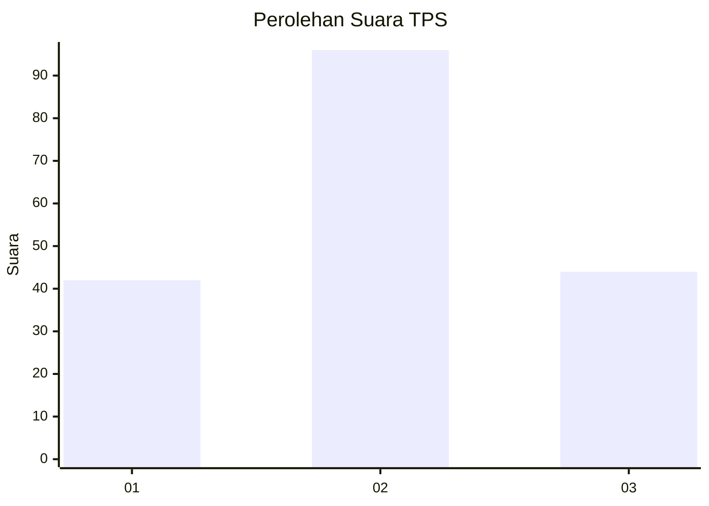
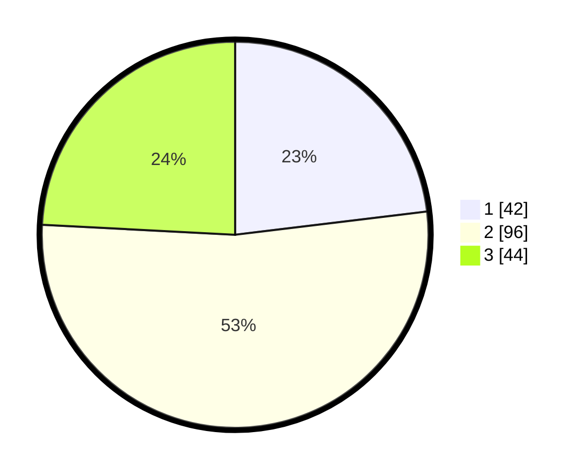

# Hasil

## Grafik

## Tabel

| No. | Nama Paslon    | Suara | Suara (raw) | Persentase |
|:--- |:-------------- | -----:| -----------:| ----------:|
| 1   | ANIES MUHAIMIN | 42    | [42][p-1]   | 23,08      |
| 2   | PRABOWO GIBRAN | 96    | [96][p-2]   | 52,75      |
| 3   | GANJAR MAHFUD  | 44    | [44][p-3]   | 24,18      |

[p-1]: https://github.com/gigit-pemilu/pemilu-2024-34-di-yogyakarta/blob/main/pilpres/hitung-suara/sub/34-di-yogyakarta/sub/04-sleman/sub/01-gamping/sub/2003-banyuraden/sub/020-tps/sub/paslon-1.txt
[p-2]: https://github.com/gigit-pemilu/pemilu-2024-34-di-yogyakarta/blob/main/pilpres/hitung-suara/sub/34-di-yogyakarta/sub/04-sleman/sub/01-gamping/sub/2003-banyuraden/sub/020-tps/sub/paslon-2.txt
[p-3]: https://github.com/gigit-pemilu/pemilu-2024-34-di-yogyakarta/blob/main/pilpres/hitung-suara/sub/34-di-yogyakarta/sub/04-sleman/sub/01-gamping/sub/2003-banyuraden/sub/020-tps/sub/paslon-3.txt

## Foto C Plano

https://sirekap-obj-formc.kpu.go.id/69b8/pemilu/ppwp/34/04/01/20/03/3404012003020-20240214-204043--ed55d639-2e44-49f6-b982-73b36ea9dc65.jpg

https://sirekap-obj-formc.kpu.go.id/69b8/pemilu/ppwp/34/04/01/20/03/3404012003020-20240214-204052--8f0a68f9-6450-4bc2-9b14-a8c616900fff.jpg

https://sirekap-obj-formc.kpu.go.id/69b8/pemilu/ppwp/34/04/01/20/03/3404012003020-20240214-204055--283332e0-148b-4477-bc0d-cdb459c5daf9.jpg

## Metadata

| Key        | Value               |
| ---------- | ------------------- |
| Time Stamp | 2024-02-15 12:00:28 |

