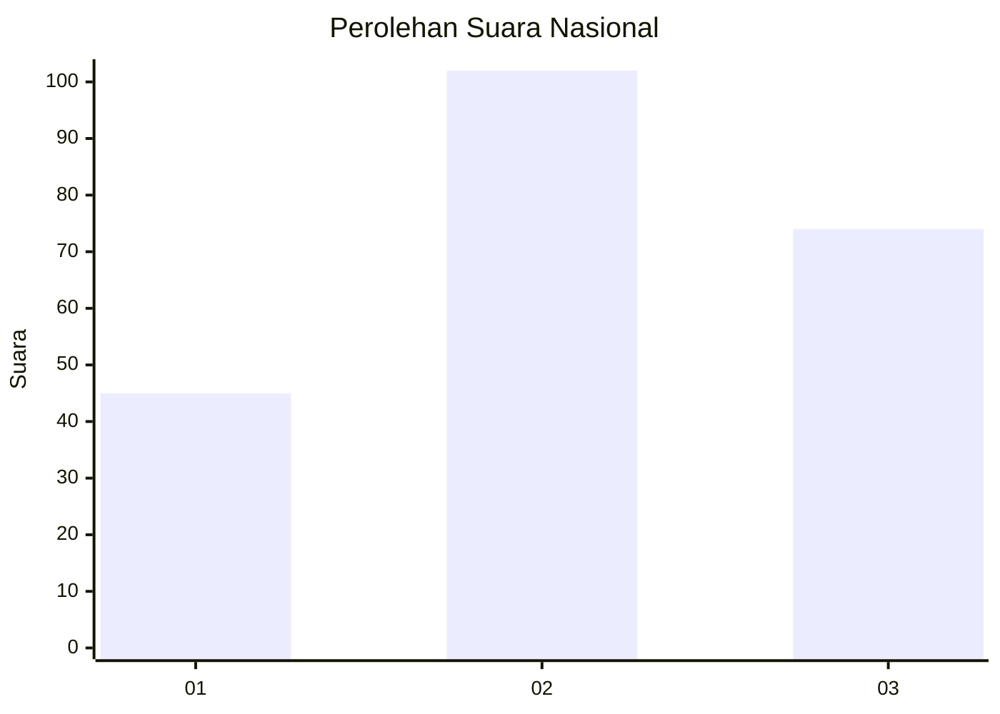
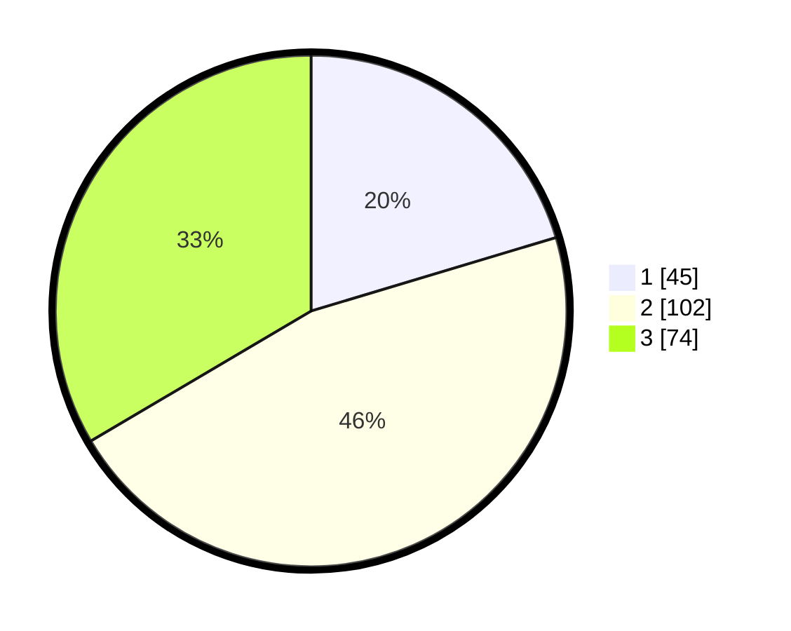

# Hasil

## Grafik

## Tabel

| No. | Nama Paslon    | Suara | Suara (raw) | Persentase |
|:--- |:-------------- | -----:| -----------:| ----------:|
| 1   | ANIES MUHAIMIN | 45    | [45][p-1]   | 20,36      |
| 2   | PRABOWO GIBRAN | 102   | [102][p-2]  | 46,15      |
| 3   | GANJAR MAHFUD  | 74    | [74][p-3]   | 33,48      |

[p-1]: https://github.com/gigit-pemilu/pemilu-2024/blob/main/pilpres/hitung-suara/sub/34-di-yogyakarta/sub/04-sleman/sub/01-gamping/sub/2003-banyuraden/sub/022-tps/sub/paslon-1.txt
[p-2]: https://github.com/gigit-pemilu/pemilu-2024/blob/main/pilpres/hitung-suara/sub/34-di-yogyakarta/sub/04-sleman/sub/01-gamping/sub/2003-banyuraden/sub/022-tps/sub/paslon-2.txt
[p-3]: https://github.com/gigit-pemilu/pemilu-2024/blob/main/pilpres/hitung-suara/sub/34-di-yogyakarta/sub/04-sleman/sub/01-gamping/sub/2003-banyuraden/sub/022-tps/sub/paslon-3.txt

## Foto C Plano

https://sirekap-obj-formc.kpu.go.id/46dd/pemilu/ppwp/34/04/01/20/03/3404012003022-20240214-155412--2c018423-1e5b-4090-a547-a9eafd29452a.jpg

https://sirekap-obj-formc.kpu.go.id/46dd/pemilu/ppwp/34/04/01/20/03/3404012003022-20240214-155505--fca6e6da-ed19-47ba-b5ea-0f871dc975c7.jpg

https://sirekap-obj-formc.kpu.go.id/46dd/pemilu/ppwp/34/04/01/20/03/3404012003022-20240214-155625--ba528856-55a4-4a14-ac90-de3167fabda4.jpg

## Metadata

| Key        | Value               |
| ---------- | ------------------- |
| Time Stamp | 2024-02-15 12:00:28 |

