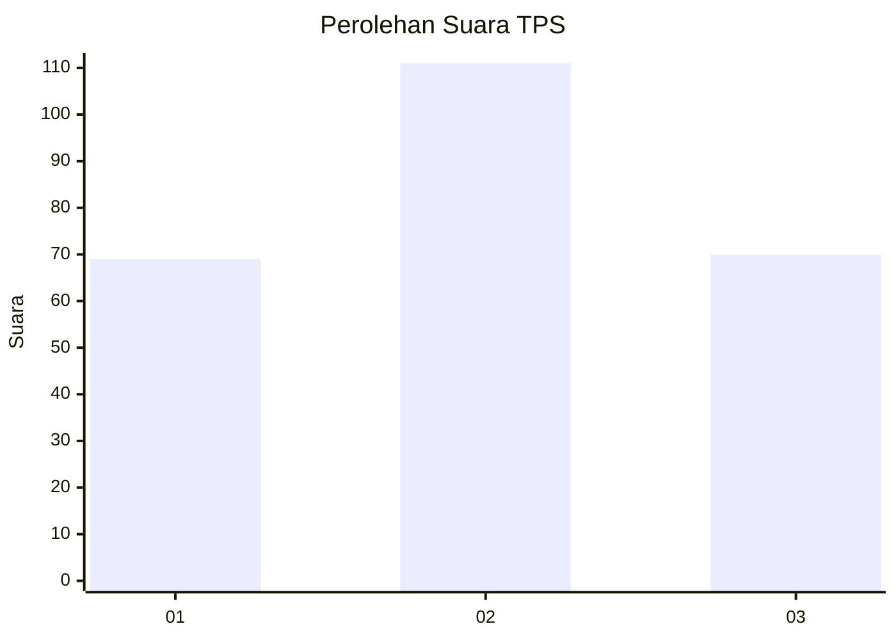
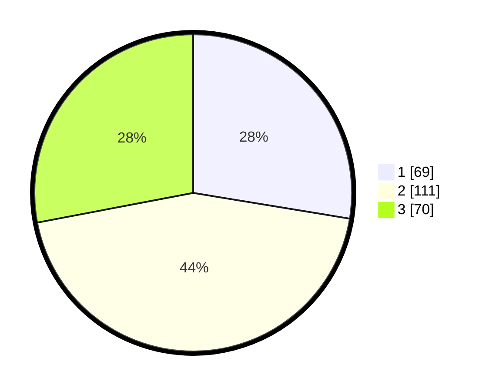

# Hasil

## Grafik

## Tabel

| No. | Nama Paslon    | Suara | Suara (raw) | Persentase |
|:--- |:-------------- | -----:| -----------:| ----------:|
| 1   | ANIES MUHAIMIN | 69    | [69][p-1]   | 27,60      |
| 2   | PRABOWO GIBRAN | 111   | [111][p-2]  | 44,40      |
| 3   | GANJAR MAHFUD  | 70    | [70][p-3]   | 28,00      |

[p-1]: https://github.com/gigit-pemilu/pemilu-2024-34-di-yogyakarta/blob/main/pilpres/hitung-suara/sub/34-di-yogyakarta/sub/04-sleman/sub/01-gamping/sub/2003-banyuraden/sub/029-tps/sub/paslon-1.txt
[p-2]: https://github.com/gigit-pemilu/pemilu-2024-34-di-yogyakarta/blob/main/pilpres/hitung-suara/sub/34-di-yogyakarta/sub/04-sleman/sub/01-gamping/sub/2003-banyuraden/sub/029-tps/sub/paslon-2.txt
[p-3]: https://github.com/gigit-pemilu/pemilu-2024-34-di-yogyakarta/blob/main/pilpres/hitung-suara/sub/34-di-yogyakarta/sub/04-sleman/sub/01-gamping/sub/2003-banyuraden/sub/029-tps/sub/paslon-3.txt

## Foto C Plano

https://sirekap-obj-formc.kpu.go.id/ee01/pemilu/ppwp/34/04/01/20/03/3404012003029-20240214-222650--80d5a8b9-9230-49cc-9382-a144b834adc2.jpg

https://sirekap-obj-formc.kpu.go.id/ee01/pemilu/ppwp/34/04/01/20/03/3404012003029-20240214-222830--2f83ec3a-129a-4ed7-a6f5-b254a4982f95.jpg

https://sirekap-obj-formc.kpu.go.id/ee01/pemilu/ppwp/34/04/01/20/03/3404012003029-20240214-222933--aab84bf7-2f11-4cdc-83f5-bda32763e78a.jpg

## Metadata

| Key        | Value               |
| ---------- | ------------------- |
| Time Stamp | 2024-02-15 12:00:28 |

