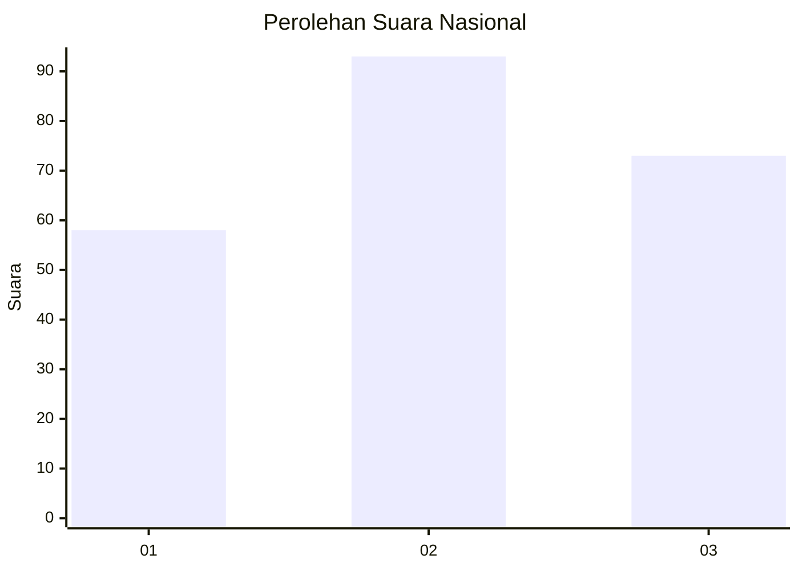
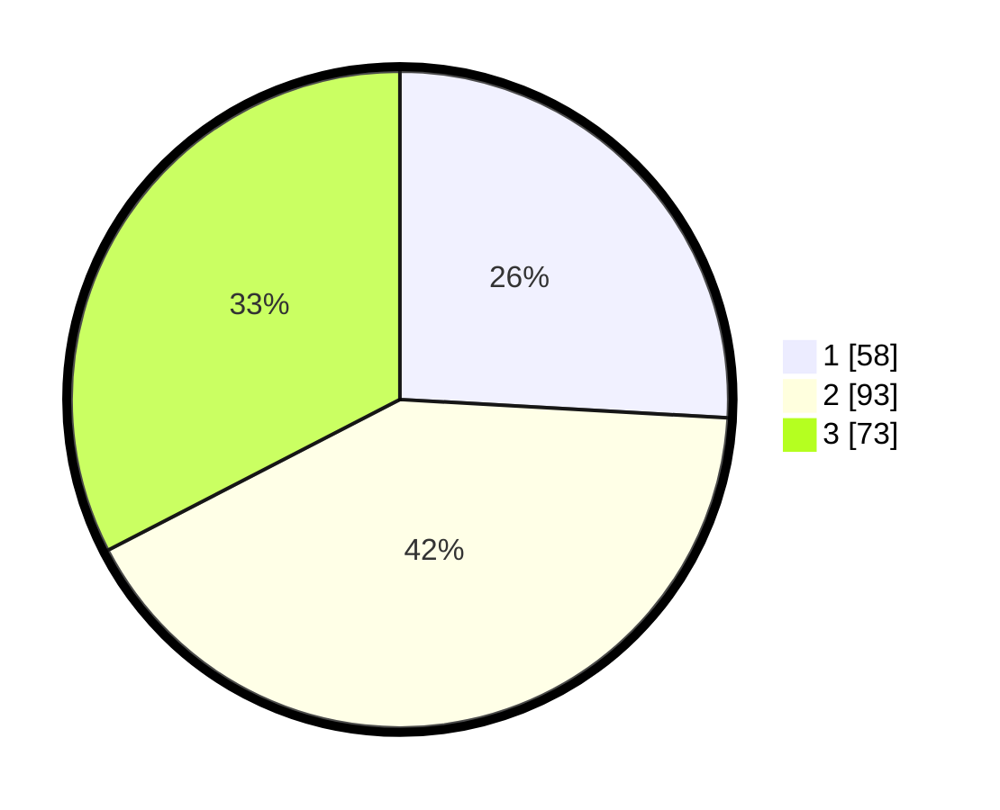

# Hasil

## Grafik

## Tabel

| No. | Nama Paslon    | Suara | Suara (raw) | Persentase |
|:--- |:-------------- | -----:| -----------:| ----------:|
| 1   | ANIES MUHAIMIN | 58    | [58][p-1]   | 25,89      |
| 2   | PRABOWO GIBRAN | 93    | [93][p-2]   | 41,52      |
| 3   | GANJAR MAHFUD  | 73    | [73][p-3]   | 32,59      |

[p-1]: https://github.com/gigit-pemilu/pemilu-2024/blob/main/pilpres/hitung-suara/sub/34-di-yogyakarta/sub/04-sleman/sub/01-gamping/sub/2003-banyuraden/sub/030-tps/sub/paslon-1.txt
[p-2]: https://github.com/gigit-pemilu/pemilu-2024/blob/main/pilpres/hitung-suara/sub/34-di-yogyakarta/sub/04-sleman/sub/01-gamping/sub/2003-banyuraden/sub/030-tps/sub/paslon-2.txt
[p-3]: https://github.com/gigit-pemilu/pemilu-2024/blob/main/pilpres/hitung-suara/sub/34-di-yogyakarta/sub/04-sleman/sub/01-gamping/sub/2003-banyuraden/sub/030-tps/sub/paslon-3.txt

## Foto C Plano

https://sirekap-obj-formc.kpu.go.id/8c4c/pemilu/ppwp/34/04/01/20/03/3404012003030-20240215-010725--04d6c021-b2be-4ecd-8e76-ab89330910b2.jpg

https://sirekap-obj-formc.kpu.go.id/8c4c/pemilu/ppwp/34/04/01/20/03/3404012003030-20240215-010941--2f5b9c8e-b2d8-4b58-aae8-2377cb605a00.jpg

https://sirekap-obj-formc.kpu.go.id/8c4c/pemilu/ppwp/34/04/01/20/03/3404012003030-20240215-011106--b1a138cf-0fd3-4166-b8dd-3ed9c57e9b21.jpg

## Metadata

| Key        | Value               |
| ---------- | ------------------- |
| Time Stamp | 2024-02-15 12:00:28 |

