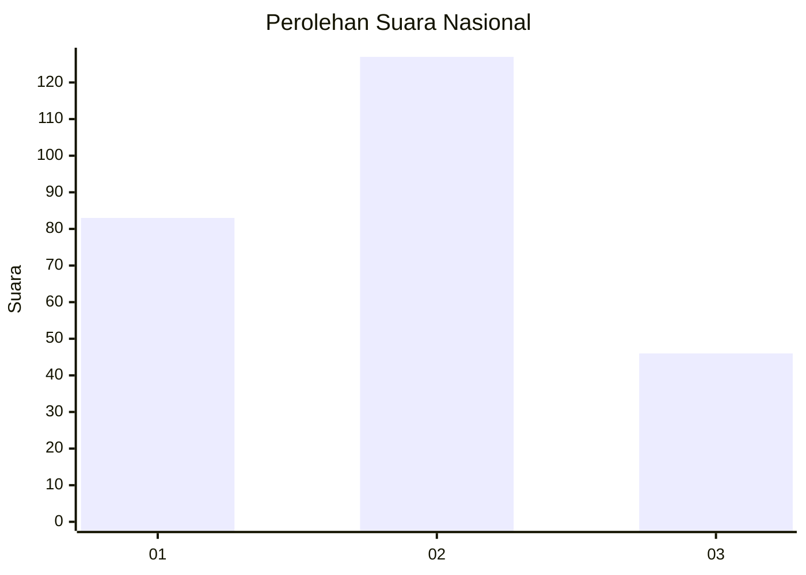
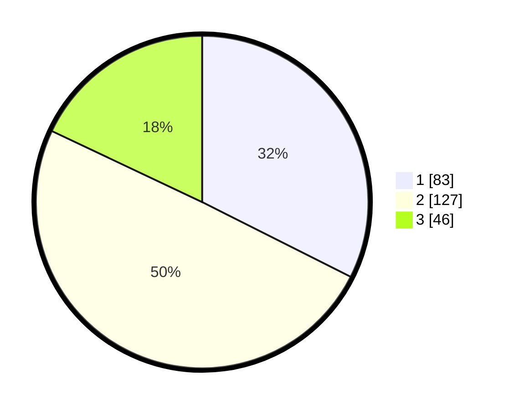

# Hasil

## Grafik

## Tabel

| No. | Nama Paslon    | Suara | Suara (raw) | Persentase |
|:--- |:-------------- | -----:| -----------:| ----------:|
| 1   | ANIES MUHAIMIN | 83    | [83][p-1]   | 32,42      |
| 2   | PRABOWO GIBRAN | 127   | [127][p-2]  | 49,61      |
| 3   | GANJAR MAHFUD  | 46    | [46][p-3]   | 17,97      |

[p-1]: https://github.com/gigit-pemilu/pemilu-2024/blob/main/pilpres/hitung-suara/sub/34-di-yogyakarta/sub/04-sleman/sub/01-gamping/sub/2003-banyuraden/sub/032-tps/sub/paslon-1.txt
[p-2]: https://github.com/gigit-pemilu/pemilu-2024/blob/main/pilpres/hitung-suara/sub/34-di-yogyakarta/sub/04-sleman/sub/01-gamping/sub/2003-banyuraden/sub/032-tps/sub/paslon-2.txt
[p-3]: https://github.com/gigit-pemilu/pemilu-2024/blob/main/pilpres/hitung-suara/sub/34-di-yogyakarta/sub/04-sleman/sub/01-gamping/sub/2003-banyuraden/sub/032-tps/sub/paslon-3.txt

## Foto C Plano

https://sirekap-obj-formc.kpu.go.id/26ce/pemilu/ppwp/34/04/01/20/03/3404012003032-20240214-232723--aeb979be-1671-4e49-b959-58af20dc8809.jpg

https://sirekap-obj-formc.kpu.go.id/26ce/pemilu/ppwp/34/04/01/20/03/3404012003032-20240214-233118--f080c24a-4c48-4fe7-8246-d9191a06305b.jpg

https://sirekap-obj-formc.kpu.go.id/26ce/pemilu/ppwp/34/04/01/20/03/3404012003032-20240214-233545--564a7f23-5f4d-4b1b-bcff-ac4ef27d79ad.jpg

## Metadata

| Key        | Value               |
| ---------- | ------------------- |
| Time Stamp | 2024-02-21 18:00:00 |

