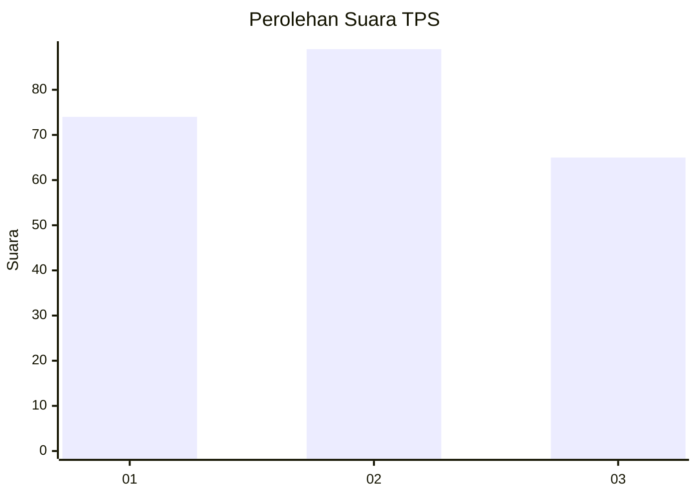
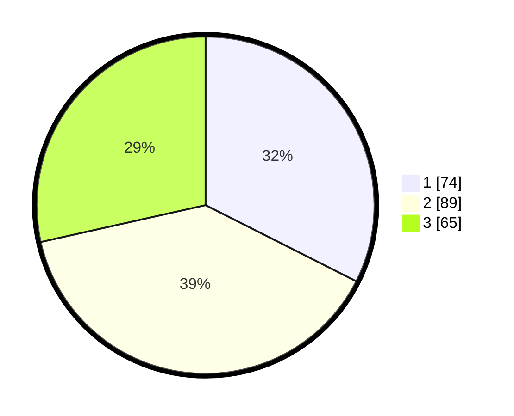

# Hasil

## Grafik

## Tabel

| No. | Nama Paslon    | Suara | Suara (raw) | Persentase |
|:--- |:-------------- | -----:| -----------:| ----------:|
| 1   | ANIES MUHAIMIN | 74    | [74][p-1]   | 32,46      |
| 2   | PRABOWO GIBRAN | 89    | [89][p-2]   | 39,04      |
| 3   | GANJAR MAHFUD  | 65    | [65][p-3]   | 28,51      |

[p-1]: https://github.com/gigit-pemilu/pemilu-2024-34-di-yogyakarta/blob/main/pilpres/hitung-suara/sub/34-di-yogyakarta/sub/04-sleman/sub/01-gamping/sub/2003-banyuraden/sub/038-tps/sub/paslon-1.txt
[p-2]: https://github.com/gigit-pemilu/pemilu-2024-34-di-yogyakarta/blob/main/pilpres/hitung-suara/sub/34-di-yogyakarta/sub/04-sleman/sub/01-gamping/sub/2003-banyuraden/sub/038-tps/sub/paslon-2.txt
[p-3]: https://github.com/gigit-pemilu/pemilu-2024-34-di-yogyakarta/blob/main/pilpres/hitung-suara/sub/34-di-yogyakarta/sub/04-sleman/sub/01-gamping/sub/2003-banyuraden/sub/038-tps/sub/paslon-3.txt

## Foto C Plano

https://sirekap-obj-formc.kpu.go.id/e638/pemilu/ppwp/34/04/01/20/03/3404012003038-20240214-213621--2458d3e4-32f5-4abf-8978-a6f6a7b4b5fa.jpg

https://sirekap-obj-formc.kpu.go.id/e638/pemilu/ppwp/34/04/01/20/03/3404012003038-20240214-205152--ea029c2c-f663-4007-bb65-1f0c78f41e45.jpg

https://sirekap-obj-formc.kpu.go.id/e638/pemilu/ppwp/34/04/01/20/03/3404012003038-20240214-205208--daeb7e19-8c2f-452e-97bd-a2b6ca069046.jpg

## Metadata

| Key        | Value               |
| ---------- | ------------------- |
| Time Stamp | 2024-02-15 12:00:28 |

