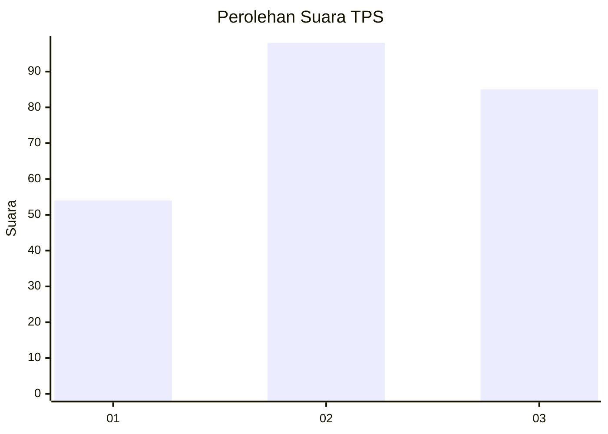
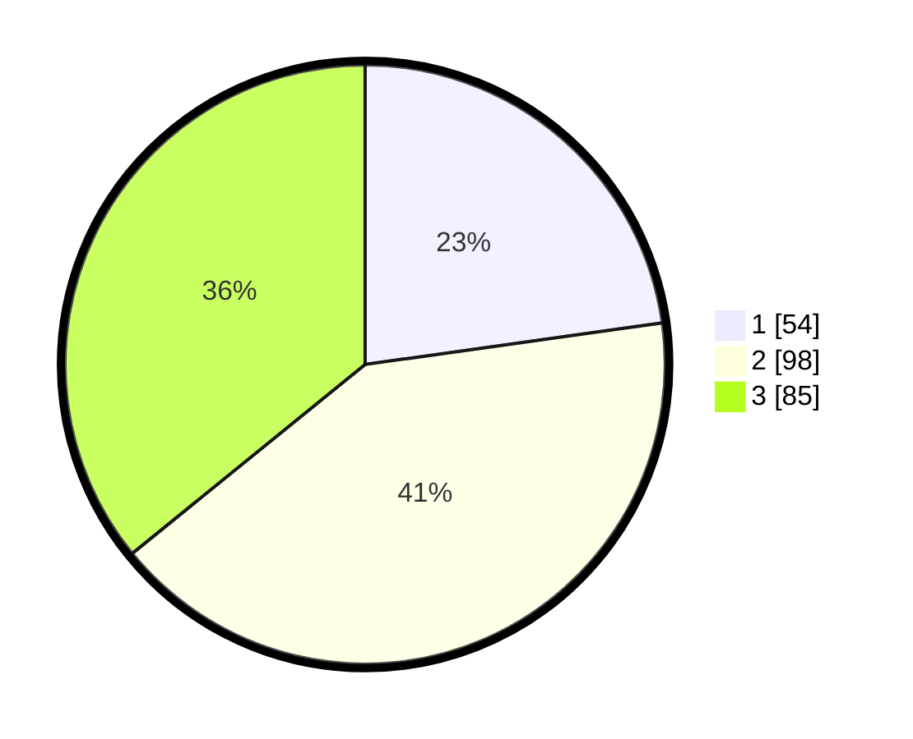

# Hasil

## Grafik

## Tabel

| No. | Nama Paslon    | Suara | Suara (raw) | Persentase |
|:--- |:-------------- | -----:| -----------:| ----------:|
| 1   | ANIES MUHAIMIN | 54    | [54][p-1]   | 22,78      |
| 2   | PRABOWO GIBRAN | 98    | [98][p-2]   | 41,35      |
| 3   | GANJAR MAHFUD  | 85    | [85][p-3]   | 35,86      |

[p-1]: https://github.com/gigit-pemilu/pemilu-2024-34-di-yogyakarta/blob/main/pilpres/hitung-suara/sub/34-di-yogyakarta/sub/04-sleman/sub/01-gamping/sub/2003-banyuraden/sub/040-tps/sub/paslon-1.txt
[p-2]: https://github.com/gigit-pemilu/pemilu-2024-34-di-yogyakarta/blob/main/pilpres/hitung-suara/sub/34-di-yogyakarta/sub/04-sleman/sub/01-gamping/sub/2003-banyuraden/sub/040-tps/sub/paslon-2.txt
[p-3]: https://github.com/gigit-pemilu/pemilu-2024-34-di-yogyakarta/blob/main/pilpres/hitung-suara/sub/34-di-yogyakarta/sub/04-sleman/sub/01-gamping/sub/2003-banyuraden/sub/040-tps/sub/paslon-3.txt

## Foto C Plano

https://sirekap-obj-formc.kpu.go.id/8595/pemilu/ppwp/34/04/01/20/03/3404012003040-20240215-021359--45c0dc2f-9939-4ab7-a75f-df5bbbaac4e7.jpg

https://sirekap-obj-formc.kpu.go.id/8595/pemilu/ppwp/34/04/01/20/03/3404012003040-20240215-021448--6b7febe5-9565-4011-a6cc-34dd0faf88ca.jpg

https://sirekap-obj-formc.kpu.go.id/8595/pemilu/ppwp/34/04/01/20/03/3404012003040-20240215-021516--981703c0-edc0-4f17-a21b-390544f660f7.jpg

## Metadata

| Key        | Value               |
| ---------- | ------------------- |
| Time Stamp | 2024-02-15 12:00:28 |

