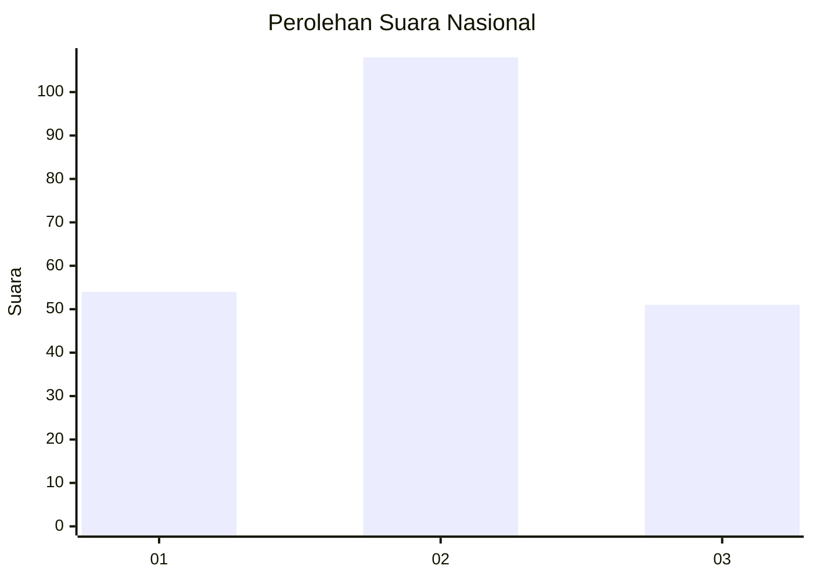
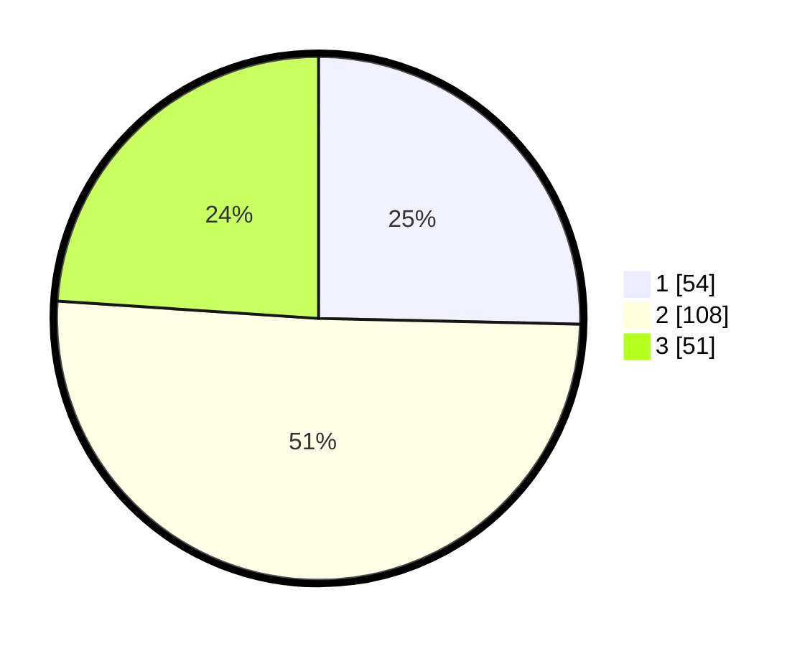

# Hasil

## Grafik

## Tabel

| No. | Nama Paslon    | Suara | Suara (raw) | Persentase |
|:--- |:-------------- | -----:| -----------:| ----------:|
| 1   | ANIES MUHAIMIN | 54    | [54][p-1]   | 25,35      |
| 2   | PRABOWO GIBRAN | 108   | [108][p-2]  | 50,70      |
| 3   | GANJAR MAHFUD  | 51    | [51][p-3]   | 23,94      |

[p-1]: https://github.com/gigit-pemilu/pemilu-2024/blob/main/pilpres/hitung-suara/sub/34-di-yogyakarta/sub/04-sleman/sub/01-gamping/sub/2003-banyuraden/sub/042-tps/sub/paslon-1.txt
[p-2]: https://github.com/gigit-pemilu/pemilu-2024/blob/main/pilpres/hitung-suara/sub/34-di-yogyakarta/sub/04-sleman/sub/01-gamping/sub/2003-banyuraden/sub/042-tps/sub/paslon-2.txt
[p-3]: https://github.com/gigit-pemilu/pemilu-2024/blob/main/pilpres/hitung-suara/sub/34-di-yogyakarta/sub/04-sleman/sub/01-gamping/sub/2003-banyuraden/sub/042-tps/sub/paslon-3.txt

## Foto C Plano

https://sirekap-obj-formc.kpu.go.id/158f/pemilu/ppwp/34/04/01/20/03/3404012003042-20240214-221008--a995174e-72ec-46a7-8fee-3a07548139fe.jpg

https://sirekap-obj-formc.kpu.go.id/158f/pemilu/ppwp/34/04/01/20/03/3404012003042-20240214-221115--384532bd-1e80-4496-a0fd-9054bb13133f.jpg

https://sirekap-obj-formc.kpu.go.id/158f/pemilu/ppwp/34/04/01/20/03/3404012003042-20240214-221252--4176c3ed-c924-4bd4-be81-2b6381e7170e.jpg

## Metadata

| Key        | Value               |
| ---------- | ------------------- |
| Time Stamp | 2024-02-15 15:00:29 |

