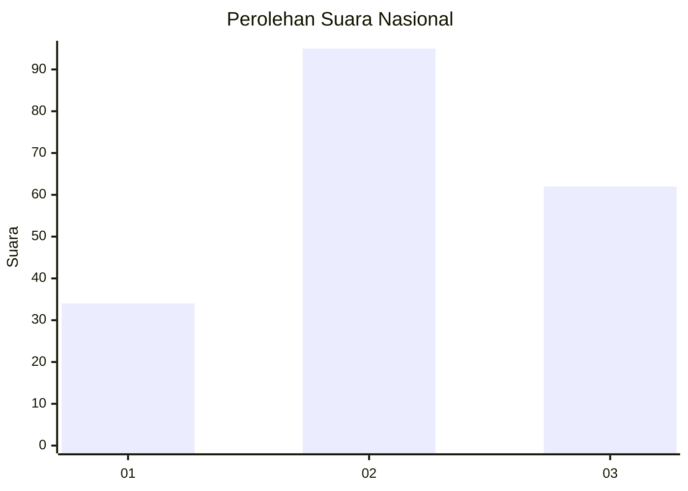
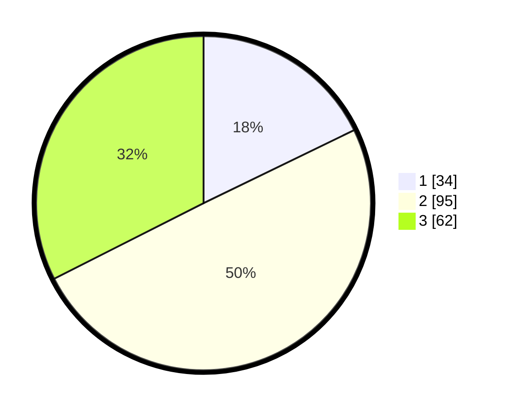

# Hasil

## Grafik

## Tabel

| No. | Nama Paslon    | Suara | Suara (raw) | Persentase |
|:--- |:-------------- | -----:| -----------:| ----------:|
| 1   | ANIES MUHAIMIN | 34    | [34][p-1]   | 17,80      |
| 2   | PRABOWO GIBRAN | 95    | [95][p-2]   | 49,74      |
| 3   | GANJAR MAHFUD  | 62    | [62][p-3]   | 32,46      |

[p-1]: https://github.com/gigit-pemilu/pemilu-2024/blob/main/pilpres/hitung-suara/sub/34-di-yogyakarta/sub/04-sleman/sub/01-gamping/sub/2003-banyuraden/sub/045-tps/sub/paslon-1.txt
[p-2]: https://github.com/gigit-pemilu/pemilu-2024/blob/main/pilpres/hitung-suara/sub/34-di-yogyakarta/sub/04-sleman/sub/01-gamping/sub/2003-banyuraden/sub/045-tps/sub/paslon-2.txt
[p-3]: https://github.com/gigit-pemilu/pemilu-2024/blob/main/pilpres/hitung-suara/sub/34-di-yogyakarta/sub/04-sleman/sub/01-gamping/sub/2003-banyuraden/sub/045-tps/sub/paslon-3.txt

## Foto C Plano

https://sirekap-obj-formc.kpu.go.id/116c/pemilu/ppwp/34/04/01/20/03/3404012003045-20240214-190431--483b7cd9-59f9-4e92-ae7d-736c4df5259e.jpg

https://sirekap-obj-formc.kpu.go.id/116c/pemilu/ppwp/34/04/01/20/03/3404012003045-20240214-190631--35d00627-5411-410f-a159-9e0bb2a126b4.jpg

https://sirekap-obj-formc.kpu.go.id/116c/pemilu/ppwp/34/04/01/20/03/3404012003045-20240214-190836--e5fb3978-8c0a-458b-a12d-4608580bdd5e.jpg

## Metadata

| Key        | Value               |
| ---------- | ------------------- |
| Time Stamp | 2024-02-15 12:00:28 |

