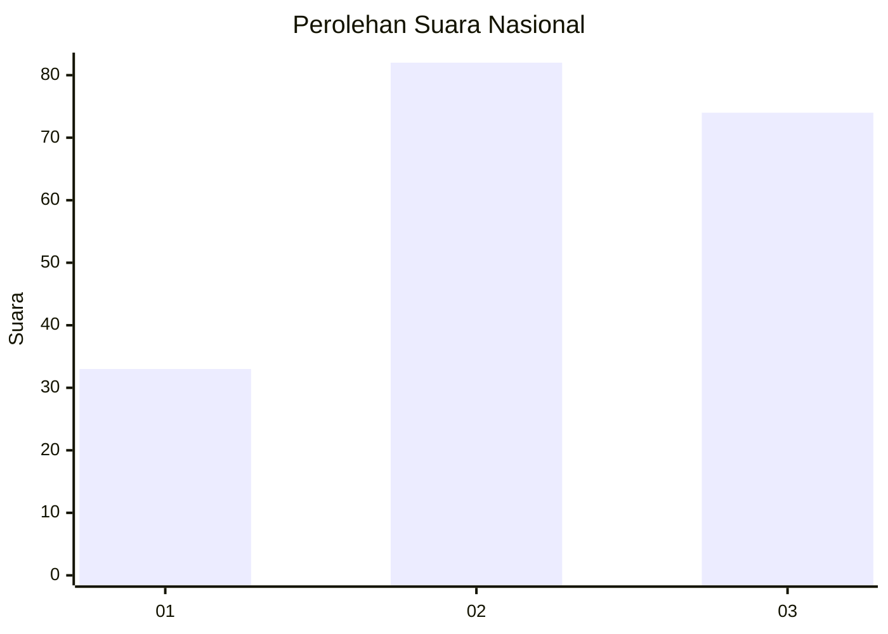
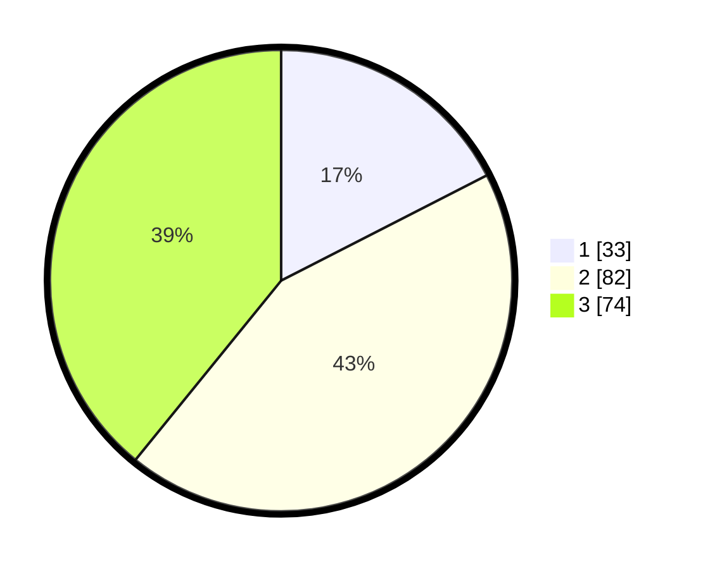

# Hasil

## Grafik

## Tabel

| No. | Nama Paslon    | Suara | Suara (raw) | Persentase |
|:--- |:-------------- | -----:| -----------:| ----------:|
| 1   | ANIES MUHAIMIN | 33    | [33][p-1]   | 17,46      |
| 2   | PRABOWO GIBRAN | 82    | [82][p-2]   | 43,39      |
| 3   | GANJAR MAHFUD  | 74    | [74][p-3]   | 39,15      |

[p-1]: https://github.com/gigit-pemilu/pemilu-2024/blob/main/pilpres/hitung-suara/sub/34-di-yogyakarta/sub/04-sleman/sub/01-gamping/sub/2004-nogotirto/sub/002-tps/sub/paslon-1.txt
[p-2]: https://github.com/gigit-pemilu/pemilu-2024/blob/main/pilpres/hitung-suara/sub/34-di-yogyakarta/sub/04-sleman/sub/01-gamping/sub/2004-nogotirto/sub/002-tps/sub/paslon-2.txt
[p-3]: https://github.com/gigit-pemilu/pemilu-2024/blob/main/pilpres/hitung-suara/sub/34-di-yogyakarta/sub/04-sleman/sub/01-gamping/sub/2004-nogotirto/sub/002-tps/sub/paslon-3.txt

## Foto C Plano

https://sirekap-obj-formc.kpu.go.id/324f/pemilu/ppwp/34/04/01/20/04/3404012004002-20240215-024808--ddf8792d-8ca6-4911-9beb-9ba5eda4a157.jpg

https://sirekap-obj-formc.kpu.go.id/324f/pemilu/ppwp/34/04/01/20/04/3404012004002-20240215-024948--4b9a1ac8-6502-4e08-960a-90e5bea2022e.jpg

https://sirekap-obj-formc.kpu.go.id/324f/pemilu/ppwp/34/04/01/20/04/3404012004002-20240214-235003--cca16fb4-e48b-4221-ba34-0591e538ba07.jpg

## Metadata

| Key        | Value               |
| ---------- | ------------------- |
| Time Stamp | 2024-02-15 12:00:28 |

