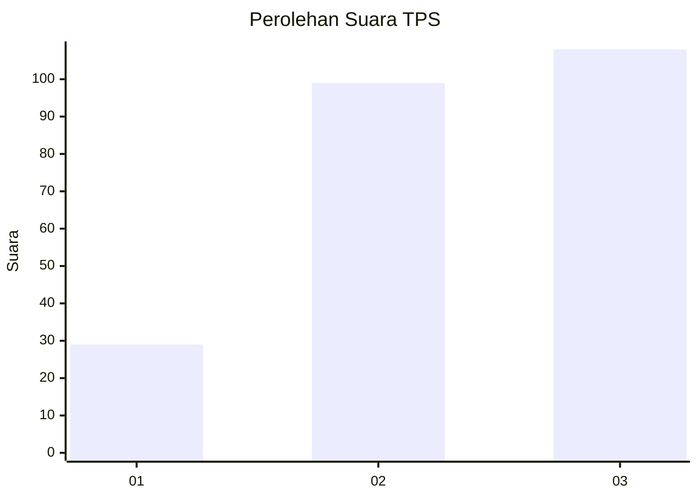
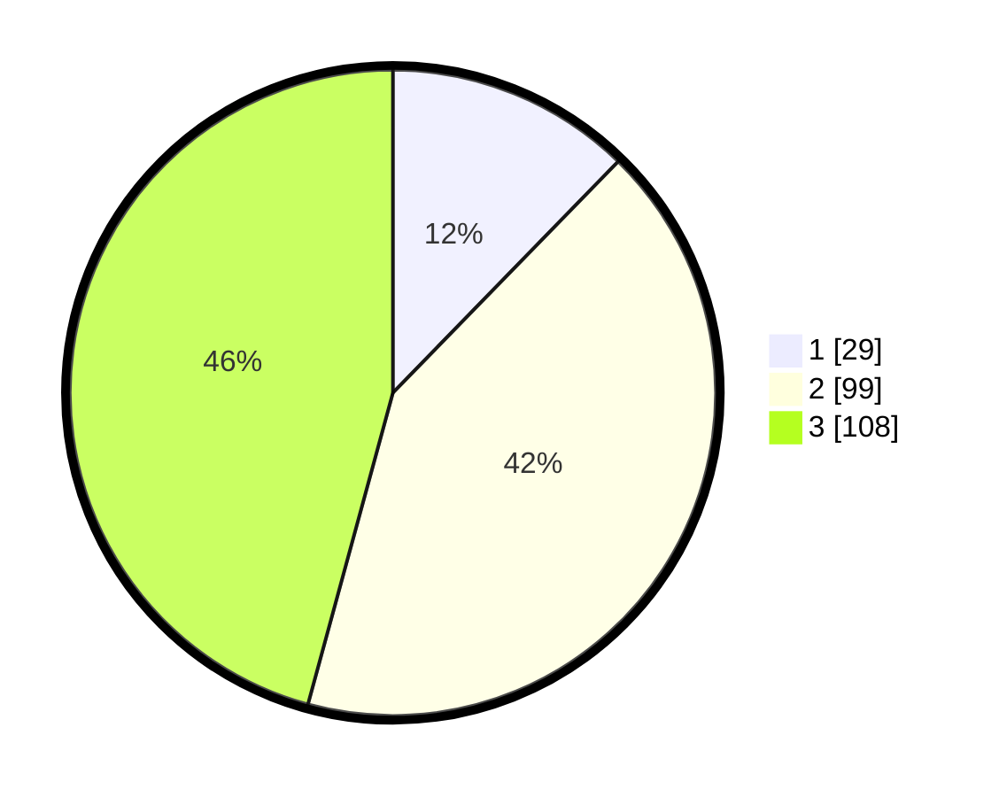

# Hasil

## Grafik

## Tabel

| No. | Nama Paslon    | Suara | Suara (raw) | Persentase |
|:--- |:-------------- | -----:| -----------:| ----------:|
| 1   | ANIES MUHAIMIN | 29    | [29][p-1]   | 12,29      |
| 2   | PRABOWO GIBRAN | 99    | [99][p-2]   | 41,95      |
| 3   | GANJAR MAHFUD  | 108   | [108][p-3]  | 45,76      |

[p-1]: https://github.com/gigit-pemilu/pemilu-2024-34-di-yogyakarta/blob/main/pilpres/hitung-suara/sub/34-di-yogyakarta/sub/04-sleman/sub/01-gamping/sub/2004-nogotirto/sub/005-tps/sub/paslon-1.txt
[p-2]: https://github.com/gigit-pemilu/pemilu-2024-34-di-yogyakarta/blob/main/pilpres/hitung-suara/sub/34-di-yogyakarta/sub/04-sleman/sub/01-gamping/sub/2004-nogotirto/sub/005-tps/sub/paslon-2.txt
[p-3]: https://github.com/gigit-pemilu/pemilu-2024-34-di-yogyakarta/blob/main/pilpres/hitung-suara/sub/34-di-yogyakarta/sub/04-sleman/sub/01-gamping/sub/2004-nogotirto/sub/005-tps/sub/paslon-3.txt

## Foto C Plano

https://sirekap-obj-formc.kpu.go.id/1868/pemilu/ppwp/34/04/01/20/04/3404012004005-20240214-215339--1e956fa0-f2a9-4c6e-8d75-bd04fdde9c02.jpg

https://sirekap-obj-formc.kpu.go.id/1868/pemilu/ppwp/34/04/01/20/04/3404012004005-20240214-215554--c4a8dafb-641d-44d7-b4af-09baa9055036.jpg

https://sirekap-obj-formc.kpu.go.id/1868/pemilu/ppwp/34/04/01/20/04/3404012004005-20240214-215745--e6845e16-192a-42e6-8b71-eb07d6c3e4b6.jpg

## Metadata

| Key        | Value               |
| ---------- | ------------------- |
| Time Stamp | 2024-02-15 12:00:28 |

